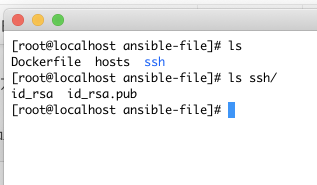
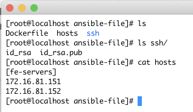
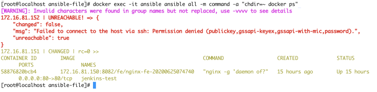

# Ansible

## 介绍与安装

### 什么是 Ansible

<br />我们先看网络上对它的解释：
> `Ansible` 是一款简单的运维自动化工具，只需要使用 `ssh` 协议连接就可以来进行系统管理，自动化执行命令，部署等任务。


<br />显而易见， `Ansible` 拿来做服务器部署再合适不过。只需要**预制好一份主机清单和要执行的命令步骤**，就可以实现**对一个清单的全部或部分主机远程****批量执行命令**。<br />

### 对比 Jenkins

<br />和 `Jenkins` 做服务部署对比， `Ansible` 更适合批量执行。<br />以前我们在 `Jenkins` 做部署，就是脚本执行 `ssh` 命令远程执行命令。**如果有大量的服务器，那么我们的脚本会写很长，且灵活度会变差**。<br />
<br />`Ansible` 还支持**无阻塞异步批量执行命令**，非常方便。**<br />

### 安装 Ansible


#### 使用 Dockerfile 制作镜像

<br />`Ansible` 目前的部署方式没有 `Docker` 安装，但我们可以定制一份 `Ansible` 镜像。<br />
<br />因为 `Ansible` 批量执行服务器时，还是采用的 `ssh` 进行操作，所以我们还是需要配置公钥私钥。**我们可以找一个已经在目标服务器配置过的公钥，和它配套的私钥一起打到 **`**Ansible**`**镜像内。这样我们就可以实现 `Ansible` 免密登录。**<br />
<br />但是，ssh连接时还涉及到一个叫做 `known_hosts` 文件。这个文件的主要作用是：<br />

> 当你用ssh连接到一个新的服务器的时候，ssh会让你确认服务器的信息（域名、IP、公钥），如果你确认了，就会将其写到 known_hosts 文件内。
> 以后你再连接到这个服务器，但是信息改变了（通常是公钥改变了），就会提示你服务器信息改变了，你可以把服务器信息它从 known_hosts 里删除，然后重新确认一份新的服务器信息。


<br />但是在我们这里该文件作用不大，我们就可以在 `Ansible` 内配置 `host_key_checking = False` 和 `host_key_checking = False` 这两个选项来关闭这个校验（下方dockerfile内有写）。**直接使用公钥私钥配对成功就可以进行连接。**我们将公钥私钥放在 `ssh` 文件夹内即可：<br />
<br />除了公钥私钥外，我们还需要准备一份 `主机清单`，命名为 `hosts`。**清单里面声明了要批量执行的主机。**这里可以先简单写一下，下一章我们会详细描述清单的语法格式。**最简单的****格式使用中括号声明主机组名称，换行写IP即可。**如下：

```bash
vim ./hosts
```

```bash
[fe-servers]
172.16.81.151
172.16.81.152
```

* **将公钥添加到目标服务器`authorized_keys`中**
```
ssh-copy-id -i ./ssh/id_rsa.pub root@172.16.81.151
```

> 目标服务器`(172.16.81.151)`如果没有`公钥/私钥`需要使用`ssh-keygen -t rsa`生成

<br />
<br />这里我们使用 `Centos7` 做镜像底座，用 `Dockerfile` 做镜像：

```bash
FROM centos:7
# 安装必要依赖，openssh-clients是为了支持ssh连接
RUN yum -y install wget curl vim openssh-clients
RUN wget -O /etc/yum.repos.d/epel.repo http://mirrors.aliyun.com/repo/epel-7.repo
RUN yum clean all
RUN yum makecache
# 拷贝公钥私钥进镜像内
COPY ssh /root/.ssh/
# 公钥私钥赋权
RUN chmod 755 ~/.ssh/
RUN chmod 600 ~/.ssh/id_rsa ~/.ssh/id_rsa.pub
# 安装 ansible
RUN yum -y install ansible
# 拷贝主机组清单进 ansible 目录
COPY hosts /etc/ansible/
# 关闭 known_hosts 校验
RUN sed -i 's/^#host_key_checking = False/host_key_checking = False/' /etc/ansible/ansible.cfg
RUN ansible --version
```

> sed -i ... ... 代表在`主配置文件`中`把#host_key_checking = False的#去掉`

使用 `docker build` 命令打包为镜像，版本为t1：

```bash
docker build -t ansible:t1 .
```


#### 启动容器并测试

<br />等待 `build` 完成后，使用 `docker run` 命令启动容器：

```bash
docker run -itd --name ansible ansible:t1
```

> 因为ansible并没有可视化界面，所以不需要分配端口


<br />启动后，使用 `docker exec` + `ansible command` 命令测试 `ansible` 安装，并远程执行一个命令测试：

```bash
docker exec -it ansible ansible all -m command -a "chdir=~ docker ps"
```

> ansible all: 代表匹配所有主机组的所有主机<br/>
> command：Ansible 命令模块。代表执行一个命令<br/>
> chdir=~：chdir 在哪里执行命令<br/>
> docker ps：查看正在跑的docker容器<br/>


<br />执行成功后，如下图（我的主机组配置了2台机器，一台可以连接另一台不存在）：<br /><br />
<br />到这里，我们的 `Ansible` 就安装成功


---------------------------

## Ansible 内的概念

**先进入docker，下文都基于docker容器内部执行**
```bash
docker exec -it ansible /bin/bash
```
> 如果ansible不是自启动可以更新为自启动<br/>
> docker container update --restart=always ansible


### 基础命令

<br />安装好 `Ansible` 后，使用 `ansible` 命令即可完成基础操作。例如以下命令可以测试你的所有主机的连通性：
```bash
ansible all -m ping
```
> `-m` 代表使用 `ansible`  某个模块，后紧跟模块名
> all代表匹配所有主机组，这里也可以传入指定的主机组名称。


<br />如果想查看有哪些模块：
```bash
ansible-doc -l
```

<br />想查看模块的具体帮助，比如fetch模块：
```bash
ansible-doc -s fetch
```


### Modules 模块


#### copy
文件拷贝模块：将 `Ansible` 主机下的目录拷贝到目标机器。例如将 `Ansible` 主机内的  `/testdir/copytest` 目录拷贝到目标机器 `/opt` 下。
```bash
ansible all -m copy -a "src=/testdir/copytest dest=/opt"
```
> mkdir -p /testdir/copytest<br/>
> touch /testdir/copytest/aa


#### file
文件操作模块：可以对目标机器进行新建和删除文件。例如：
```
ansible all -m file -a "path=/testdir/testfile state=touch"
```
> 在目标机器下新建 /testdir/testfile 文件

```
ansible all -m file -a "path=/testdir/testfile state=absent"
```
> 在目标机器下删除 /testdir/testfile 文件


#### find
文件查找模块：可以查找目标机器内的文件。例如查找 `/testdir` 文件夹下包含 `abc` 字符串的文件：
```
ansible all -m find -a 'paths=/testdir contains=".*abc.*"'
```


#### replace
文件内容替换模块：可以在指定文件中通过正则匹配指定内容进行替换。例如在 `/testdir/test` 文件夹内，查找符合正则 `abc` 的内容，替换为 `buck`
```
ansible all -m replace -a 'path=/testdir/test  regexp="abc" replace=buck'
```


#### command
命令模块：可以在目标机器内执行命令。<br />**和shell命令不同的是，shell中的 `<` , `>` , `|` , `;` , `&` , `$` 等特殊字符不能在command模块中使用，如果需要使用，则用shell模块。**<br />例如：
```
ansible all -m command -a "chdir=/testdir ls"
```
> 在目标机器 /testdir 目录下执行 ls命令


<br />更详细的介绍，可以参考：[**链接**](https://www.cnblogs.com/yanjieli/p/10969143.html)<br />


### Inventory 主机清单

<br />主机清单是 `Ansible` 最基础的概念，它声明了 `Ansible` **到底在哪些机器上执行命令**。主机清单默认是 `/etc/ansible/hosts` 文件。<br />主机清单语法花样也很多。**不仅可以保存主机清单，还可以定义主机密码，授权方式等其他信息**。<br />
<br />一般在 `Ansible` 内，都是以 `组` 为集合管理主机。被称为 `主机组` ，一个主机组内有许多主机。<br />
<br />最简单的主机组声明：
```
[apache]
192.168.1.36
192.168.1.33
```
其中， `apache` 是主机组名，下面是组内的主机IP。<br />

#### 使用密码连接

<br />在主机组内，可以在清单内定义主机密码，端口等信息。
```
# 方法一 主机+端口+密码
[webserver]
192.168.1.31 ansible_ssh_port=22 ansible_ssh_user=root ansible_ssh_pass="123456"
192.168.1.32 ansible_ssh_port=22 ansible_ssh_user=root ansible_ssh_pass="123456"
192.168.1.33 ansible_ssh_port=22 ansible_ssh_user=root ansible_ssh_pass="123456"
192.168.1.36 ansible_ssh_port=22 ansible_ssh_user=root ansible_ssh_pass="123456"


# 方法二 主机+端口+密码
[webserver]
192.168.1.3[1:3] ansible_ssh_user=root ansible_ssh_pass="123456"


# 方法二 主机+端口+密码
[webserver]
192.168.1.3[1:3]
[webserver:vars]
ansible_ssh_pass="123456"
```
> 192.168.1.3[1:3]：代表 192.168.1.31 和 192.168.1.33


#### 使用密钥连接

<br />当然，最常用的就是密钥连接服务器。这种情况下，我们只需要定义最简单的主机组，将Ansible机器公钥在目标机器配置即可。<br />
<br />更多花样玩法 => [https://www.cnblogs.com/yanjieli/p/10969089.html#380920160](https://www.cnblogs.com/yanjieli/p/10969089.html#380920160)<br />


### Playbook 任务剧本

<br />任务剧本（任务集），yaml格式文件，定义 Ansible 任务的配置文件。作用有点像 `Dockerfile` 。**是一组任务的集合声明文件**<br />示例如下：
```yaml
---
- hosts: all
  remote_user: root
  vars:
    timestamp: 20200625233149
  tasks:
    - name: docker pull new images
      shell: 'chdir=~ docker pull 172.16.81.150:8082/fe/nginx-fe-{{timestamp}}'
    - name: docker rmf
      shell: 'chdir=~ docker ps | grep jenkins-test && docker rm -f jenkins-test'
      ignore_errors: true
    - name: docker run
      shell: 'chdir=~ docker run -p 80:80 -itd --name jenkins-test 172.16.81.150:8082/fe/nginx-fe-{{timestamp}}'
      
```

- hosts: 指定在哪个主机组执行该任务集合。 `all` 代表全部主机
- remote_user: 使用哪个用户进行远程执行
- vars: 定义变量的地方。在下方任务命令中可以使用 `{{ varName }}` 使用变量
- tasks: 任务集合
- shell: `Ansible` 的 `shell` 模块，上面有讲解模块的作用和类型。后面跟着模块的命令


<br />更详细的语法：[https://www.cnblogs.com/yanjieli/p/10969299.html](https://www.cnblogs.com/yanjieli/p/10969299.html)<br />


#### 执行 Playbook

<br />可以使用 `ansible-playbook` 命令执行 `playbook` ：
```bash
ansible-playbook test.yml
```

<br />使用 `--syntax-check` 命令测试 playbook 语法是否正确
```bash
ansible-playbook --syntax-check test.yml
```

<br />测试playbook执行（并不会真的在主机组上执行，只是模拟）：
```bash
ansible-playbook --check test.yml
```

<br />替换playbook中默认的变量值，并执行playbook。在这种情况下，**命令行传入参数 > 默认值**：
```bash
ansible-playbook -e "timestamp=212123323" test.yml
```


