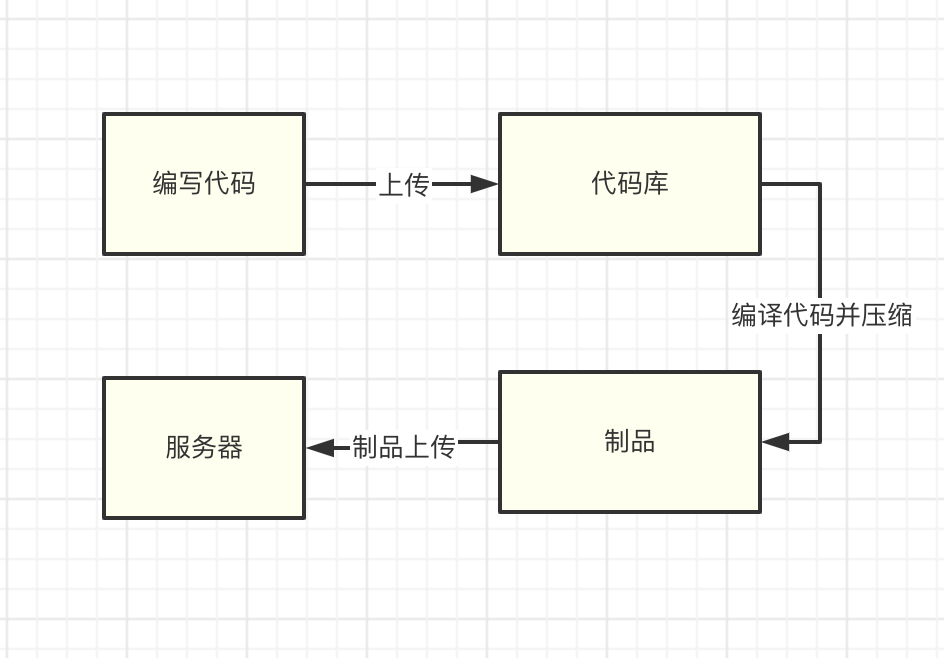
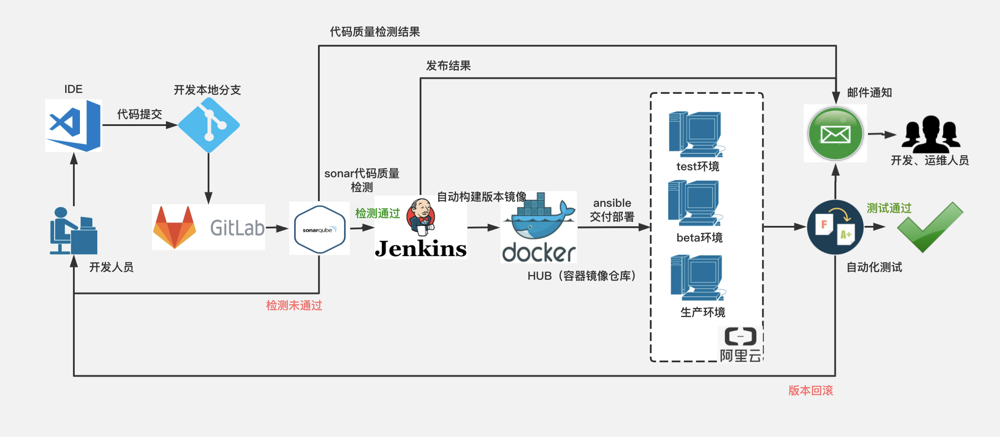
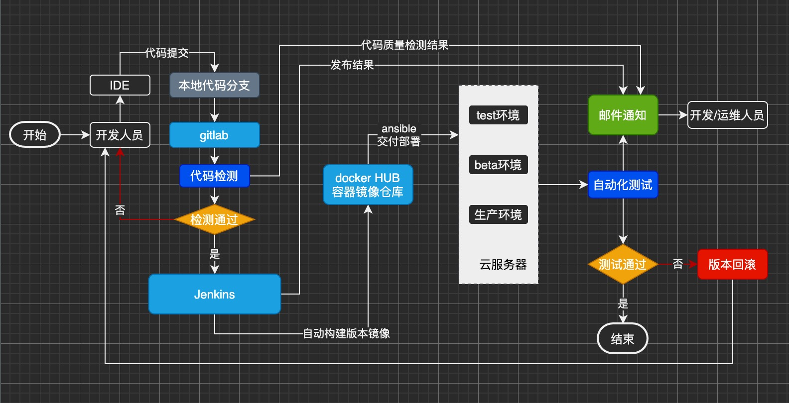

# 什么是CI/CD?

## 传统部署方式

 在说CI/CD之前，我们先说一说传统软件部署方式。 在CI/CD还没有出现之前，软件是这样部署的： 
  
 这样的部署方式缺点显然易见：**人工操作，部署速度慢，容易慌乱中出差错，且版本管理机制差** 

## CI/CD

 CI/CD 的根本原则就是**实现自动化****构建部署，解决人肉构建部署带来的效率低，出错率高等问题**。下面是CI/CD的总体流程：

我们可以看到，一套CI/CD的流程包含：

**代码编写 => 提交到Git代码库 => 触发代码扫描 => 通过后触发 Jenkins => 构建镜像到hub => 服务器拉取镜像并部署** ** 这样的好处非常明显：流程规范，不容易出错，速度快，省力 

## CI

 **CI**的意思是**持续构建**。**负责将上游代码库的代码拉取后，执行用户预置定义好的构建脚本，通过一系列编译操作构建出一个 “制品”，并将制品推送至到制品库里面。常用工具有 ****Gitlab CI，Github CI，Jenkins。** 

## CD

**CD**的意思是**持续部署**。**负责****从制品库内拉取最新的制品，通过一系列部署工具（如Ansible）单个或批量执行命令对服务器进行部署****。****常用工具有 ****Ansible**** 等。** **

## **制品库**
** 构建后的产物称为“**制品**”，制品则要放到**制品库**做**中转和版本管理**。常用平台有 **Nexus，Jfrog，harbor** 或其他对象存储平台。

--------------------------
## 特别声明
**该CI/CD系列出自 《珠峰训练营CI/CD教练员 王圣松》**  
如转载请注明《珠峰培训+王圣松联合版权》。 
王圣松，00后程序员，文档撰写期间，他就职于开源中国。

