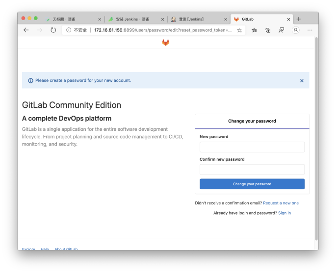
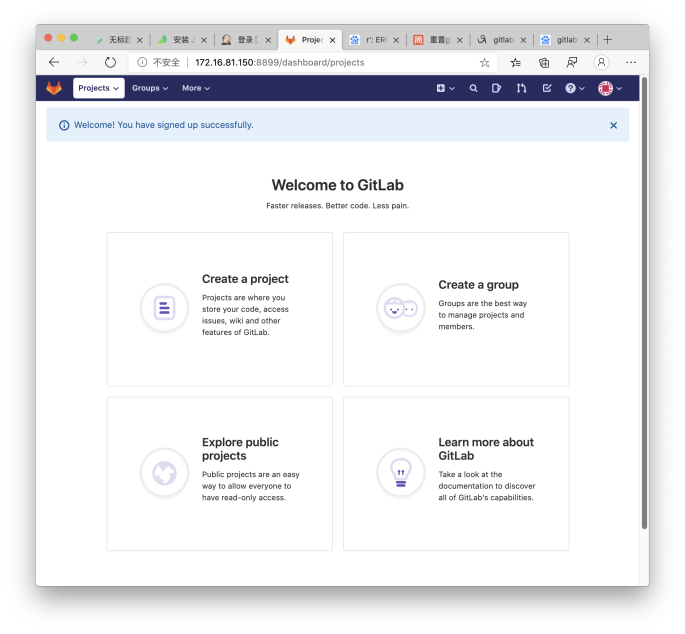

# 安装 Gitlab

## 1. 拉取 Gitlab 镜像
这里我们拉取最新的gitlab-ce镜像
```bash
docker pull gitlab/gitlab-ce
```

## 2. 创建 Gitlab 容器
我们使用 `docker run` 命令启动一个新的 Gitlab 容器
```bash
mkdir /home/gitlab #创建Gitlab工作目录

docker run -itd -p 443:443 \
-p 8899:8899 \
-p 333:333 \
--name gitlab \
--restart always \
-v /home/gitlab/config:/etc/gitlab \
-v /home/gitlab/logs:/var/log/gitlab \
-v /home/gitlab/data:/var/opt/gitlab \
gitlab/gitlab-ce
```
>--restart: 当 Docker 重启时，容器自动启动，否则就需要使用 docker restart 启动<br>
gitlab端口映射规则：最好内外端口映射一致，gitlab 会根据你的配置文件调整服务端口。如外部访问8899，内外都配置8899<br>
一般Gitlab有三个端口要使用：ssh，https，主服务地址。<br>
ssh默认是22，这里我改为了333，下方配置文件内也要改为333

然后我们在防火墙添加 `333` 和 `8899` 端口的放行，并重载防火墙
```bash
firewall-cmd --zone=public --add-port=333/tcp --permanent
firewall-cmd --zone=public --add-port=8899/tcp --permanent
systemctl reload firewalld
```

## 3. 修改Gitlab配置文件
容器启动后，我们需要修改 `Gitlab` 配置文件，修改 `Gitlab` 主服务地址和 `SSH` 服务地址
```bash
vi /home/gitlab/config/gitlab.rb
```
在文件内增加三条配置：
* external_url: 外部服务访问地址
* gitlab_rails['gitlab_ssh_host']：SSH代码拉取地址
* gitlab_rails['gitlab_shell_ssh_port']：SSH代码拉取端口
```
external_url 'http://外部访问域名:端口/地址'
gitlab_rails['gitlab_ssh_host'] = 'SSH外部访问域名/地址'
gitlab_rails['gitlab_shell_ssh_port'] = SSH端口
```

### 如何修改SSH端口
SSH 默认的端口是 `22` 。这里内外分开，将Gitlab容器内SSH端口改为了 `333` 。

先进入 Gitlab 容器，直接编辑 `/assets/sshd_config` 和 `/etc/ssh/sshd_config` 这两个文件即可。修改最上方的 `Port` 字段。

```bash
docker exec -it gitlab /bin/bash
vim /assets/sshd_config
vim /etc/ssh/sshd_config
```
接着重启 Gitlab
```bash
docker restart gitlab
```

## 4. 启动 Gitlab
访问 `宿主机:端口` ，查看Gitlab启动情况，如果显示 `502` ，则代表正在启动中。第一次启动时间可能会有些长。如显示以下界面，代表启动成功。

修改密码后，默认管理员是  `root` ，登录进入即可





## 5. 加餐 配置邮件服务器
* 本案例以QQ邮箱为例子，配置IMAP/SMTP服务<br>
打开邮箱->设置->账户，开启 IMAP/SMTP 服务，获取 授权码，并将授权码复制到电脑文本，请重视 授权码
* 修改gitlab配置文件
```bash
vi /home/gitlab/config/gitlab.rb
```
* 修改下边内容的 * 处，然后复制到 gitlab.rb 中
```
gitlab_rails['smtp_enable'] = true
gitlab_rails['smtp_address'] = "smtp.qq.com"
gitlab_rails['smtp_port'] = 465
gitlab_rails['smtp_user_name'] = "35****69@qq.com"
gitlab_rails['smtp_password'] = "ju****ah"
gitlab_rails['smtp_authentication'] = "login"
gitlab_rails['smtp_enable_starttls_auto'] = true
gitlab_rails['smtp_tls'] = true
gitlab_rails['gitlab_email_from'] = '35****69@qq.com'
```
>第1行 smtp_enable 开启 SMTP 功能<br>
第3行 smtp_port 587 会报错<br>
第4行 smtp_user_name 改成你的邮箱账号<br>
第5行 smtp_password 改成你的授权码<br>
第9行 gitlab_email_from 发件人信息，必须跟 第4行 smtp_user_name 保持一致，否则报错
* 使gitlab配置生效
```bash
docker exec gitlab gitlab-ctl reconfigure
```
* 测试邮件功能
进入gitlab容器并启动bash命令
```bash
docker exec -it gitlab /bin/bash
```
开启 gitlab-rails 工具
```bash
gitlab-rails console production
```
等待程序运行完毕，发送邮件测试
```bash
Notify.test_email('35****69@qq.com', '邮件标题', '邮件内容').deliver_now
```
收到邮件后，邮件测试完成
>该段描述用于记录，已经可以通过qq邮箱发送给163邮件，原因尚不明确<br>
敲黑板划重点：qq邮箱不能给163发送邮件，即使使用网页qq邮箱，也会被打回来！！！<br>
但是163可以给qq发送邮件，如果想要配置163邮箱，请上网参考163的smtp配置。
* 关闭注册功能
1. 管理员进入admin area,点击settings
2. 在sign-up Restrictions 取消sign-up enabled
3. 保存,退出
