# Jenkins + Gitlab


<br />到这里，我们的Jenkins 和Gitlab就已经安装完成。<br />接下来我们将这两个平台串联起来，**实现第一阶段的持续构建和部署**

<a name="PL5tW"></a>
## Jenkins 安装 Nodejs 环境


<a name="56rzz"></a>
### 安装

<br />《安装 Jenkins》那一章我们讲到，Jenkins容器环境是一个全新的环境，与外界隔离。那我们怎么在容器内部使用Node环境呢？有以下三种方式：<br />

1. 进入Jenkins容器，手动安装Node：这种方式靠谱，但是比较费时间，且需要找寻缺失的依赖（Jenkins容器底层是Ubuntu）
1. 像Docker in Docker一样，把宿主机的Node环境挂载到容器内：这种也可以，但是可能环境会有问题。如依赖缺失等
1. **使用Jenkins平台自带的工具安装Node**


<br />在这里，我们**选择第三种方式**安装Nodejs，既方便又省力。<br />
<br />我们打开 Jenkins 首页，找到左侧的“系统配置”，选择“插件管理”，点击“可选插件”，搜索 “Node”。点击左下角的 “直接安装”<br />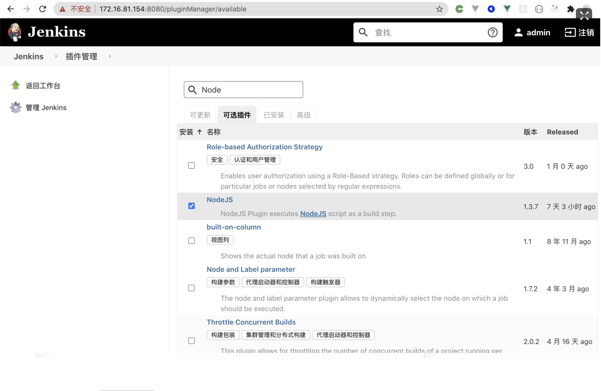<br />
<br />安装完毕后，重启 `Jenkins` 
```bash
docker restart jenkins
```

<br />重启完毕后，回到 Jenkins 首页，找到左侧的“系统配置”，选择“全局工具配置”<br />
<br />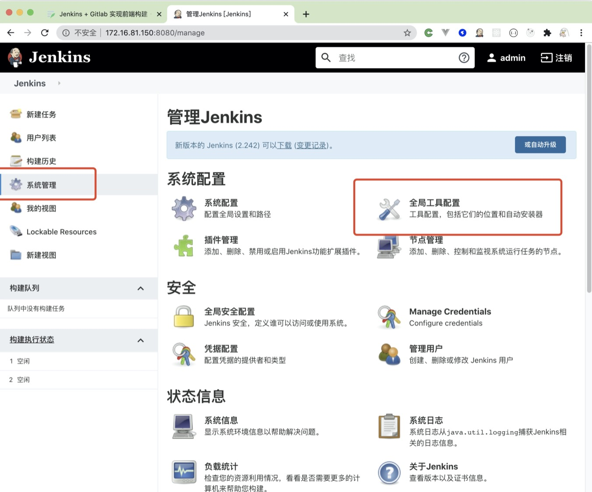<br />
<br />找到下面的“Node JS”，点击NodeJS安装，选择相应的版本填写信息保存即可。<br />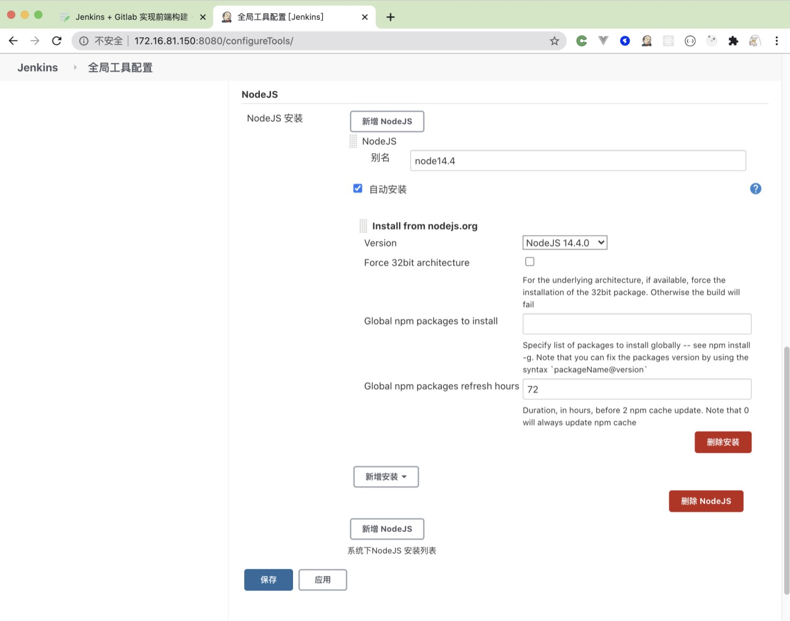<br />

<a name="hTd85"></a>
### 使用

<br />那我们在任务中如何使用呢？我们只需要在任务的“配置”中，找到“构建环境”，选中 “Provide Node & npm bin/ folder to PATH” ，选择刚才配置好的NodeJS即可。<br />
<br />第一次执行会下载对应的Node版本，后续不会下载。<br />
<br />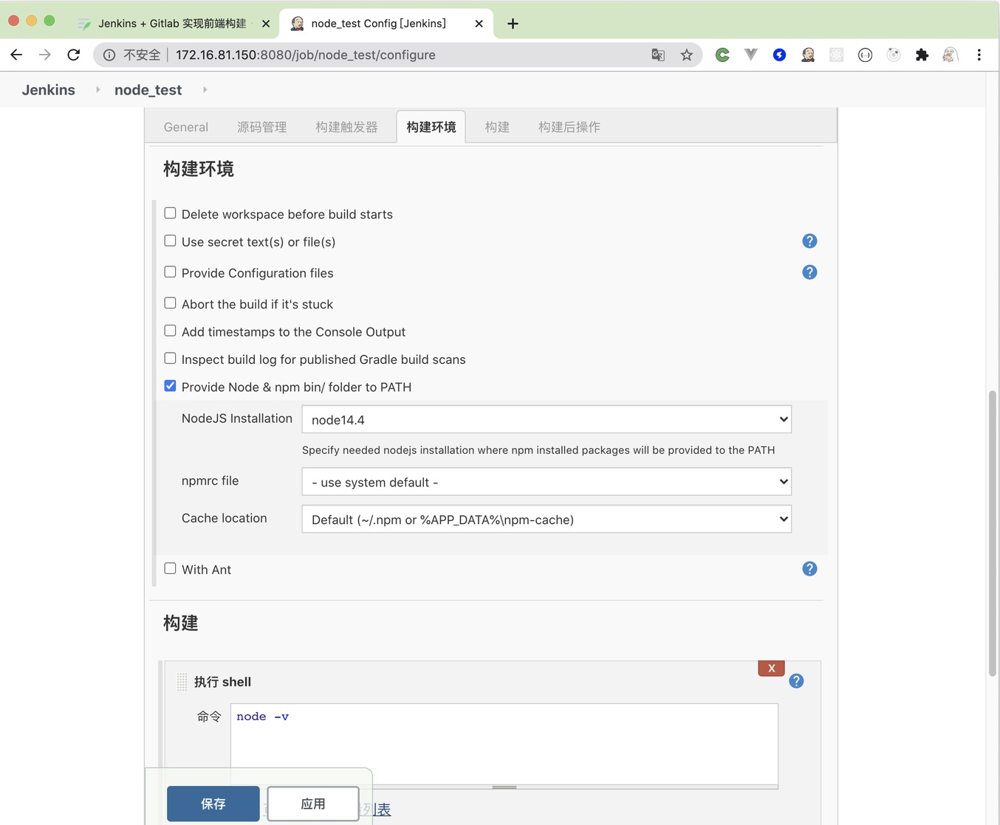<br />

<a name="Fi3uS"></a>
## 开始集成


<a name="EmgFy"></a>
### Jenkins 容器端生成私钥公钥

<br />先进入Jenkins容器内，使用 `ssh-keygen -t rsa` 生成私钥公钥。如下图所示，代表生成成功。<br />

```bash
docker exec -it jenkins /bin/bash
ssh-keygen -t rsa
```

<br />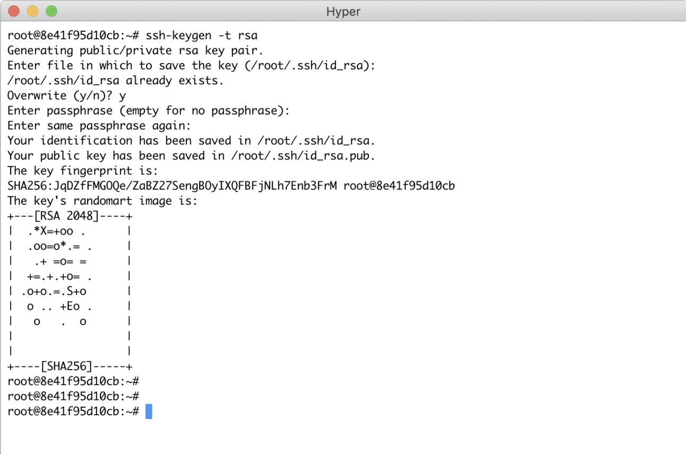<br />执行后，我们生成的私钥公钥文件存放在了 `~/.ssh` 目录下。其中， `id_rsa` 为私钥， `id_rsa.pub` 为公钥。<br />

<a name="6i7Ca"></a>
### Jenkins 端配置私钥

<br />我们在Jenkins端先配置刚才创建的私钥，然后在Gitlab端配置公钥，用于代码拉取身份验证。<br />找到Jenkins首页的 “系统设置”，选择 “Manage Credentials”<br />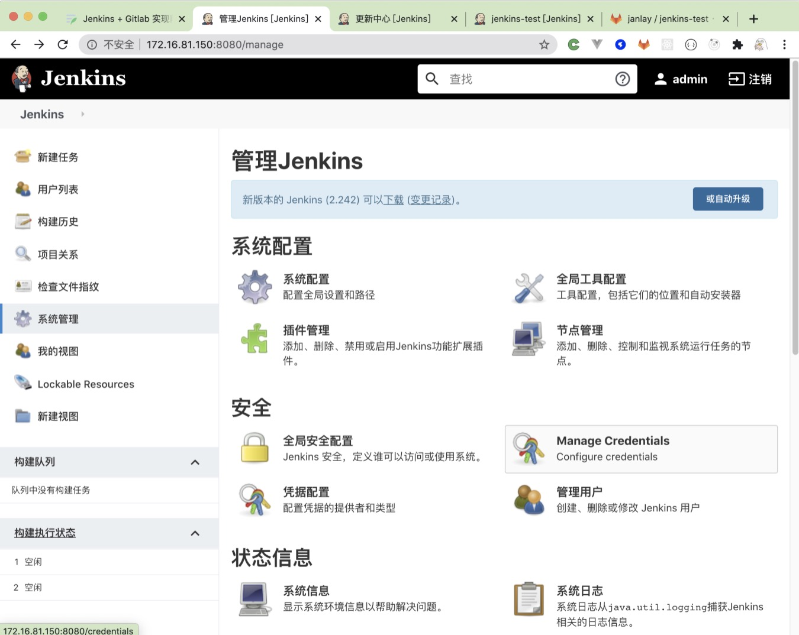<br />点击下方 “全局”，点击左边的 “添加凭据”<br />
<br />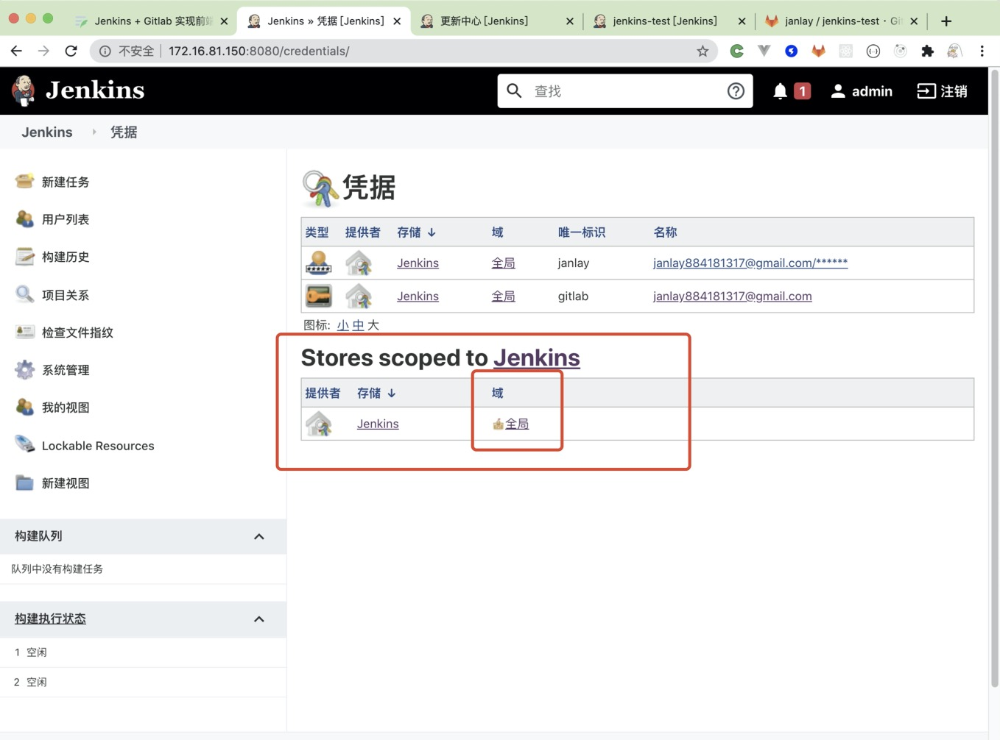<br />接着选择类型为 “SSH Username with private key.”<br />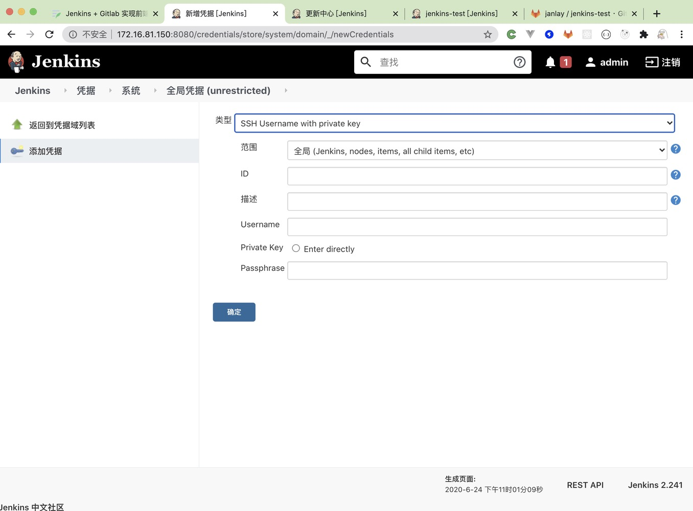<br />在这里，ID为此凭据在Jenkins的标示，UserName 为你的Gitlab用户名，PrivateKey 为你的服务器私钥。<br />
<br />选择PrivateKey，点击下方的“add”，将服务器的私钥内容复制进去（记得上下方的提示英文也复制）。
```bash
cat ~/.ssh/id_rsa
```
然后点击确定，保存退出。<br />

<a name="3Wrk8"></a>
### Gitlab 端配置公钥

<br />打开Gitlab页面，点击右上角头像 => 设置，找到左边的 “SSH密钥”。将 `~/.ssh/id_rsa.pub` 文件内容复制进去。点击添加密钥，保存成功
```bash
cat ~/.ssh/id_rsa.pub
```

<br />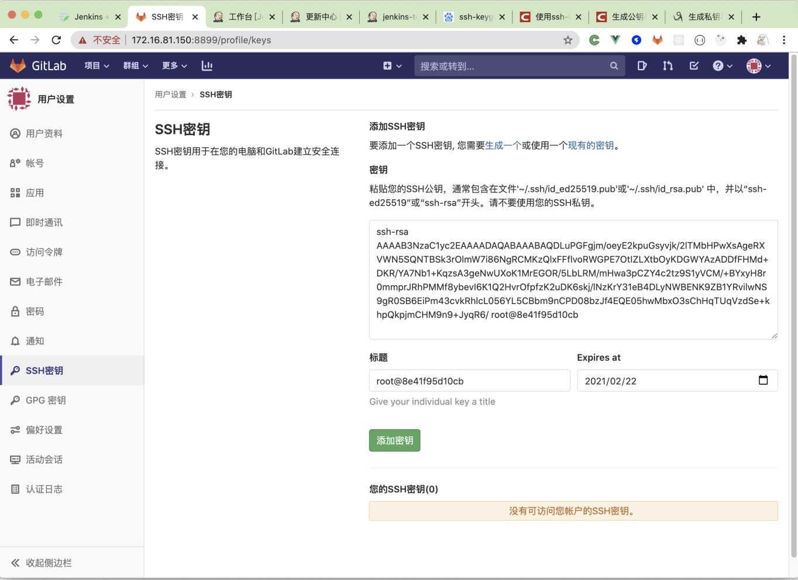<br />

<a name="OCyDk"></a>
### 配置任务

<br />在上面，我们在分别配置了公钥和私钥用来做SSH免密登录。接下来我们的代码拉取，也用SSH的方式拉取。<br />
<br />我们新建一个任务，选择 “自由风格的软件项目”。创建完成后，找到“源码管理“，点击”Git“。<br />
<br />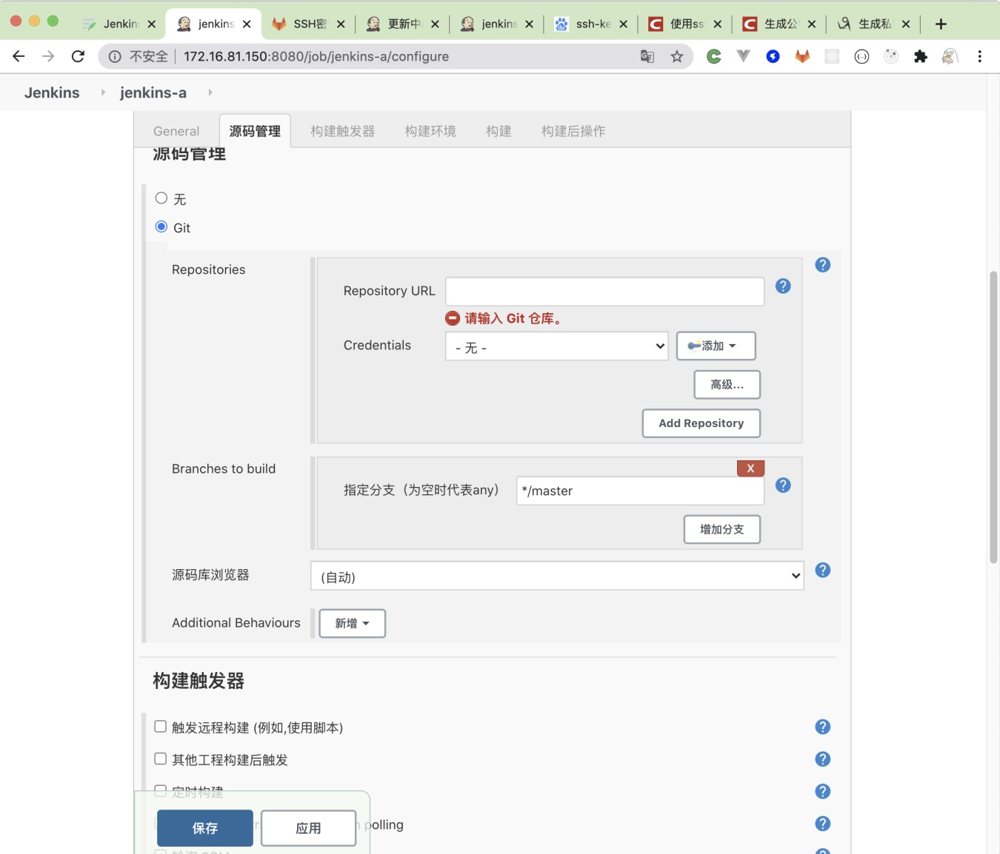<br />
<br />前往Gitlab仓库地址，找到 “克隆”，复制SSH克隆地址。<br />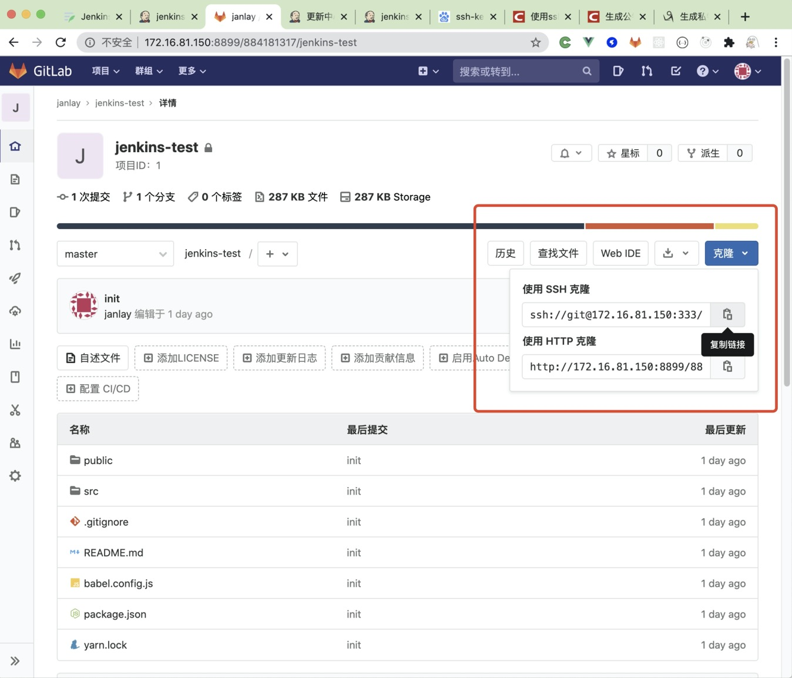<br />
<br />将地址复制进刚才Jenkins任务 “Repository URL” 内，“Credentials” 选择刚才添加的凭证。<br />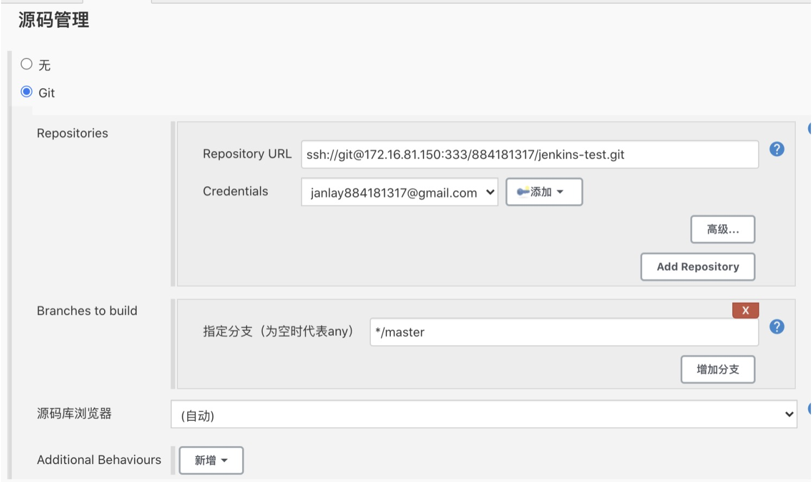<br />在下方找到 “构建”，选择 “执行Shell”。输入一段构建脚本来测试是否成功运行。<br />

> 不要忘记勾选：Provide Node & npm bin/ folder to PATH，否则没有Node环境

```bash
node -v
npm -v
npm install -g cnpm --registry=https://registry.npm.taobao.org
cnpm install
npm run build
```
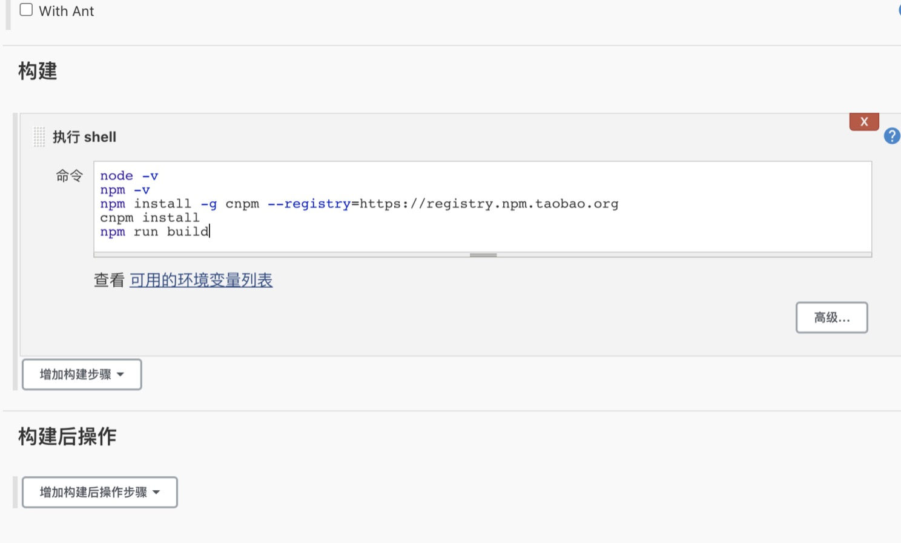<br />
<br />最后我们查看Jenkins构建日志，构建成功。<br />
<br />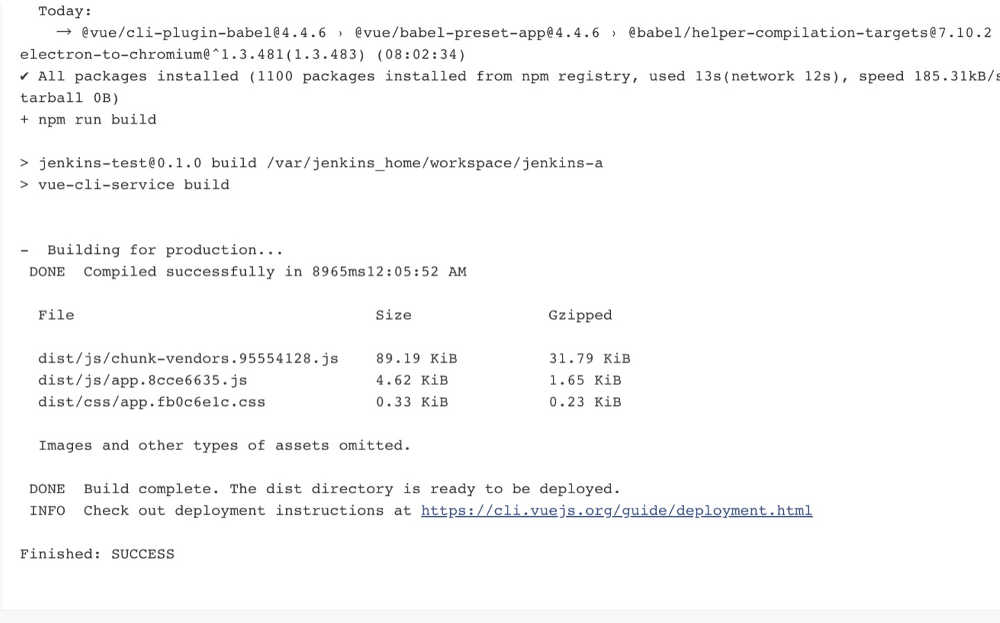<br />

<a name="KCdIc"></a>
## 部署


<a name="J2Gub"></a>
### 配置Nginx端公钥

<br />上面我们讲到，使用Jenkins做自动化构建，但缺少部署一环。<br />我们新创建一个服务器，只存放一个 Nginx 服务。在这里，nginx的安装方式不限，可以用docker也可以直接安装。<br />
<br />我们在Nginx服务器内，使用 `ssh-keygen -t rsa` 生成公钥和私钥。接着 在 `.ssh/` 文件夹下，创建一个 `authorized_keys` 文件。将我们Jenkins容器端的公钥拷贝进 `authorized_keys` 文件内。
```bash
ssh-keygen -t rsa
cd .ssh/
touch authorized_keys
vi authorized_keys
```
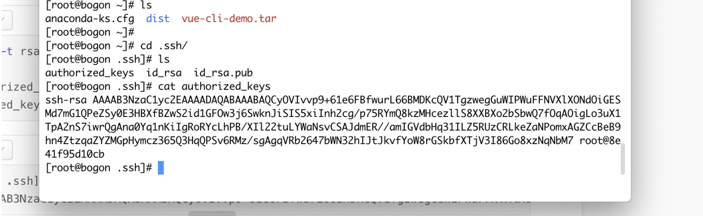<br />
<br />


### 初始化`scp`

进入到 `Jenkins` 服务器<br/>

```bash
docker exec -it jenkins /bin/bash
cd ~
touch test.txt
scp test.txt root@10.211.55.4:~
```
> 首次scp需要手动操作

**如果不想首次手动操作，需要降低安全级别跳过`ssh公钥`检查，需要为`ssh`或`scp`添加参数`-o StrictHostKeyChecking=no`**


<a name="3W1m3"></a>
### 修改 Jenkins 配置

<br />编辑我们的 `Jenkins` 任务，新增加几条 `shell` 命令。<br />
<br />在我们 `build` 结束后，先将dist文件打包为压缩包，然后通过 `linux scp` 命令上传至Nginx服务器。接着用 `ssh` 命令远程操控解压到 `Nginx` 目录即可。
```bash
# node -v
# npm -v
# npm install -g cnpm --registry=https://registry.npm.taobao.org
# cnpm install
# npm run build

# # 压缩
# tar -czvf vue-cli-demo.tar ./dist
# scp ./vue-cli-demo.tar root@172.16.81.151:~
# ssh root@172.16.81.151 "tar zxvf ~/vue-cli-demo.tar && mv dist/* /home/nginx/html"
```
> scp: 将本地文件/远程服务器内文件通过ssh上传/下载到指定地址

最终优化后的版本:
```bash
node -v
npm -v
npm install -g cnpm --registry=https://registry.npm.taobao.org
rm -rf node_modules/
rm -rf dist/
rm -rf vue-cli-demo.tar
cnpm install
npm run build

tar -czvf vue-cli-demo.tar ./dist
ssh root@10.211.55.4 "rm -rf ~/vue-cli-demo.tar && rm -rf /home/nginx/html/jenkins-test-vue"
scp ./vue-cli-demo.tar root@10.211.55.4:~
ssh root@10.211.55.4 "tar zxvf ~/vue-cli-demo.tar && mv ~/dist/ /home/nginx/html/jenkins-test-vue"
```
> 前提是修改了 vue 项目的 publicPath: '/jenkins-test-vue'
>访问浏览器 10.211.55.4/jenkins-test-vue


<br />打开新机器的页面，如果访问成功代表部署成功。<br />
<br />

