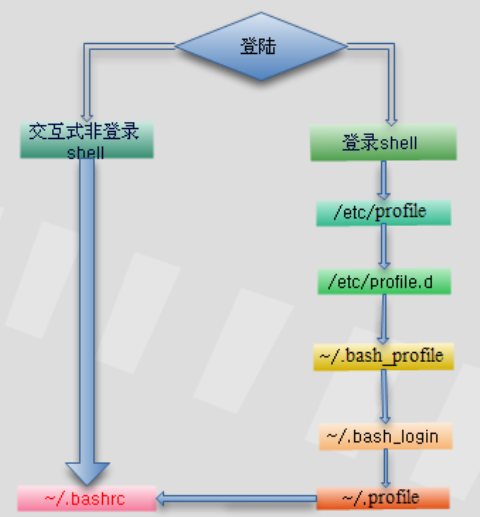

# node工具
* node官网: [https://nodejs.org/zh-cn/](https://nodejs.org/zh-cn/)
* node是后端运行javascript基础环境
* 与node直接相关的是npm，即`node`的`package manager`
```bash
node -v
```
>查看node版本

* **安装node之前，强力建议先安装nvm，详细介绍请看`nvm`**

## 1. npm
* node的包管理工具
```bash
npm -v
```
>查看npm版本
```bash
npm init -y
```
>初始化当前目录生成package<br>
>`-y`生成默认配置，不加`-y`需要选择package配置参数
```bash
npm list -g --depth=0
```
>查看所有已安装的包<br>
>`-g`指向全局，不加`-g`指向当前目录<br>
>`--depth=0`不显示整棵树，只显示第一层
```bash
npm install express --save -dev
```
>安装express<br>
>`--save`和`-dev`同时存在，添加到`package.json`的`devDependencies`中<br>
>`--save`单独存在，添加到`package.json`的`dependencies`中<br>
>`-S`等价于`--save`，`-S -D`等价于`--save -dev`
```bash
npm uninstall express
```
>卸载express
```bash
npm show express
```
>显示express详情
```bash
npm update express
```
>升级express
```bash
npm update
```
>升级所有模块

## 2. nvm
* node版本管理工具，可以管理多个node版本 `node version management`
* nvm官方地址: [https://github.com/nvm-sh/nvm](https://github.com/nvm-sh/nvm)
* nvm安装，mac及linux，可根据官方说明安装，windows可参考其他网上方法
### 2.1 mac安装举例
* 以下两种命令，任意选择一个，可获取到资源即可
```bash
curl -o- https://raw.githubusercontent.com/nvm-sh/nvm/v0.35.3/install.sh | bash
```
```bash
wget -qO- https://raw.githubusercontent.com/nvm-sh/nvm/v0.35.3/install.sh | bash
```
>注意，该版本号为举例，请根据具体官方提供版本号进行安装
* `/etc/`目录下为全局文件，`~/`目录下为user文件，全局文件优先级更高
* 查看和修改配置，建议到`user`下完成
* `~/.bashrc`,`~/.profile`,`~/.zshrc`优先级如下图，其中`.zshrc`关联窗口

* 查看`.zshrc`配置，修改`.bash_profile`
```bash
ls -a ~/
```
>查看`user`目录里包含上述哪些文件
```bash
cat ~/.zshrc
```
>source /Users/$USER/.bash_profile<br>
>说明真正的配置在`.bash_profile`中
* 将下边命令加入到`.bash_profile`中
```
export NVM_DIR="$HOME/.nvm"
[ -s "$NVM_DIR/nvm.sh" ] && \. "$NVM_DIR/nvm.sh" # This loads nvm
```
```bash
source ~/.bash_profile
```
* 如果未生效，重新开启命令窗口
### 2.2 常用命令
```bash
nvm --version
```
>查看nvm版本
```bash
nvm ls
```
>列出所有已经安装的node版本
```bash
nvm current
```
>当前node版本
```bash
nvm use v12.13.0
```
>切换node的版本
```bash
nvm alias default v12.13.0
```
>指定默认node版本
```bash
nvm ls-remote
```
>列出所有可以安装的node版本号
```bash
nvm install v12.13.0
```
>安装指定版本号的node
```bash
nvm uninstall v12.13.0
```
>卸载指定版本号的node

## 3. nrm
* npm的镜像源管理工具
### 3.1 安装
```bash
npm i -g nrm
```
>全局安装
### 3.2 常用命令
```bash
nrm ls
```
>查看所有npm源(`*`指向当前使用源)
```bash
nrm use taobao
```
>切换npm源
```bash
nrm add example https://example.com.cn/
```
>添加自定义npm源
```bash
nrm del example
```
>删除npm源

## 4. nodemon
* 守护进程执行node脚本
### 4.1 安装
```bash
npm install -g  nodemon
```
### 4.2 运行
```bash
nodemon server.js
```
>守护进程启动`server.js`

## 5. pm2
* node进程管理工具，相比于nodemon，具备自动重启、负载均衡等功能。
### 5.1 安装
```bash
npm install -g pm2
```
### 5.2 常用命令
```bash
pm2 start app.js --watch -i 2
```
>`start`启动app.js<br>
>`--watch`监听变化，一旦变化，自动重启<br>
>`-i 2`启动`2`个实例
```bash
pm2 restart app.js
```
>重启
```bash
pm2 stop app_name|app_id
```
>停止【可以先通过pm2 list获取应用的名字（--name指定的）或者进程id】
```bash
pm2 stop all
```
>停止所有应用
```bash
pm2 delete app_name|app_id
```
>删除
```bash
pm2 stop all
```
>关闭并删除所有应用
```bash
pm2 list
```
>查看进程状态

### 5.3 启动参数
* --watch：监听应用目录的变化，一旦发生变化，自动重启。如果要精确监听、不见听的目录，最好通过配置文件。
* -i --instances：启用多少个实例，可用于负载均衡。如果-i 0或者-i max，则根据当前机器核数确定实例数目。
* --ignore-watch：排除监听的目录/文件，可以是特定的文件名，也可以是正则。比如--ignore-watch="test node_modules "some scripts""
* -n --name：应用的名称。查看应用信息的时候可以用到。
* -o --output &#60;path&#62;：标准输出日志文件的路径。
* -e --error &#60;path&#62;：错误输出日志文件的路径。
* --interpreter &#60;interpreter&#62;：the interpreter pm2 should use for executing app (bash, python...)。比如你用的coffee script来编写应用。

## 6. yarn
* yarn可以进行异步node依赖包的安装，并且不局限于node的依赖包管理。
* 官网: [https://yarn.bootcss.com/](https://yarn.bootcss.com/)
### 6.1 安装
* **强力推荐，安装到node全局模块下**<br>
这样做的好处是，便于维护和升级，不推荐官网提供的`brew安装`<br>
***当然，如果高级使用，不局限于node，请自行调研安装方式。***
```bash
npm install -g yarn
```
### 6.2 常用命令
```bash
yarn --version
```
>查看版本号
```bash
yarn init
```
>初始化项目
```bash
yarn global list
```
>查看yarn安装的依赖包<br>
>`global`是全局参数，不能用`-g`替代
```bash
yarn add [package]
yarn add [package]@[version]
yarn add [package]@[tag]
```
>添加依赖包，相当于`npm install --save`
```bash
yarn add [package] --dev
yarn add [package] --peer
yarn add [package] --optional
```
>不加参数添加到`dependencies`<br>
>`--dev`添加到`devDependencies`<br>
>`--peer`添加到`peerDependencies`<br>
>`--optional`添加到`optionalDependencies`
```bash
yarn upgrade [package]
yarn upgrade [package]@[version]
yarn upgrade [package]@[tag]
```
>升级依赖包
```bash
yarn remove [package]
```
>移除依赖包
```bash
yarn
```
>相当于`yarn install`，安装项目全局依赖
```bash
which yarn
```
>查看`yarn`软链接位置，然后用`ls -al`查看实际位置

## 7. gnvm-windows
对于windows系统的版本管理，有`nvm-windows`和`gnvm`等<br/>
**建议使用`gnvm`，简单绿色方便**<br/>
而`nvm-windows`亲测，有的电脑环境配置后，无法识别`node`命令.

### 环境安装
**过程: &nbsp; 安装node => node环境变量 => 下载gnvm => 移动gnvm.exe => 安装其他版本**<br/>

#### 1. 安装`node.js`<br/>
1.1. 下载地址 [https://nodejs.org/en/download/](https://nodejs.org/en/download/)<br/>
1.2. msi文件安装或者zip包解压<br/>
1.3. 安装至`D:\nodejs\`<br/>
1.4. 在`D:\nodejs\`下，创建文件夹`node_global`和`node_cache`<br/>
1.5. 在`D:\nodejs\`目录窗口地址栏，输入`CMD`<br/>
```bash
npm config set prefix "D:\nodejs\node_global"
npm config set cache "D:\nodejs\node_cache"
```
1.6. 设置环境变量：我的电脑->右键->属性->高级系统设置->高级->环境变量
* 设置用户变量`PATH`添加`D:\nodejs\node_global`
* 设置系统变量`NODE_PATH``D:\nodejs\node_global\node_modules`
* 设置系统变量`PATH`添加`D:\nodejs`

#### 2. 安装gnvm
2.1. 下载 [http://ksria.com/gnvm/?lang=zh-cn#download](http://ksria.com/gnvm/?lang=zh-cn#download)<br/>
2.2. 把`gnvm.exe`放到`D:\nodejs\`目录下

#### 3. 安装其他版本`node`
3.1. 更换更快的库 registry
>`gnvm.exe` 内建了 `DEFAULT` and `TAOBAO` 两个库。
```bash
gnvm config registry TAOBAO
```
3.2. 在`D:\nodejs\`目录窗口地址栏，输入`CMD`<br/>
3.3. 执行`gnvm install 8.2.1`安装`node v8.2.1`

#### 4. 观察目录变化
观察`D:\nodejs\`目录
>如果第一步安装的是`node v12.8.0`，刚开始目录中没有`v12.8.0`文件夹<br/>
>安装完`node v8.2.1`之后，目录中出现两个文件夹`v8.2.1`和`v12.8.0`

### 常用命令
* 安装命令
```bash
gnvm install 8.2.1
```
* 切换`node`版本
```bash
gnvm use 12.8.0
```
* 查看`node`版本
```bash
node -v
```
* 列出本地已存在的全部 Node.js 版本
```bash
gnvm ls
```
* 更多参考
[http://ksria.com/gnvm/?lang=zh-cn](http://ksria.com/gnvm/?lang=zh-cn)
