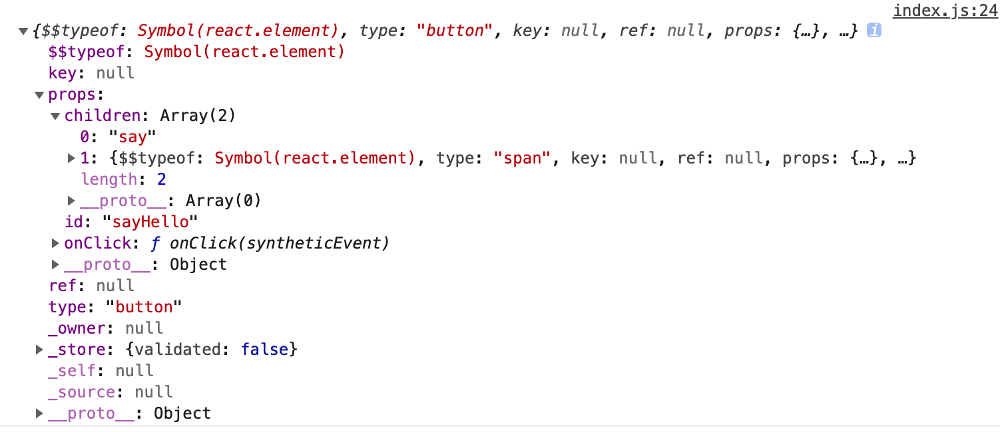
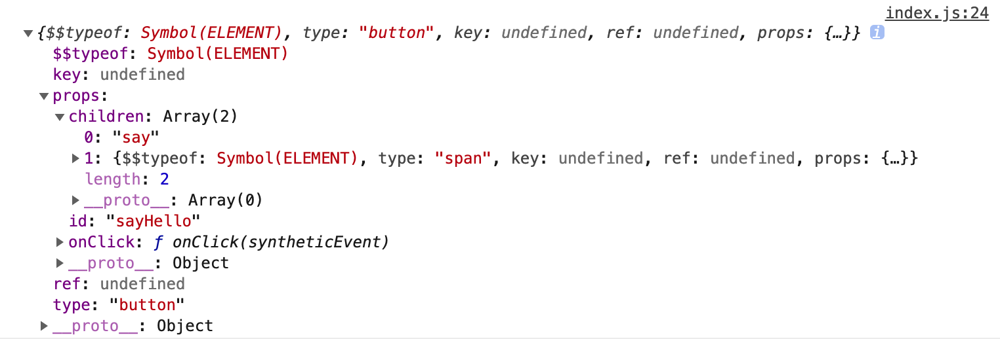
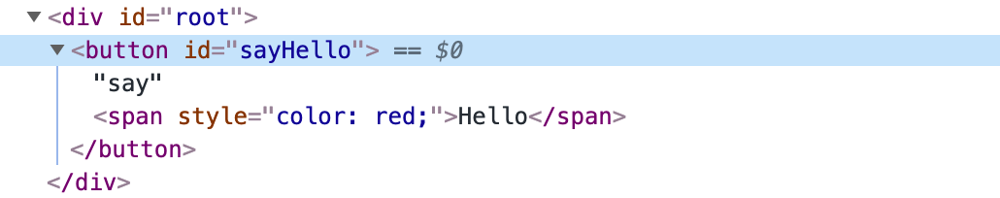
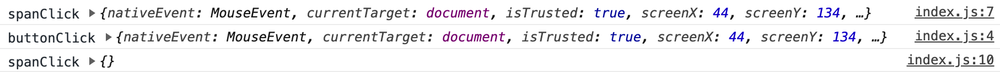
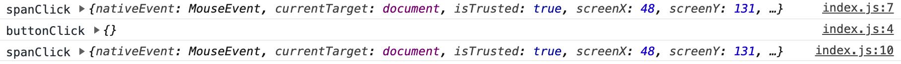
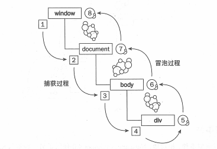
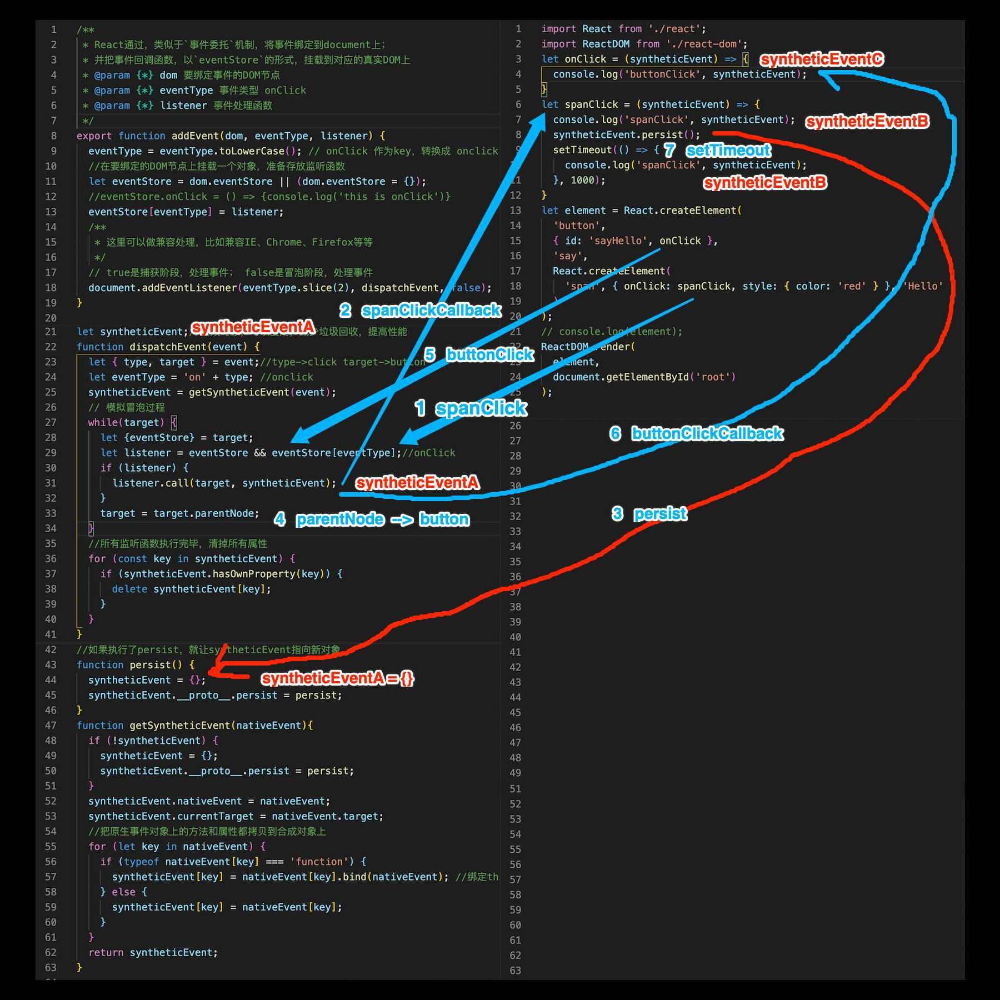

# 渲染原生组件

* 该文介绍前提，已经通过`create-react-app`初始化项目。
* 由于`React`本身也是不断演化出来的产品，因此该文的源码跟官方并不完全一致。
* 意义在于核心思想跟`react`大体一致，以便于理解分析`React`源码。

## 1. React.createElement
### 1.1. src/index.js
```js
import React from './react';
let element = React.createElement('button',
  { id: 'sayHello' },
  'say', React.createElement('span', { style: { color: 'red' } }, 'Hello')
);
console.log(element);
```
### 1.2. src/react/index.js
```js
import { ELEMENT } from './constants';
import { ReactElement } from './vdom';

function createElement(type, config = {}, children) {
  delete config.__source;//dev环境下变量，不考虑该变量
  delete config.__self;//dev环境下变量，不考虑该变量
  let { key, ref, ...props } = config;
  let $$typeof = null;
  if (typeof type === 'string') {//span div button
    $$typeof = ELEMENT;//是一个原生的DOM类型
    /**
     * 这里要注意，用真实React在测试时，你会发现：
     * let e1 = React.createElement('abc');
     * console.log(e1); // $$typeof 仍然是 react.element类型，type: 'abc'
     */
  } else {
    console.error('Warning: React.createElement: type is invalid -- expected a string (for built-in components) or a class/function (for composite components) but got: number.');
  }
  const childrenLength = arguments.length - 2;
  if (childrenLength === 1) {//children是一个对象或字符串
    props.children = children;
  } else if (childrenLength > 1) {//children是一个数组
    const childArray = Array(childrenLength);
    for (let i = 0; i < childrenLength; i++) {
      childArray[i] = arguments[i + 2];
    }
    props.children = childArray;
  }
  return ReactElement($$typeof, type, key, ref, props);
}
const React = {
  createElement
}
export default React;
```
### 1.3. src/react/constants.js
```js
export const TEXT = Symbol.for('TEXT');// 文本类型
export const ELEMENT = Symbol.for('ELEMENT');//React元素类型 button div span 等等
```
### 1.4. src/react/vdom.js
```js
export function ReactElement($$typeof, type, key, ref, props) {
  let element = {
    $$typeof, type, key, ref, props
  };
  return element;
}
```
### 1.5 测试效果
* 官方结构如下图:

* 改写结构如下图:

* **当阅读到dom-diff，设计的结构跟官方会不一样，为了方便dom比对**

## 2. ReactDom.render
### 2.1. src/index.js
```js {2,7-11}
import React from './react';
import ReactDOM from './react-dom';
let element = React.createElement('button',
  { id: 'sayHello' },
  'say', React.createElement('span', { style: { color: 'red' } }, 'Hello')
);
//console.log(element);
ReactDOM.render(
  element,
  document.getElementById('root')
);
```
### 2.2. src/react/vdom.js
```js {1-43}
import { ELEMENT } from './constants';
import { setProps } from './utils';

export function createDOM(element) {
  let dom = null;
  if (element == null) { // null or undefined
    return dom; // appendChild时，如果为null，则不挂载到parent上
  } else if (typeof element === 'object') { // 如果是对象类型
    let { $$typeof } = element;
    if (!$$typeof) { // 字符串或者数字
      dom = document.createTextNode(element);
    } else if ($$typeof == ELEMENT) { // 原生DOM节点
      dom = createNativeDOM(element);
    }
  } else { // 如果非对象类型，数字，字符串
    dom = document.createTextNode(element);
  }
  return dom;
}
/**
let element = React.createElement('button',
  { id: 'sayHello', onClick },
  'say', React.createElement('span', { onClick: spanClick, style: { color: 'red' } }, 'Hello')
);
 */
function createNativeDOM(element) {
  let {type, props} = element; // div button span
  let dom = document.createElement(type); //真实DOM对象
  //1，创建虚拟dom的子节点
  createNativeDOMChildren(dom, element.props.children);
  //2，给DOM元素添加属性
  setProps(dom, props);
  return dom;
}
function createNativeDOMChildren(parentNode, ...children) {
  let childrenNodeArr = children && children.reduce((prev,curr) => prev.concat(curr),[]);
  if (childrenNodeArr) {
    for (let i = 0; i < childrenNodeArr.length; i++) {
      let childDOM = createDOM(childrenNodeArr[i]);
      childDOM && parentNode.appendChild(childDOM);
    }
  }
}

export function ReactElement($$typeof, type, key, ref, props) {
  let element = {
    $$typeof, type, key, ref, props
  };
  return element;
}
```
### 2.3. src/react/utils
```js
export function setProps(dom, props) {
  for (let key in props) {
    if (key != 'children') {
      let value = props[key];
      setProp(dom, key, value);
    }
  }
}
function setProp(dom, key, value) {
  if (/^on/.test(key)) {
    // TODO 绑定事件
  } else if (key === 'style') {
    for (const styleName in value) {
      dom.style[styleName] = value[styleName];
    }
  } else {
    dom.setAttribute(key, value);
  }
}
```
### 2.4. 测试效果
* 页面渲染效果如下图:


## 3. event事件
### 3.1. src/index.js
```js {3-16}
import React from './react';
import ReactDOM from './react-dom';
let onClick = (syntheticEvent) => {
  console.log('buttonClick', syntheticEvent);
}
let spanClick = (syntheticEvent) => {
  console.log('spanClick', syntheticEvent);
  // syntheticEvent.persist();
  setTimeout(() => {
    console.log('spanClick', syntheticEvent);
  }, 1000);
}
let element = React.createElement('button',
  { id: 'sayHello', onClick },
  'say', React.createElement('span', { onClick: spanClick, style: { color: 'red' } }, 'Hello')
);
// console.log(element);
ReactDOM.render(
  element,
  document.getElementById('root')
);
```
### 3.2. src/react/util.js
```js {1,13}
import { addEvent } from './event';

export function setProps(dom, props) {
  for (let key in props) {
    if (key != 'children') {
      let value = props[key];
      setProp(dom, key, value);
    }
  }
}
function setProp(dom, key, value) {
  if (/^on/.test(key)) {
    addEvent(dom, key, value);
  } else if (key === 'style') {
    for (const styleName in value) {
      dom.style[styleName] = value[styleName];
    }
  } else {
    dom.setAttribute(key, value);
  }
}
```
### 3.3. src/react/event.js
```js
/**
 * React通过，类似于`事件委托`机制，将事件绑定到document上；
 * 并把事件回调函数，以`eventStore`的形式，挂载到对应的真实DOM上
 * @param {*} dom 要绑定事件的DOM节点
 * @param {*} eventType 事件类型 onClick
 * @param {*} listener 事件处理函数
 */
export function addEvent(dom, eventType, listener) {
  eventType = eventType.toLowerCase(); // onClick 作为key，转换成 onclick
  //在要绑定的DOM节点上挂载一个对象，准备存放监听函数
  let eventStore = dom.eventStore || (dom.eventStore = {});
  //eventStore.onClick = () => {console.log('this is onClick')}
  eventStore[eventType] = listener;
  /**
   * 这里可以做兼容处理，比如兼容IE、Chrome、Firefox等等
   */
  // true是捕获阶段，处理事件； false是冒泡阶段，处理事件
  document.addEventListener(eventType.slice(2), dispatchEvent, false);
}

let syntheticEvent;//合成对象，可以复用，减少垃圾回收，提高性能
function dispatchEvent(event) {
  let { type, target } = event;//type->click target->button
  let eventType = 'on' + type; //onclick
  syntheticEvent = getSyntheticEvent(event);
  // 模拟冒泡过程
  while(target) {
    let {eventStore} = target;
    let listener = eventStore && eventStore[eventType];//onClick
    if (listener) {
      listener.call(target, syntheticEvent);
    }
    target = target.parentNode;
  }
  //所有监听函数执行完毕，清掉所有属性
  for (const key in syntheticEvent) {
    if (syntheticEvent.hasOwnProperty(key)) {
      delete syntheticEvent[key];
    }
  }
}
//如果执行了persist，就让syntheticEvent指向新对象
function persist() {
  syntheticEvent = {};
  syntheticEvent.__proto__.persist = persist;
}
function getSyntheticEvent(nativeEvent){
  if (!syntheticEvent) {
    syntheticEvent = {};
    syntheticEvent.__proto__.persist = persist;
  }
  syntheticEvent.nativeEvent = nativeEvent;
  syntheticEvent.currentTarget = nativeEvent.target;
  //把原生事件对象上的方法和属性都拷贝到合成对象上
  for (let key in nativeEvent) {
    if (typeof nativeEvent[key] === 'function') {
      syntheticEvent[key] = nativeEvent[key].bind(nativeEvent); //绑定this
    } else {
      syntheticEvent[key] = nativeEvent[key];
    }
  }
  return syntheticEvent;
}
```
### 3.4. 测试效果
3.4.1. 不调用`persist()`，控制台效果如下图:

3.4.2. 调用`persist()`，控制台效果如下图:
修改`src/index.js`的第8行，将注释放开
```js
syntheticEvent.persist();
```
控制台效果如下图:

### 3.5. 浏览器的`捕获`和`冒泡`
* 首先要理解`捕获`和`冒泡`的浏览器事件，如下图:

* 用`MouseEvent`点击事件举例说明:<br>
1，目标元素是`div`，先走捕获，再走冒泡<br>
2，捕获事件依次从（1）走到（4）<br>
3，冒泡事件已从（5）走到（8）<br>
>*阻止捕获和冒泡事件`event.stopPropagation();`*
### 3.6. React模拟冒泡事件
* 在`src/react/event.js`第18行
```js
document.addEventListener(eventType.slice(2), dispatchEvent, false);
```
将事件挂载到`document`上
* 在`src/react/event.js`第27至34行
```js
while(target) {
  let {eventStore} = target;
  let listener = eventStore && eventStore[eventType];//onClick
  if (listener) {
    listener.call(target, syntheticEvent);
  }
  target = target.parentNode;
}
```
当一个元素事件调用完毕，继续冒泡到`parentNode`，如果有事件继续执行。
### 3.7. 程序调用过程分解
* `React`模拟冒泡，执行流程如下图:

* 过程分解:
* 一，执行addEvent方法<br>
在执行`addEvent`方法时，将事件绑定到`document`上，并在每个DOM上添加`eventStore`.<br>
并将`src/index.js`中的以`on`开始的属性`key`和`value`，比如`onClick`，赋值给`eventStore`的`onclick`属性.<br>
这样，每个DOM都有`eventStore`，如果`eventStore`具有`onclick`属性，当触发时，就可以执行事件回调.<br>
* 二，执行浏览器行为<br>
由于`document`绑定监听函数第3个参数为`false`，因此浏览器会监听冒泡事件.<br>
浏览器执行冒泡事件，会找到最底层元素`span`，`span`的父类理论上来讲，如果它本来就绑定了事件，那该事件也会执行，比如`jquery`给`button`绑定了事件.<br>
但是`react`声明的事件并不是原生事件，因此需要代码中触发，那么`while`循环中使用`target = target.parentNode;`向上查找，并触发`listener`回调，就模拟出了浏览器的冒泡行为.
* 三，触发阶段过程分解（图例中的过程）<br>
1, spanClick 事件首先触发<br>
2, spanClick 回调，将 `syntheticEventA` 变量赋值给 `syntheticEventB` 变量<br>
3, 调用 persist 持久化方法，调用后 `syntheticEventA` 指向了新的 {} 空对象<br>
4, 程序继续向下执行，找到父类 button<br>
5, 触发 button 的 onClick 事件<br>
6, button 的 onClick 回调，将 `syntheticEventA` 变量赋值给 `syntheticEventC` 变量，<br>
注意此时的 `syntheticEventA` 已经是 {} 空对象<br>
7, setTimeout 执行，此时 `syntheticEventB` 来自 spanClick 回调，并不是空对象.
### 3.8. 改进思路
* 仔细观察 `3.4.2` 的结果，会发现很奇怪吗？我们并不希望 buttonClick 回调 `syntheticEvent` 变成空对象.
* 改进思路: 改造`src/react/event.js`中的全局`syntheticEvent`，变成一个 Array 或 Map，利用池的思路去实现.
