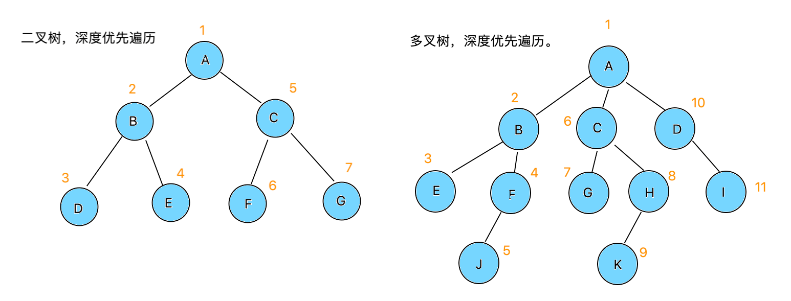

# dom-diff

## 1. 整体策略
### 1.1. 递归算法
* 深度优先遍历:<br>
>先序 —> 父节点,左子树,右子树<br>
>中序 —> 左子树,父节点,右子树<br>
>后序 -> 左子树,右子树,父节点
* 多叉树递归，深度优先遍历
```js
let tree = {
  node: 'A',children: [
    {node: 'B',children:[
      {node: 'E'},
      {node: 'F',children:[
        {node: 'J'}
      ]}
    ]},
    {node: 'C',children:[
      {node: 'G'},
      {node: 'H',children:[
        {node: 'K'}
      ]}
    ]},
    {node: 'D',children:[
      {node: 'I'}
    ]}
  ]
}
function search(tree){
  if (tree) {
    console.log(tree.node);
    const children = tree.children;
    if (children) {
      children.forEach(child => {
        search(child);
      });
    }
  }
}
search(tree);
//A B E F J C G H K D I
```
* 二叉树与多叉树:

图中的 1,2,3,...,10,11 代表了递归检索的顺序，并使用了`先序`遍历
>当分析到`源码`的递归思路时，可能会感到困惑，到底是`二叉树`，还是`多叉树`.<br>
>结论是`多叉树`，虽然比较函数传递了`老节点`和`新节点`，但是分别对`老节点`和`新节点`进行了递归.<br>
>并且把**每一层**`老节点`和`新节点`**同时递归**，确保他们递归到的是**同一层**.
* 老节点 <==> 新节点<br>
图中`O...`(old)代表老节点，`N...`(new)代表新节点<br>
图中假设了`OA`和`NA`类型相同，`OC`和`NC`类型相同

----
*** **结论：**
* dom-diff是`多叉树深度遍历`，但不是简单的单颗树遍历.
* dom-diff深度遍历规则是，如果类型相同，老节点遍历到`第n层`，新节点也一定同时遍历到`第n层`.
* dom-diff采用的深度优先遍历，属于先序遍历.
----
### 1.2. 比对算法
**老元素的dom属性是挂载在html上的，因此真正执行 不动、插入、删除 的操作实际是针对老元素数组.**<br>
**新元素是最新状态，排序顺序由新元素决定，迭代新元素数组时，当某一新元素和某一老元素相等时，对于老元素前边未比对到的，只存在2种情况，1继续迭代新元素数组，能找到相同的则标记为移动，2迭代完毕新元素数组，没找到相同的则标记为删除.**<br>
*（王麻子在山寨里排行老八，由于给山寨做了贡献，提升为二当家，老五在战斗中去世了。开饭时，大当家还坐第一把椅子，王麻子还坐以前的椅子，而原来的老二到老七，默默地将椅子搬到王麻子的后边，老五的椅子被拿走了）*
****
* **一，新老map赋值**

1. 上方是老数组，下方是新数组，字母代表key值.<br>
2. 递归老数组，利用`key`和`element`映射成`map` (element上的dom属性指向真实DOM).<br>
3. 递归新数组，找到相同`key`和`type`相同的`element`，赋值给新数组对应对象，最终返回新`map`.
* **二，标记元素：不动、插入、删除**
* 迭代新数组，并根据上一步的赋值，可判断相等的节点
* 老元素默认_mountIndex === 老元素索引
* 公式: `lastIndex = max(老元素_mountIndex，lastIndex)`
* 公式: `新元素_mountIndex` = 新索引
* 图中蓝色手写数字，表示步骤

1. 新A === 老A，不小于lastIndex不动.
2. 新E === 老E，不小于lastIndex不动，lastIndex = 4，老元素_mountIndex = 1.
3. 插入新G，插入位置为2.
4. 新C === 老C，老元素_mountIndex 2&lt;lastIndex 4，从2移动到3，老元素_mountIndex = 3.
5. 插入新H，插入位置为4.
6. 插入新I，插入位置为5.
7. 新D === 老D，老元素_mountIndex 3&lt;lastIndex 4，从3移动到6，老元素_mountIndex = 6.
8. 插入新J，插入位置为7.
9. 新数组中不存在，删除老元素索引1.
10. 新数组中不存在，删除老元素索引5.
* **三，标记完毕后的队列**

根据标记后的队列，进行实际的dom操作
>insert => 插入、move => 移动、remove => 删除<br>
>toIndex => 插入或移动 目标索引<br>
>fromIndex => 移动或删除 哪个索引的元素
### 1.3. 移动和剔除
* `dom-diff`利用`diffQueue`进行整体移动和剔除，将`parentNode、操作方式(移动/剔除)、索引、dom`等信息，作为对象放入`diffQueue`.
* 每次`diff`递归到一层，全局变量`updateDepth++`，由于深度优先遍历，只要还有叶子层，就会继续递归，`updateDepth`会继续`++`，当没有叶子层时就会执行这一层`diff`，每执行完一层，`updateDepth--`，返回父类一层。<br>
当执行到最末端叶子层，此时`updateDepth`最大，当所有层执行完毕，`updateDepth`还原为0，此时循环触发`diffQueue`中的操作
* 由于`深度优先`，最末端的叶子操作，在`diffQueue`中的位置，总是比叶子所属的父节点靠前，这样保证了总是先执行叶子层操作，再执行该叶子层对应的父节点层操作，就不会出现“`先删除了父节点，叶子节点操作时报错`”

## 2. 递归更新属性
* **在解读源代码实现时，对照`1.整体策略`的分析便于理解**
### 2.1. src/index.js
```js
import React from './react';
import ReactDOM from './react-dom';
class Counter extends React.Component {
  constructor(props) {
    super(props);
    this.state = { number: 0 };
  }
  handleClick = () => {
    this.setState((state) => ({ number: state.number + 1 }));
  }
  render() {
    return (
      <div id={'counter' + this.state.number}>
        <p>{this.state.number}</p>
        <button onClick={this.handleClick}>+</button>
      </div>
    )
  }
}
ReactDOM.render(
  <Counter />,
  document.getElementById('root')
);
```
### 2.2. src/react/vdom.js
```js {25-27,34-38,45-85,109,147,168,190}
import { TEXT, ELEMENT, CLASS_COMPONENT, FUNCTION_COMPONENT } from './constants';
import { setProps, onlyOne, flatten, patchProps } from './utils';

export function compareTwoElements(oldRenderElement, newRenderElement) {
  oldRenderElement = onlyOne(oldRenderElement);
  newRenderElement = onlyOne(newRenderElement);
  let currentDOM = oldRenderElement.dom;//取出老的DOM节点（此处，element.dom = dom;已经做过预埋设计）
  let currentElement = oldRenderElement;
  if (newRenderElement == null) {
    currentDOM.parentNode.removeChild(currentDOM);//新的虚拟DOM为null，删掉老节点
    currentDOM = null;
  } else if (oldRenderElement.type != newRenderElement.type) { // span div function class
    let newDOM = createDOM(newRenderElement);//类型不同，新节点替换老节点
    currentDOM.parentNode.replaceChild(newDOM, currentDOM);
    currentElement = newRenderElement;
  } else {
    //新老节点都存在，类型一样。进行 dom-diff 深度比较，比较他们的属性和子节点，并尽可能复用老节点
    updateElement(oldRenderElement, newRenderElement);
  }
  return currentElement;
}
// *** 如果是`函数组件`或`类组件`,`oldElement`就是`oldRenderElement`
// renderElement 是函数组件执行后 或 类组件调用render后返回的虚拟DOM，虚拟DOM是由React.createElement创建的
function updateElement(oldElement, newElement) {
  /**
   * !!!给 src/react/index.js 做比对，如果是字符串或者数字，仍需要获取dom，并根据dom内容更新
   */
  let currentDOM = newElement.dom = oldElement.dom;
  if (oldElement.$$typeof === TEXT && newElement.$$typeof === TEXT) {
    if (oldElement.content !== newElement.content) {
      currentDOM.textContent = newElement.content;
    }
  } else if (oldElement.$$typeof === ELEMENT) {// div span p
    //先更新父节点的属性，再比较更新子节点（返回来也可以）
    updateDOMProperties(currentDOM, oldElement.props, newElement.props);
    updateChildrenElements(currentDOM, oldElement.props.children, newElement.props.children);
    //把newElement.props赋给oldElement.props，不仅要更新dom上的attribute，还是要同步props
    oldElement.props = newElement.props;
  } else if (oldElement.$$typeof === FUNCTION_COMPONENT) {// 函数组件
    updateFunctionComponent(oldElement, newElement);
  } else if (oldElement.$$typeof === CLASS_COMPONENT) {// 类组件
    updateClassComponent(oldElement, newElement);
  }
}
function updateChildrenElements(dom, oldChildrenElements, newChildrenElements) {
  diff(dom, oldChildrenElements, newChildrenElements);
}
function diff(parentNode, oldChildrenElements, newChildrenElements) {
  let oldChildrenElementsMap = getChildrenElementsMap(oldChildrenElements);
  let newChildrenElementsMap = getNewChildrenElementsMap(oldChildrenElementsMap, newChildrenElements);
}
function getNewChildrenElementsMap(oldChildrenElementsMap, newChildrenElements) {
  let map = {};
  for (let i = 0; i < newChildrenElements.length; i++) {
    const newChildElement = newChildrenElements[i];
    if (newChildElement) {
      let newKey = newChildElement.key || (i + '');
      let oldChildElement = oldChildrenElementsMap[newKey];
      // key一样，类型一样
      if (canDeepCompare(oldChildElement, newChildElement)) {
        updateElement(oldChildElement, newChildElement);//更新属性后，递归更新子节点
        newChildrenElements[i] = oldChildElement;//复用老的虚拟DOM，老的虚拟DOM的dom属性，指向真实DOM
      }
      //新数组上的每个element都映射到map，其中包含了跟oldChildElement相等的元素
      map[newKey] = newChildrenElements[i];
    }
  }
  return map;
}
//是否可以深度递归比较
function canDeepCompare(oldChildElement, newChildElement) {
  if(!!oldChildElement && !!newChildElement){
    return oldChildElement.type === newChildElement.type;
  }
  return false;
}
// 获取老map
function getChildrenElementsMap(oldChildrenElements) {
  let map = {};
  for (let i = 0; i < oldChildrenElements.length; i++) {
    const oldKey = oldChildrenElements[i].key || (i + '');
    map[oldKey] = oldChildrenElements[i];
  }
  return map;
}
function updateDOMProperties(dom, oldProps, newProps) {
  patchProps(dom, oldProps, newProps);
}
//类组件element.componentInstance.renderElement.dom=真实DOM
function updateClassComponent(oldElement, newElement) {
  let componentInstance = oldElement.componentInstance;
  let updater = componentInstance.$updater;
  let nextProps = newElement.props;
  updater.emitUpdate(nextProps);
}
//函数组件element.renderElement.dom=真实DOM
function updateFunctionComponent(oldElement, newElement) {
  let oldRenderElement = oldElement.renderElement;
  let newRenderElement = newElement.type(newElement.props);
  let currentDOM = compareTwoElements(oldRenderElement, newRenderElement);
  newElement.renderElement = currentDOM;//更新之后，重新挂载
}

export function createDOM(element) {
  if (typeof element !== 'object') {
    throw Error(`Uncaught DOMException: Failed to execute 'createElement' on 'Document': The tag name provided ('${element}') is not a valid name.`)
  }
  /**
   * !!! element 如果是字符串或者数字，修改成在 createElement时，封装成对象
   */
  let dom;
  element = onlyOne(element); // 如果是数组，只取第一个
  let { $$typeof } = element;
  if (!$$typeof) { // 字符串或者数字
    dom = document.createTextNode(element);
  } else if ($$typeof == TEXT) {
    dom = document.createTextNode(element.content);
  } else if ($$typeof == ELEMENT) { // 原生DOM节点
    dom = createNativeDOM(element);
  } else if ($$typeof == FUNCTION_COMPONENT) { // 函数组件
    dom = createFunctionComponentDOM(element);
  } else if ($$typeof == CLASS_COMPONENT) { // 类组件
    dom = createClassComponentDOM(element);
  }
  /**
   * `element`是ReactElement创建出来的虚拟DOM，让虚拟的DOM的`dom`属性指向真实DOM
   * 这里是一个预埋设计，或者叫铺垫，通过虚拟DOM能够获取真实DOM
   */
  element.dom = dom;
  return dom;
}
// 创建函数组件真实的DOM对象
function createFunctionComponentDOM(element) {
  //element: $$typeof, type, key, ref, props
  let { type, props } = element;
  /**
   * function FunctionComponent(props) {
   *   return React.createElement('div', { id: 'counter' }, 'hello');
   * }
   */
  let renderElement = type(props);// type === FunctionComponent
  //element 是 React.createElement(FunctionComponent, config, children); 的返回值
  //element 是 FunctionComponent 的父级，当然这里不是DOM的父级，只是理解为父级
  element.renderElement = renderElement; // 这里也是一个预埋设计
  let dom = createDOM(renderElement);
  return dom;
  // `element.dom = dom;`，可以推导出: element.renderElement.dom=真实DOM
}
// 创建类组件真实的DOM对象
function createClassComponentDOM(element) {
  let { type, props } = element;
  /**
   * class ClassCounter extends React.Component {
   *   constructor(props) {
   *     super(props);
   *   }
   *   render() {
   *     return React.createElement('div', { id: 'counter' }, 'hello');
   *   }
   * }
   */
  let componentInstance = new type(props);
  element.componentInstance = componentInstance; // 这里也是一个预埋设计
  let renderElement = componentInstance.render();
  componentInstance.renderElement = renderElement; // 这里也是一个预埋设计
  let dom = createDOM(renderElement);
  return dom;
  // `element.dom = dom;`，可以推导出: element.componentInstance.renderElement.dom=真实DOM
}
/**
let element = React.createElement('button',
  { id: 'sayHello', onClick },
  'say', React.createElement('span', { onClick: spanClick, style: { color: 'red' } }, 'Hello')
);
 */
function createNativeDOM(element) {
  let { type, props } = element; // div button span
  let dom = document.createElement(type); //真实DOM对象
  //1，创建虚拟dom的子节点
  createNativeDOMChildren(dom, element.props.children);
  //2，给DOM元素添加属性
  setProps(dom, props);
  return dom;
}
function createNativeDOMChildren(parentNode, ...children) {
  let childrenNodeArr = children && flatten(children);
  if (childrenNodeArr) {
    for (let i = 0; i < childrenNodeArr.length; i++) {
      let child = childrenNodeArr[i];
      //child会传递给element，预埋设计，跟`element.dom = dom;`逻辑一样，给element添加索引
      child._mountIndex = i;
      let childDOM = createDOM(child);
      parentNode.appendChild(childDOM);
    }
  }
}

export function ReactElement($$typeof, type, key, ref, props) {
  let element = {
    $$typeof, type, key, ref, props
  };
  return element;
}
```
### 2.3. src/react/index.js
叶子节点为字符串或数字时，需要包装成对象，这样才能指向dom节点，并根据dom更新内容<br>
经过这样的改造后，element的输出结构，将跟官方有区别，（跟`渲染原生组件`中的官方结构不再相同）
```js {1,5,6,25-32}
import { TEXT, ELEMENT, CLASS_COMPONENT, FUNCTION_COMPONENT } from './constants';
import { ReactElement } from './vdom';
import { Component } from './component';

//利用数组 rest，方便children直接拿到数组
function createElement(type, config = {}, ...children) {
  delete config.__source;//dev环境下变量，不考虑该变量
  delete config.__self;//dev环境下变量，不考虑该变量
  let { key, ref, ...props } = config;
  let $$typeof = null;
  if (typeof type === 'string') {//span div button
    $$typeof = ELEMENT;//是一个原生的DOM类型
    /**
     * 这里要注意，用真实React在测试时，你会发现：
     * let e1 = React.createElement('abc');
     * console.log(e1); // $$typeof 仍然是 react.element类型，type: 'abc'
     */
  } else if (typeof type === 'function' && type.prototype.isReactComponent) {
    $$typeof = CLASS_COMPONENT;
  } else if (typeof type === 'function') {
    $$typeof = FUNCTION_COMPONENT;
  } else {
    console.error(`Warning: React.createElement: type is invalid -- expected a string (for built-in components) or a class/function (for composite components) but got: ${typeof type}.`);
  }
  /**
   * !!! 叶子节点为字符串或数字时，需要包装成对象，这样才能指向dom节点，并根据dom更新内容
   * 见 src/react/vdom.js updateElement方法
   * 经过这样的改造后，element的输出结构，将跟官方有区别
   */
  props.children = children.map(item =>
    typeof item === 'object' ? item : ({ $$typeof: TEXT, type: TEXT, content: item })
  );
  return ReactElement($$typeof, type, key, ref, props);
}
export {
  Component
}
const React = {
  createElement,
  Component
}
export default React;
```

## 3. 递归更新元素
### 3.1. src/index.js
```js
import React from './react';
import ReactDOM from './react-dom';

class Counter extends React.Component {
  constructor(props) {
    super(props);
    this.state = { show: true };
  }
  handleClick = () => {
    this.setState((state) => ({ show: !state.show }));
  }
  render() {
    if (this.state.show) {
      return (
        <ul onClick={this.handleClick}>
          <li key="A">A</li>
          <li key="B">B</li>
          <div key="C">C</div>
          <li key="D">D</li>
        </ul>
      )
    } else {
      return (
        <ul onClick={this.handleClick}>
          <li key="A">A</li>
          <li key="C">C</li>
          <li key="B">B</li>
          <li key="E">E</li>
          <li key="F">F</li>
        </ul>
      )
    }
  }
}
ReactDOM.render(
  <Counter />,
  document.getElementById('root')
);
```
### 3.2. src/react/constant.js
```js {6-8}
export const TEXT = Symbol.for('TEXT');
export const ELEMENT = Symbol.for('ELEMENT');
export const FUNCTION_COMPONENT = Symbol.for('FUNCTION_COMPONENT');//函数数件
export const CLASS_COMPONENT = Symbol.for('CLASS_COMPONENT');//类组件

export const MOVE = 'MOVE';
export const REMOVE = 'REMOVE';
export const INSERT = 'INSERT';
```
### 3.3. src/react/vdom.js
```js {1,4,5,48,50-95,99-148}
import { TEXT, ELEMENT, CLASS_COMPONENT, FUNCTION_COMPONENT, MOVE, REMOVE, INSERT } from './constants';
import { setProps, onlyOne, flatten, patchProps } from './utils';

let updateDepth = 0;//递归深度
let diffQueue = [];//补丁包，比较移动、添加、删除的节点
export function compareTwoElements(oldRenderElement, newRenderElement) {
  oldRenderElement = onlyOne(oldRenderElement);
  newRenderElement = onlyOne(newRenderElement);
  let currentDOM = oldRenderElement.dom;//取出老的DOM节点（此处，element.dom = dom;已经做过预埋设计）
  let currentElement = oldRenderElement;
  if (newRenderElement == null) {
    currentDOM.parentNode.removeChild(currentDOM);//新的虚拟DOM为null，删掉老节点
    currentDOM = null;
  } else if (oldRenderElement.type != newRenderElement.type) { // span div function class
    let newDOM = createDOM(newRenderElement);//类型不同，新节点替换老节点
    currentDOM.parentNode.replaceChild(newDOM, currentDOM);
    currentElement = newRenderElement;
  } else {
    //新老节点都存在，类型一样。进行 dom-diff 深度比较，比较他们的属性和子节点，并尽可能复用老节点
    updateElement(oldRenderElement, newRenderElement);
  }
  return currentElement;
}
// *** 如果是`函数组件`或`类组件`,`oldElement`就是`oldRenderElement`
// renderElement 是函数组件执行后 或 类组件调用render后返回的虚拟DOM，虚拟DOM是由React.createElement创建的
function updateElement(oldElement, newElement) {
  /**
   * !!!给 src/react/index.js 做比对，如果是字符串或者数字，仍需要获取dom，并根据dom内容更新
   */
  let currentDOM = newElement.dom = oldElement.dom;
  if (oldElement.$$typeof === TEXT && newElement.$$typeof === TEXT) {
    if (oldElement.content !== newElement.content) {
      currentDOM.textContent = newElement.content;
    }
  } else if (oldElement.$$typeof === ELEMENT) {// div span p
    //先更新父节点的属性，再比较更新子节点（返回来也可以）
    updateDOMProperties(currentDOM, oldElement.props, newElement.props);
    updateChildrenElements(currentDOM, oldElement.props.children, newElement.props.children);
    //把newElement.props赋给oldElement.props，不仅要更新dom上的attribute，还是要同步props
    oldElement.props = newElement.props;
  } else if (oldElement.$$typeof === FUNCTION_COMPONENT) {// 函数组件
    updateFunctionComponent(oldElement, newElement);
  } else if (oldElement.$$typeof === CLASS_COMPONENT) {// 类组件
    updateClassComponent(oldElement, newElement);
  }
}
function updateChildrenElements(dom, oldChildrenElements, newChildrenElements) {
  updateDepth++;//每递归新一层，updateDepth++
  diff(dom, oldChildrenElements, newChildrenElements);
  updateDepth--;//每diff完一层，返回上一级，updateDepth--
  if (updateDepth === 0) {//当updateDepth为0，说明到了最上层，执行补丁包
    patch(diffQueue);//执行补丁
    diffQueue.length = 0;
  }
}
//注意 MOVE 的逻辑：删除原节点，再插入到新的位置，因此需要缓存老DOM
function patch(diffQueue) {
  let deleteMap = {};//缓存老的dom
  let deleteChildren = [];//要删除的子节点
  for (let i = 0; i < diffQueue.length; i++) {
    const difference = diffQueue[i];
    let { type, fromIndex, toIndex } = difference;
    if (type === MOVE || type === REMOVE) {//移动或删除
      let oldChildDOM = difference.parentNode.children[fromIndex];//老的DOM节点
      if (type === MOVE) {//移动则缓存
        deleteMap[fromIndex] = oldChildDOM;//缓存老的DOM，方便复用
      }
      deleteChildren.push(oldChildDOM);
    }
  }
  //把移动和删除的节点，执行删除操作。因为移动的真实DOM已经缓存，所以还可以拿到
  deleteChildren.forEach(childDOM => {
    childDOM.parentNode.removeChild(childDOM);
  });
  for (let i = 0; i < diffQueue.length; i++) {
    //diff函数处理完毕后
    //MOVE具有fromIndex,toIndex
    //INSERT具有toIndex,dom
    //REMOVE具有fromIndex
    let { type, fromIndex, toIndex, parentNode, dom } = diffQueue[i];
    if (type === INSERT) {
      insertChildAt(parentNode, dom, toIndex);
    } else if (type === MOVE) {
      insertChildAt(parentNode, deleteMap[fromIndex], toIndex);
    }
  }
  //释放资源
  deleteMap = {};
  deleteChildren.length = 0;
}
//向index索引位置插入元素
function insertChildAt(parentNode, newChildDOM, index) {
  let oldChild = parentNode.children[index];//拿到老的节点
  oldChild ? parentNode.insertBefore(newChildDOM, oldChild) : parentNode.appendChild(newChildDOM);
}
function diff(parentNode, oldChildrenElements, newChildrenElements) {
  let oldChildrenElementsMap = getChildrenElementsMap(oldChildrenElements);
  let newChildrenElementsMap = getNewChildrenElementsMap(oldChildrenElementsMap, newChildrenElements);
  let lastIndex = 0;
  //由于深度优先，所有子节点在diffQueue中的位置，比父节点位置靠前
  for (let i = 0; i < newChildrenElements.length; i++) {
    const newChildElement = newChildrenElements[i];
    if (newChildElement) {
      let newKey = newChildElement.key || i.toString();
      let oldChildElement = oldChildrenElementsMap[newKey];
      if (newChildElement === oldChildElement) {//同一个对象，在构建newChildrenElementsMap时确定
        if (oldChildElement._mountIndex < lastIndex) {
          diffQueue.push({
            parentNode,//记录父节点
            type: MOVE,
            fromIndex: oldChildElement._mountIndex,
            toIndex: i
          });
        }
        lastIndex = Math.max(oldChildElement._mountIndex, lastIndex);
      } else {//如果类型不相等，插入新元素（后边该key对应的老元素将被迭代，并会标记为删除）
        diffQueue.push({
          parentNode,
          type: INSERT,
          toIndex: i,
          dom: createDOM(newChildElement)
        });
      }
      newChildElement._mountIndex = i;//新的节点，下次更新时，将变成老节点，需要_mountIndex
    }
  }
  //迭代老节点，如果新节点map中不包含老key，或者key相同type不同，则将老节点标记为删除
  for (const oldKey in oldChildrenElementsMap) {
    let oldChildElement = oldChildrenElementsMap[oldKey];
    if (newChildrenElementsMap.hasOwnProperty(oldKey)) {//新老key相同
      let newChildElement = newChildrenElementsMap[oldKey];
      //如果key相同，type相同，在getNewChildrenElementsMap方法中，就确保了newChildElement === oldChildElement
      //当然，也可以使用canDeepCompare判断
      if (oldChildElement !== newChildElement) {//type不同
        diffQueue.push({
          parentNode,
          type: REMOVE,
          fromIndex: oldChildElement._mountIndex
        });
      }
    } else {//新map不包含老key，标记老元素删除
      diffQueue.push({
        parentNode,
        type: REMOVE,
        fromIndex: oldChildElement._mountIndex
      });
    }
  }
}
function getNewChildrenElementsMap(oldChildrenElementsMap, newChildrenElements) {
  let map = {};
  for (let i = 0; i < newChildrenElements.length; i++) {
    const newChildElement = newChildrenElements[i];
    if (newChildElement) {
      let newKey = newChildElement.key || (i + '');
      let oldChildElement = oldChildrenElementsMap[newKey];
      // key一样，类型一样
      if (canDeepCompare(oldChildElement, newChildElement)) {
        updateElement(oldChildElement, newChildElement);//更新属性后，递归更新子节点
        newChildrenElements[i] = oldChildElement;//复用老的虚拟DOM，老的虚拟DOM的dom属性，指向真实DOM
      }
      //新数组上的每个element都映射到map，其中包含了跟oldChildElement相等的元素
      map[newKey] = newChildrenElements[i];
    }
  }
  return map;
}
//是否可以深度递归比较
function canDeepCompare(oldChildElement, newChildElement) {
  if (!!oldChildElement && !!newChildElement) {
    return oldChildElement.type === newChildElement.type;
  }
  return false;
}
// 获取老map
function getChildrenElementsMap(oldChildrenElements) {
  let map = {};
  for (let i = 0; i < oldChildrenElements.length; i++) {
    const oldKey = oldChildrenElements[i].key || (i + '');
    map[oldKey] = oldChildrenElements[i];
  }
  return map;
}
function updateDOMProperties(dom, oldProps, newProps) {
  patchProps(dom, oldProps, newProps);
}
//类组件element.componentInstance.renderElement.dom=真实DOM
function updateClassComponent(oldElement, newElement) {
  let componentInstance = oldElement.componentInstance;
  let updater = componentInstance.$updater;
  let nextProps = newElement.props;
  updater.emitUpdate(nextProps);
}
//函数组件element.renderElement.dom=真实DOM
function updateFunctionComponent(oldElement, newElement) {
  let oldRenderElement = oldElement.renderElement;
  let newRenderElement = newElement.type(newElement.props);
  let currentDOM = compareTwoElements(oldRenderElement, newRenderElement);
  newElement.renderElement = currentDOM;//更新之后，重新挂载
}

export function createDOM(element) {
  if (typeof element !== 'object') {
    throw Error(`Uncaught DOMException: Failed to execute 'createElement' on 'Document': The tag name provided ('${element}') is not a valid name.`)
  }
  /**
   * !!! element 如果是字符串或者数字，修改成在 createElement时，封装成对象
   */
  let dom;
  element = onlyOne(element); // 如果是数组，只取第一个
  let { $$typeof } = element;
  if (!$$typeof) { // 字符串或者数字
    dom = document.createTextNode(element);
  } else if ($$typeof == TEXT) {
    dom = document.createTextNode(element.content);
  } else if ($$typeof == ELEMENT) { // 原生DOM节点
    dom = createNativeDOM(element);
  } else if ($$typeof == FUNCTION_COMPONENT) { // 函数组件
    dom = createFunctionComponentDOM(element);
  } else if ($$typeof == CLASS_COMPONENT) { // 类组件
    dom = createClassComponentDOM(element);
  }
  /**
   * `element`是ReactElement创建出来的虚拟DOM，让虚拟的DOM的`dom`属性指向真实DOM
   * 这里是一个预埋设计，或者叫铺垫，通过虚拟DOM能够获取真实DOM
   */
  element.dom = dom;
  return dom;
}
// 创建函数组件真实的DOM对象
function createFunctionComponentDOM(element) {
  //element: $$typeof, type, key, ref, props
  let { type, props } = element;
  /**
   * function FunctionComponent(props) {
   *   return React.createElement('div', { id: 'counter' }, 'hello');
   * }
   */
  let renderElement = type(props);// type === FunctionComponent
  //element 是 React.createElement(FunctionComponent, config, children); 的返回值
  //element 是 FunctionComponent 的父级，当然这里不是DOM的父级，只是理解为父级
  element.renderElement = renderElement; // 这里也是一个预埋设计
  let dom = createDOM(renderElement);
  return dom;
  // `element.dom = dom;`，可以推导出: element.renderElement.dom=真实DOM
}
// 创建类组件真实的DOM对象
function createClassComponentDOM(element) {
  let { type, props } = element;
  /**
   * class ClassCounter extends React.Component {
   *   constructor(props) {
   *     super(props);
   *   }
   *   render() {
   *     return React.createElement('div', { id: 'counter' }, 'hello');
   *   }
   * }
   */
  let componentInstance = new type(props);
  element.componentInstance = componentInstance; // 这里也是一个预埋设计
  let renderElement = componentInstance.render();
  componentInstance.renderElement = renderElement; // 这里也是一个预埋设计
  let dom = createDOM(renderElement);
  return dom;
  // `element.dom = dom;`，可以推导出: element.componentInstance.renderElement.dom=真实DOM
}
/**
let element = React.createElement('button',
  { id: 'sayHello', onClick },
  'say', React.createElement('span', { onClick: spanClick, style: { color: 'red' } }, 'Hello')
);
 */
function createNativeDOM(element) {
  let { type, props } = element; // div button span
  let dom = document.createElement(type); //真实DOM对象
  //1，创建虚拟dom的子节点
  createNativeDOMChildren(dom, element.props.children);
  //2，给DOM元素添加属性
  setProps(dom, props);
  return dom;
}
function createNativeDOMChildren(parentNode, ...children) {
  let childrenNodeArr = children && flatten(children);
  if (childrenNodeArr) {
    for (let i = 0; i < childrenNodeArr.length; i++) {
      let child = childrenNodeArr[i];
      //child会传递给element，预埋设计，跟`element.dom = dom;`逻辑一样，给element添加索引
      child._mountIndex = i;
      let childDOM = createDOM(child);
      parentNode.appendChild(childDOM);
    }
  }
}

export function ReactElement($$typeof, type, key, ref, props) {
  let element = {
    $$typeof, type, key, ref, props
  };
  return element;
}
```

## 4. 番外篇DOM-DIFF
**番外篇出自《珠峰架构》，挪用时请注明《珠峰架构》版权**
* DOM 节点跨层级的移动操作特别少，可以忽略不计
* 拥有相同类的两个组件将会生成相似的树形结构，拥有不同类的两个组件将会生成不同的树形结构
* 对于同一层级的一组子节点，它们可以通过唯一key进行区分
* DIFF算法在执行时有三个维度，分别是Tree DIFF、Component DIFF和Element DIFF，执行时按顺序依次执行，它们的差异仅仅因为DIFF粒度不同、执行先后顺序不同
### 4.1. Tree DIFF
* Tree DIFF是对树的每一层进行遍历，如果某组件不存在了，则会直接销毁

* 当出现节点跨层级移动时，并不会出现想象中的移动操作，而是以 A 为根节点的树被整个重新创建

### 4.2. Component DIFF
* 如果是同一类型的组件，按照原策略继续比较
* 类型不同则直接替换

### 4.3. Element DIFF
* 当节点处于同一层级时，React diff 提供了三种节点操作,分别为：INSERT(插入)、MOVE(移动)和 REMOVE(删除)
>INSERT: 新的 component 类型不在老集合里， 即是全新的节点，需要对新节点执行插入操作<br>
>MOVE: 在老集合有新 component 类型，就需要做更新和移动操作，可以复用以前的 DOM 节点<br>
>REMOVE: 老 component 不在新集合里的，也需要执行删除操作


