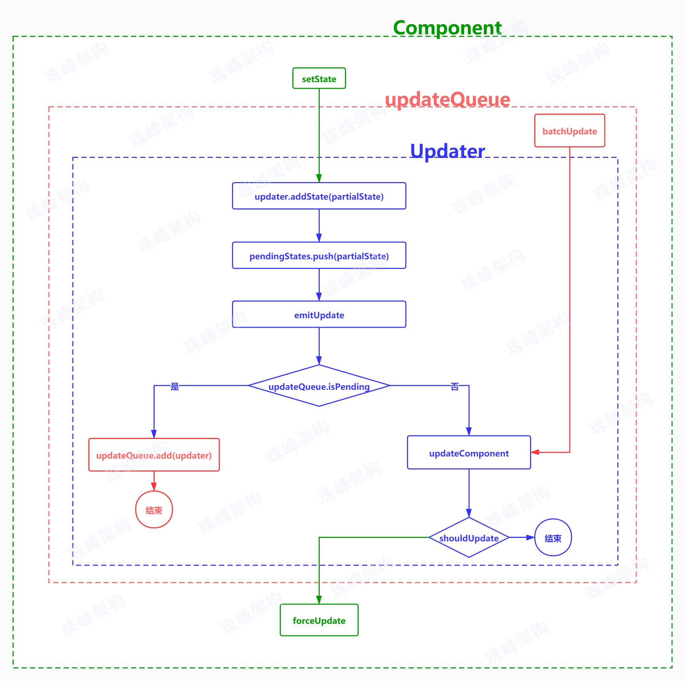

# 组件更新
* 组件更新判断逻辑如下图:


## 1. 合并state
### 1.1. src/index.js
```js {1-3,6-9,12-17}
import React from './react';
import ReactDOM from './react-dom';
class Counter extends React.Component {
  constructor(props) {
    super(props);
    this.state = { number: 0 };
    setTimeout(() => {
      this.setState({ number: this.state.number + 1 });
      console.log(this.state);
    }, 1000);
  }
  render() {
    return <div id={'counter' + this.state.number}>+</div>
  }
}
ReactDOM.render(
  <Counter />,
  document.getElementById('root')
);
```
### 1.2. src/react/component.js
```js {1-64,68-76}
//更新队列
export const updateQueue = {
  updaters: [],//要执行的updater对象
  isPending: false,//是否处于批量更新模式
};

class Updater {
  constructor(componentInstance) {
    this.componentInstance = componentInstance;//Updater和类组件1对1关系
    this.pendingStates = [];//更新如果批量的，先把状态暂存到数组，最后更新时统一合并
    this.nextProps = null;//新的属性对象
  }
  addState(partialState){
    this.pendingStates.push(partialState);//把新状态放入数组
    this.emitUpdate();
  }
  emitUpdate(nextProps){
    this.nextProps = nextProps;
    //如果有新属性对象 或者 队列处于‘休息’状态，直接更新
    if (nextProps || !updateQueue.isPending) {
      this.updateComponent();
    } else {//否则交给队列处理
      updateQueue.add(this);
    }
  }
  updateComponent(){
    let { componentInstance, pendingStates, nextProps } = this;
    if (nextProps || pendingStates.length > 0) {//长度大于0，有要合并的状态
      shouldUpdate(componentInstance, nextProps, this.getState());
    }
  }
  //合并及返回新的状态
  getState(){
    let { componentInstance, pendingStates } = this;
    let { state } = componentInstance;//老组件当前状态
    if (pendingStates.length > 0) {
      //迭代pendingStates，将所有状态合并到state
      for (let i = 0; i < pendingStates.length; i++) {
        let nextState = pendingStates[i];
        if (typeof nextState === 'function') {
          state = { ...state, ...nextState.call(componentInstance, state) };
        } else {
          state = { ...state, ...nextState };
        }
      }
    }
    pendingStates.length = 0;//合并后清空数组
    return state;
  }
}
//判断是否要更新
function shouldUpdate(componentInstance, nextProps, nextState) {
  componentInstance.props = nextProps;//将新props赋给组件
  componentInstance.state = nextState;//将新state赋给组件
  if (
    componentInstance.shouldComponentUpdate &&
    !componentInstance.shouldComponentUpdate(nextProps, nextState)
  ) {
    //如果shouldComponentUpdate返回false，则不更新
    return false;
  }
  componentInstance.forceUpdate();//让组件强制更新
}

class Component {
  constructor(props) {
    this.props = props;
    this.$updater = new Updater(this); //this 就是类组件的实例
    this.state = {}; // 当前状态
    this.nextProps = null; // 下一个属性对象
  }
  //批量更新 partial，状态可能会被合并
  setState(partialState) {
    this.$updater.addState(partialState);
  }
  forceUpdate(){//进行组件更新
  }
}
//类组件的本质也是函数(请参考new Class原理)，通过`isReactComponent`判断是类组件还是函数组件
Component.prototype.isReactComponent = {};
export {
  Component
}
```

## 2. 简单替换DOM
### 2.1. src/react/component.js
```js {1,2,79-88}
import { compareTwoElements } from './vdom';

//更新队列
export const updateQueue = {
  updaters: [],//要执行的updater对象
  isPending: false,//是否处于批量更新模式
};

class Updater {
  constructor(componentInstance) {
    this.componentInstance = componentInstance;//Updater和类组件1对1关系
    this.pendingStates = [];//更新如果批量的，先把状态暂存到数组，最后更新时统一合并
    this.nextProps = null;//新的属性对象
  }
  addState(partialState){
    this.pendingStates.push(partialState);//把新状态放入数组
    this.emitUpdate();
  }
  emitUpdate(nextProps){
    this.nextProps = nextProps;
    //如果有新属性对象 或者 队列处于‘休息’状态，直接更新
    if (nextProps || !updateQueue.isPending) {
      this.updateComponent();
    } else {//否则交给队列处理
      updateQueue.add(this);
    }
  }
  updateComponent(){
    let { componentInstance, pendingStates, nextProps } = this;
    if (nextProps || pendingStates.length > 0) {//长度大于0，有要合并的状态
      shouldUpdate(componentInstance, nextProps, this.getState());
    }
  }
  //合并及返回新的状态
  getState(){
    let { componentInstance, pendingStates } = this;
    let { state } = componentInstance;//老组件当前状态
    if (pendingStates.length > 0) {
      //迭代pendingStates，将所有状态合并到state
      for (let i = 0; i < pendingStates.length; i++) {
        let nextState = pendingStates[i];
        if (typeof nextState === 'function') {
          state = { ...state, ...nextState.call(componentInstance, state) };
        } else {
          state = { ...state, ...nextState };
        }
      }
    }
    pendingStates.length = 0;//合并后清空数组
    return state;
  }
}
//判断是否要更新
function shouldUpdate(componentInstance, nextProps, nextState) {
  componentInstance.props = nextProps;//将新props赋给组件
  componentInstance.state = nextState;//将新state赋给组件
  if (
    componentInstance.shouldComponentUpdate &&
    !componentInstance.shouldComponentUpdate(nextProps, nextState)
  ) {
    //如果shouldComponentUpdate返回false，则不更新
    return false;
  }
  componentInstance.forceUpdate();//让组件强制更新
}

class Component {
  constructor(props) {
    this.props = props;
    this.$updater = new Updater(this); //this 就是类组件的实例
    this.state = {}; // 当前状态
    this.nextProps = null; // 下一个属性对象
  }
  //批量更新 partial，状态可能会被合并
  setState(partialState) {
    this.$updater.addState(partialState);
  }
  forceUpdate(){//进行组件更新
    let { props, state, renderElement: oldRenderElement } = this;
    if (this.componentWillUpdate) {
      this.componentWillUpdate();
    }
    let newRenderElement = this.render();
    let currentElement = compareTwoElements(oldRenderElement, newRenderElement);
    this.renderElement = currentElement;
    if (this.componentDidUpdate) {
      this.componentDidUpdate();
    }
  }
}
//类组件的本质也是函数(请参考new Class原理)，通过`isReactComponent`判断是类组件还是函数组件
Component.prototype.isReactComponent = {};
export {
  Component
}
```
### 2.2. src/react/vdom.js
```js {1,4-53,112-121}
import { TEXT, ELEMENT, CLASS_COMPONENT, FUNCTION_COMPONENT } from './constants';
import { setProps, onlyOne, flatten } from './utils';

export function compareTwoElements(oldRenderElement, newRenderElement) {
  oldRenderElement = onlyOne(oldRenderElement);
  newRenderElement = onlyOne(newRenderElement);
  let currentDOM = oldRenderElement.dom;//取出老的DOM节点（此处，element.dom = dom;已经做过预埋设计）
  let currentElement = oldRenderElement;
  if (newRenderElement == null) {
    currentDOM.parentNode.removeChild(currentDOM);//新的虚拟DOM为null，删掉老节点
    currentDOM = null;
  } else if (oldRenderElement.type != newRenderElement.type) { // span div function class
    let newDOM = createDOM(newRenderElement);//类型不同，新节点替换老节点
    currentDOM.parentNode.replaceChild(newDOM, currentDOM);
    currentElement = newRenderElement;
  } else {//新老节点都存在，类型一样。进行 dom-diff 深度比较，比较他们的属性和子节点，并尽可能复用老节点
    //TODO 这里简单模拟实现
    let newDOM = createDOM(newRenderElement);
    currentDOM.parentNode.replaceChild(newDOM, currentDOM);
    currentElement = newRenderElement;
  }
  return currentElement;
}

export function createDOM(element) {
  if (typeof element !== 'object') {
    throw Error(`Uncaught DOMException: Failed to execute 'createElement' on 'Document': The tag name provided ('${element}') is not a valid name.`)
  }
  /**
   * !!! element 如果是字符串或者数字，已经在迭代`children`时封装成对象
   * 因此`createDOM`方法可以整体进行改造
   */
  let dom;
  element = onlyOne(element); // 如果是数组，只取第一个
  let { $$typeof } = element;
  if (!$$typeof) { // 字符串或者数字
    dom = document.createTextNode(element);
  } else if ($$typeof == TEXT) {
    dom = document.createTextNode(element.content);
  } else if ($$typeof == ELEMENT) { // 原生DOM节点
    dom = createNativeDOM(element);
  } else if ($$typeof == FUNCTION_COMPONENT) { // 函数组件
    dom = createFunctionComponentDOM(element);
  } else if ($$typeof == CLASS_COMPONENT) { // 类组件
    dom = createClassComponentDOM(element);
  }
  /**
   * `element`是ReactElement创建出来的虚拟DOM，让虚拟的DOM的`dom`属性指向真实DOM
   * 这里是一个预埋设计，或者叫铺垫，通过虚拟DOM能够获取真实DOM
   */
  element.dom = dom;
  return dom;
}
// 创建函数组件真实的DOM对象
function createFunctionComponentDOM(element) {
  //element: $$typeof, type, key, ref, props
  let { type, props } = element;
  /**
   * function FunctionComponent(props) {
   *   return React.createElement('div', { id: 'counter' }, 'hello');
   * }
   */
  let renderElement = type(props);// type === FunctionComponent
  //element 是 React.createElement(FunctionComponent, config, children); 的返回值
  //element 是 FunctionComponent 的父级，当然这里不是DOM的父级，只是理解为父级
  element.renderElement = renderElement; // 这里也是一个预埋设计
  let dom = createDOM(renderElement);
  return dom;
  // 第25行`element.dom = dom;`，可以推导出: element.renderElement.dom=真实DOM
}
// 创建类组件真实的DOM对象
function createClassComponentDOM(element) {
  let { type, props } = element;
  /**
   * class ClassCounter extends React.Component {
   *   constructor(props) {
   *     super(props);
   *   }
   *   render() {
   *     return React.createElement('div', { id: 'counter' }, 'hello');
   *   }
   * }
   */
  let componentInstance = new type(props);
  element.componentInstance = componentInstance; // 这里也是一个预埋设计
  let renderElement = componentInstance.render();
  componentInstance.renderElement = renderElement; // 这里也是一个预埋设计
  let dom = createDOM(renderElement);
  return dom;
  // 第25行`element.dom = dom;`，可以推导出: element.componentInstance.renderElement.dom=真实DOM
}
/**
let element = React.createElement('button',
  { id: 'sayHello', onClick },
  'say', React.createElement('span', { onClick: spanClick, style: { color: 'red' } }, 'Hello')
);
 */
function createNativeDOM(element) {
  let { type, props } = element; // div button span
  let dom = document.createElement(type); //真实DOM对象
  //1，创建虚拟dom的子节点
  createNativeDOMChildren(dom, element.props.children);
  //2，给DOM元素添加属性
  setProps(dom, props);
  return dom;
}
function createNativeDOMChildren(parentNode, ...children) {
  let childrenNodeArr = children && flatten(children);
  if (childrenNodeArr) {
    for (let i = 0; i < childrenNodeArr.length; i++) {
      let child = childrenNodeArr[i];
      /**
       * !!! 由于需要通过 element 获取 dom 元素，此处将 字符串或者数字 封装成对象
       */
      if (typeof child !== 'object') { // 字符串或数字
        child = childrenNodeArr[i] = { $$typeof: TEXT, type: TEXT, content: child };
      }
      //child会传递给element，预埋设计，跟第25行`element.dom = dom;`逻辑一样，给element添加索引
      child._mountIndex = i;
      let childDOM = createDOM(child);
      parentNode.appendChild(childDOM);
    }
  }
}

export function ReactElement($$typeof, type, key, ref, props) {
  let element = {
    $$typeof, type, key, ref, props
  };
  return element;
}
```

## 3. state与事件
### 3.1. src/index.js
```js {8-21}
import React from './react';
import ReactDOM from './react-dom';
class Counter extends React.Component {
  constructor(props) {
    super(props);
    this.state = { number: 0 };
  }
  handleClick = () => {
    this.setState({ number: this.state.number + 1 });
    console.log(this.state.number);//0
    this.setState({ number: this.state.number + 1 });
    console.log(this.state.number);//0
    setTimeout(() => {
      this.setState({ number: this.state.number + 1 });
      console.log(this.state.number);//2
      this.setState({ number: this.state.number + 1 });
      console.log(this.state.number);//3
    }, 10);
  }
  render() {
    return <div id={'counter' + this.state.number} onClick={this.handleClick}>+</div>
  }
}
ReactDOM.render(
  <Counter />,
  document.getElementById('root')
);
```
### 3.2. src/react/component.js
```js {7-19,92}
import { compareTwoElements } from './vdom';

//更新队列
export const updateQueue = {
  updaters: [],//要执行的updater对象
  isPending: false,//是否处于批量更新模式
  add(updater) {
    this.updaters.push(updater);
  },
  //需要调用batchUpdate才更新
  batchUpdate(){
    let { updaters } = this;
    this.isPending = true;//开始更新
    let updater;
    while (updater = updaters.pop()) {
      updater.updateComponent();//更新所有 dirty 组件
    }
    this.isPending = false;//更新完毕
  }
};

class Updater {
  constructor(componentInstance) {
    this.componentInstance = componentInstance;//Updater和类组件1对1关系
    this.pendingStates = [];//更新如果批量的，先把状态暂存到数组，最后更新时统一合并
    this.nextProps = null;//新的属性对象
  }
  addState(partialState){
    this.pendingStates.push(partialState);//把新状态放入数组
    this.emitUpdate();
  }
  emitUpdate(nextProps){
    this.nextProps = nextProps;
    //如果有新属性对象 或者 队列处于‘休息’状态，直接更新
    if (nextProps || !updateQueue.isPending) {
      this.updateComponent();
    } else {//否则交给队列处理
      updateQueue.add(this);
    }
  }
  updateComponent(){
    let { componentInstance, pendingStates, nextProps } = this;
    if (nextProps || pendingStates.length > 0) {//长度大于0，有要合并的状态
      shouldUpdate(componentInstance, nextProps, this.getState());
    }
  }
  //合并及返回新的状态
  getState(){
    let { componentInstance, pendingStates } = this;
    let { state } = componentInstance;//老组件当前状态
    if (pendingStates.length > 0) {
      //迭代pendingStates，将所有状态合并到state
      for (let i = 0; i < pendingStates.length; i++) {
        let nextState = pendingStates[i];
        if (typeof nextState === 'function') {
          state = { ...state, ...nextState.call(componentInstance, state) };
        } else {
          state = { ...state, ...nextState };
        }
      }
    }
    pendingStates.length = 0;//合并后清空数组
    return state;
  }
}
//判断是否要更新
function shouldUpdate(componentInstance, nextProps, nextState) {
  componentInstance.props = nextProps;//将新props赋给组件
  componentInstance.state = nextState;//将新state赋给组件
  if (
    componentInstance.shouldComponentUpdate &&
    !componentInstance.shouldComponentUpdate(nextProps, nextState)
  ) {
    //如果shouldComponentUpdate返回false，则不更新
    return false;
  }
  componentInstance.forceUpdate();//让组件强制更新
}

class Component {
  constructor(props) {
    this.props = props;
    this.$updater = new Updater(this); //this 就是类组件的实例
    this.state = {}; // 当前状态
    this.nextProps = null; // 下一个属性对象
  }
  //批量更新 partial，状态可能会被合并
  setState(partialState) {
    this.$updater.addState(partialState);
  }
  forceUpdate(){//进行组件更新
    console.log('force')
    let { props, state, renderElement: oldRenderElement } = this;
    if (this.componentWillUpdate) {
      this.componentWillUpdate();
    }
    let newRenderElement = this.render();
    let currentElement = compareTwoElements(oldRenderElement, newRenderElement);
    this.renderElement = currentElement;
    if (this.componentDidUpdate) {
      this.componentDidUpdate();
    }
  }
}
//类组件的本质也是函数(请参考new Class原理)，通过`isReactComponent`判断是类组件还是函数组件
Component.prototype.isReactComponent = {};
export {
  Component
}
```
### 3.3. src/react/event.js
```js {1,28,29,45-48}
import { updateQueue } from './component';

/**
 * React通过，类似于`事件委托`机制，将事件绑定到document上；
 * 并把事件回调函数，以`eventStore`的形式，挂载到对应的真实DOM上
 * @param {*} dom 要绑定事件的DOM节点
 * @param {*} eventType 事件类型 onClick
 * @param {*} listener 事件处理函数
 */
export function addEvent(dom, eventType, listener) {
  eventType = eventType.toLowerCase(); // onClick 作为key，转换成 onclick
  //在要绑定的DOM节点上挂载一个对象，准备存放监听函数
  let eventStore = dom.eventStore || (dom.eventStore = {});
  //eventStore.onClick = () => {console.log('this is onClick')}
  eventStore[eventType] = listener;
  /**
   * 这里可以做兼容处理，比如兼容IE、Chrome、Firefox等等
   */
  // true是捕获阶段，处理事件； false是冒泡阶段，处理事件
  document.addEventListener(eventType.slice(2), dispatchEvent, false);
}

let syntheticEvent;//合成对象，可以复用，减少垃圾回收，提高性能
function dispatchEvent(event) {
  let { type, target } = event;//type->click target->button
  let eventType = 'on' + type; //onclick
  syntheticEvent = getSyntheticEvent(event);
  //事件监听函数执行之前，进入批量更新模式
  updateQueue.isPending = true;
  // 模拟冒泡过程
  while(target) {
    let {eventStore} = target;
    let listener = eventStore && eventStore[eventType];//onClick
    if (listener) {
      listener.call(target, syntheticEvent);
    }
    target = target.parentNode;
  }
  //所有监听函数执行完毕，清掉所有属性
  for (const key in syntheticEvent) {
    if (syntheticEvent.hasOwnProperty(key)) {
      delete syntheticEvent[key];
    }
  }
  //事件处理函数执行完成，关掉批量更新模式
  updateQueue.isPending = false;
  //执行批量更新，把缓存的updater全部执行
  updateQueue.batchUpdate();
}
//如果执行了persist，就让syntheticEvent指向新对象
function persist() {
  syntheticEvent = {};
  syntheticEvent.__proto__.persist = persist;
}
function getSyntheticEvent(nativeEvent){
  if (!syntheticEvent) {
    syntheticEvent = {};
    syntheticEvent.__proto__.persist = persist;
  }
  syntheticEvent.nativeEvent = nativeEvent;
  syntheticEvent.currentTarget = nativeEvent.target;
  //把原生事件对象上的方法和属性都拷贝到合成对象上
  for (let key in nativeEvent) {
    if (typeof nativeEvent[key] === 'function') {
      syntheticEvent[key] = nativeEvent[key].bind(nativeEvent); //绑定this
    } else {
      syntheticEvent[key] = nativeEvent[key];
    }
  }
  return syntheticEvent;
}
```
### 3.4. 测试结果
```
0
0
force
force
2
force
3
```
### 3.5. setState函数形式
```js {9-17}
import React from './react';
import ReactDOM from './react-dom';
class Counter extends React.Component {
  constructor(props) {
    super(props);
    this.state = { number: 0 };
  }
  handleClick = () => {
    this.setState((state) => ({ number: state.number + 1 }));
    console.log(this.state.number);//0
    this.setState((state) => ({ number: state.number + 1 }));
    console.log(this.state.number);//0
    setTimeout(() => {
      this.setState((state) => ({ number: state.number + 1 }));
      console.log(this.state.number);//3
      this.setState((state) => ({ number: state.number + 1 }));
      console.log(this.state.number);//4
    }, 10);
  }
  render() {
    return <div id={'counter' + this.state.number} onClick={this.handleClick}>+</div>
  }
}
ReactDOM.render(
  <Counter />,
  document.getElementById('root')
);
```
### 3.5. 测试结果
```js
0
0
force
force
3
force
4
```


