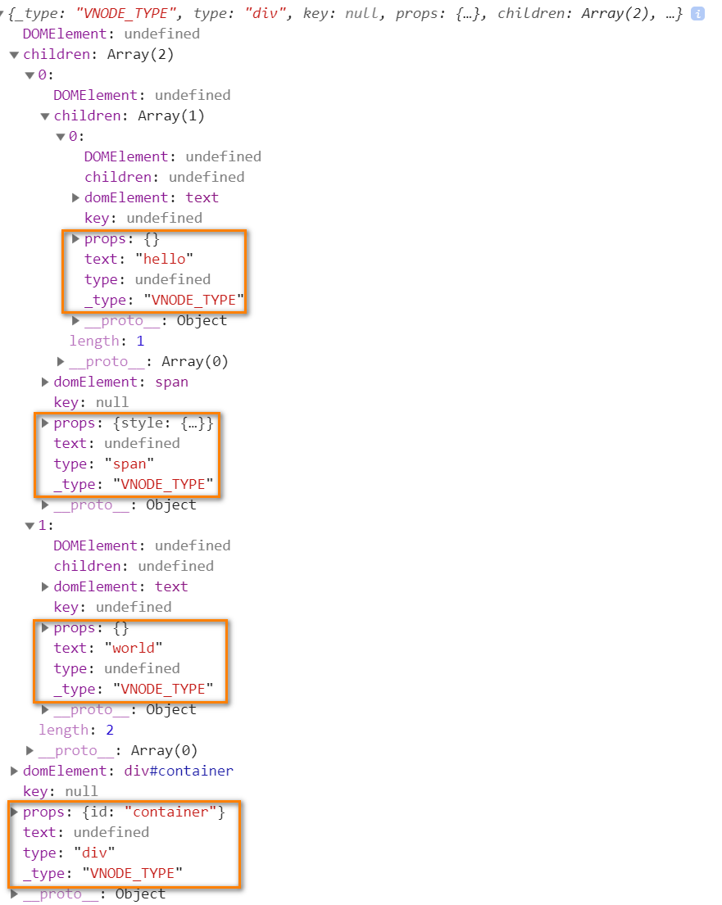

# Vue2 dom-diff算法 源码分解

## 1. 最终目录结构
```{5,8}
|-- vue2-dom-diff
    |-- .gitignore
    |-- package-lock.json
    |-- package.json
    |-- dist
    |   |-- index.html
    |   |-- main.js
    |-- src
        |-- index.js
        |-- vdom
            |-- h.js
            |-- index.js
            |-- patch.js
            |-- vnode.js
```

## 2. 构建项目
1. 初始化项目
```bash
cd ~/Documents/
mkdir vue2-dom-diff
cd vue2-dom-diff
npm init -y
```
2. 修改package.json文件
```json {7,8,13,14,15,16,17,18}
{
  "name": "vue2-dom-diff",
  "version": "1.0.0",
  "description": "",
  "main": "index.js",
  "scripts": {
    "build": "webpack --mode=development",
    "dev": "webpack-dev-server --mode=development --contentBase=./dist"
  },
  "keywords": [],
  "author": "",
  "license": "ISC",
  "devDependencies": {
    "@types/webpack-dev-server": "^3.1.7",
    "webpack": "^4.41.2",
    "webpack-cli": "^3.3.9",
    "webpack-dev-server": "^3.8.2"
  }
}
```
3. 添加.gitignore
```
node_modules
```
4. 添加 src/index.js
```js
alert('hello');
```
5. 初始化main.js
```bash
npm install
npm run build
```
6. 创建index.html
```html
<!DOCTYPE html>
<html lang="en">
<head>
    <meta charset="UTF-8">
    <meta name="viewport" content="width=device-width, initial-scale=1.0">
    <meta http-equiv="X-UA-Compatible" content="ie=edge">
    <title>Vue DOM DIFF</title>
    <style>
        ul {
            text-align: center;
            transition: all 1s;
        }
        li {
            width: 100px;
            color: #FFF;
            text-align: center;
            transition: all 1s;
        }
    </style>
</head>
<body>
    <div id="root"></div>
    <script src="main.js"></script>
</body>
</html>
```
7. 启动服务
```bash
npm run dev
```

## 3. 虚拟dom实现
### 3.1 虚拟dom结构

### 3.2 src/vdom/vnode.js
```js
const VNODE_TYPE = 'VNODE_TYPE';
// 根据图定义结构
export default function(type, key, props = {}, children, text, domElement) {
  return {
    _type: VNODE_TYPE, // 表示这是一个虚拟dom节点
    type, key, props, children, text, domElement
  }
};
```
### 3.3 src/vdom/h.js
```js
import vnode from './vnode';
const hasOwnProperty = Object.prototype.hasOwnProperty;
function h(type, config, ...children) {
  const props = {}; // 属性对象
  let key;
  if (config) {
    if (config.key) {
      key = config.key;
    }
  }
  // 迭代config中的每一个属性
  for (let propName in config) {
    // 上边已经把config中的可以传给了key
    if (hasOwnProperty.call(config, propName) && propName != 'key') {
      props[propName] = config[propName];
    }
  }
  return vnode(type, key, props, children.map(child => (
    typeof child === 'string' || typeof child === 'number' ?
      vnode(undefined, undefined, undefined, undefined, child) :
      child
  )));
}
export default h;
```
### 3.4 src/vdom/index.js
```js
import h from './h';
export {h};
```
### 3.5 src/index.js
```js
import { h } from './vdom';
// h是用来创建虚拟dom的，虚拟dom就是一个普通js对象，放着类型、属性、多个子类
const root = document.getElementById('root');
const oldVnode = h(
  'div', { id: 'container' },
    h('span', { style: { color: 'red'}}, 'hello'),
    'world'
);
console.log(oldVnode);
```
### 查看测试效果
打开浏览器`审查`，在Console中查看效果

## 4. 初次渲染
```html
<div id="root">
  <div id="container">
    <span style="color: red;">hello</span>
    "world"
  </div>
</div>
```
### 4.1 src/vdom/patch.js
```js
/**
 * 把虚拟DOM变成真实DOM挂载到真实DOM容器上
 * @param {*} vnode 虚拟DOM节点
 * @param {*} container 真实DOM容器
 */
export function mount(vnode, container) {
};
```
### 4.2 src/vdom/index.js
```js {2,3}
import h from './h';
import { mount } from './patch';
export { h, mount };
```
### 4.3 src/index.js
```js {10,11}
import { h, mount } from './vdom';
// h是用来创建虚拟dom的，虚拟dom就是一个普通js对象，放着类型、属性、多个子类
const root = document.getElementById('root');
const oldVnode = h(
  'div', { id: 'container' },
    h('span', { style: { color: 'red'}}, 'hello'),
    'world'
);
console.log(oldVnode);
// 把虚拟DOM节点挂载到root上去
mount(oldVnode, root);
```
### 4.4 src/vdom/patch.js
```js
/**
 * 把虚拟DOM变成真实DOM挂载到真实DOM容器上
 * @param {*} vnode 虚拟DOM节点
 * @param {*} container 真实DOM容器
 */
export function mount(vnode, container) {
  let newDOMElement = createDOMElementFromVnode(vnode);
  container.appendChild(newDOMElement);
};
/**
 * 通过虚拟DOM节点创建真实DOM节点
 * @param {*} vnode 
 */
function createDOMElementFromVnode(vnode) {
  let {type, children} = vnode; // type: span div
  if (type) {
    // 创建真实DOM元素并挂载到vnode的domElement上
    const domElement = vnode.domElement = document.createElement(type);
    // 更新vnode属性
    updateProperties(vnode);
    // 如果子类存在，递归挂载append子类到domElement上
    if (Array.isArray(children)) {
      children.forEach(child => domElement.appendChild(createDOMElementFromVnode(child)));
    }
  } else {
    vnode.domElement = document.createTextNode(vnode.text);
  }
  return vnode.domElement;
}
/**
 * 更新样式及属性
 * @param {*} vnode 
 * @param {*} oldProps 
 */
function updateProperties(vnode, oldProps = {}) {
  let newProps = vnode.props; // 新属性对象
  let domElement = vnode.domElement; // 真实DOM
  // 样式对象
  let oldStyle = oldProps.style || {};
  let newStyle = newProps.style || {};
  // 先处理样式对象，老的对象里有，新的对象里没有，要删除
  for (let oldAttrName in oldStyle) {
    if (!newStyle[oldAttrName]) {
      domElement.style[oldAttrName] = '';
    }
  }
  // 处理属性对象，老的对象里有，新的对象里没有，要删除
  for (let oldPropName in oldProps) {
    if (!newProps[oldPropName]) {
      delete domElement[oldPropName];
    }
  }
  // 添加+更新 新的属性 和 样式
  for (let newPropName in newProps) {
    if (newPropName === 'style') {
      let styleObject = newProps.style; // 拿到新的样式对象
      for (let newAttrName in styleObject) {
        domElement.style[newAttrName] = styleObject[newAttrName];
      }
    } else {
      // 直接更新 用 新属性对象 中的属性 覆盖真实DOM的属性
      domElement[newPropName] = newProps[newPropName];
    }
  }
}
```
### 查看测试效果
看到`4. 初次渲染`标题下的效果

## 5. 替换不同类型
### 5.1 src/vdom/patch.js
```js {6-15}
/**
 * 比较老的虚拟DOM节点和新的虚拟DOM节点
 * @param {*} oldVnode 
 * @param {*} newVnode 
 */
export function patch(oldVnode, newVnode) {
  // 如果新的虚拟DOM节点类型type不一样，直接重建
  if (oldVnode.type !== newVnode.type) {
    return oldVnode.domElement.parentNode.replaceChild(createDOMElementFromVnode(newVnode), oldVnode.domElement);
  }
  // 老的是文本，新的也是文本，type都是undefined，undefined === undefined，因此不能通过判断type，来确定新值和老值是否相等
  if (typeof newVnode.text !== 'undefined') {
    return oldVnode.domElement.textContent = newVnode.text;
  }
}
/**
 * 把虚拟DOM变成真实DOM挂载到真实DOM容器上
 * @param {*} vnode 虚拟DOM节点
 * @param {*} container 真实DOM容器
 */
export function mount(vnode, container) {
  let newDOMElement = createDOMElementFromVnode(vnode);
  container.appendChild(newDOMElement);
};
/**
 * 通过虚拟DOM节点创建真实DOM节点
 * @param {*} vnode 
 */
function createDOMElementFromVnode(vnode) {
  let {type, children} = vnode; // type: span div
  if (type) {
    // 创建真实DOM元素并挂载到vnode的domElement上
    const domElement = vnode.domElement = document.createElement(type);
    // 更新vnode属性
    updateProperties(vnode);
    // 如果子类存在，递归挂载append子类到domElement上
    if (Array.isArray(children)) {
      children.forEach(child => domElement.appendChild(createDOMElementFromVnode(child)));
    }
  } else {
    vnode.domElement = document.createTextNode(vnode.text);
  }
  return vnode.domElement;
}
/**
 * 更新样式及属性
 * @param {*} vnode 
 * @param {*} oldProps 
 */
function updateProperties(vnode, oldProps = {}) {
  let newProps = vnode.props; // 新属性对象
  let domElement = vnode.domElement; // 真实DOM
  // 样式对象
  let oldStyle = oldProps.style || {};
  let newStyle = newProps.style || {};
  // 先处理样式对象，老的对象里有，新的对象里没有，要删除
  for (let oldAttrName in oldStyle) {
    if (!newStyle[oldAttrName]) {
      domElement.style[oldAttrName] = '';
    }
  }
  // 处理属性对象，老的对象里有，新的对象里没有，要删除
  for (let oldPropName in oldProps) {
    if (!newProps[oldPropName]) {
      delete domElement[oldPropName];
    }
  }
  // 添加+更新 新的属性 和 样式
  for (let newPropName in newProps) {
    if (newPropName === 'style') {
      let styleObject = newProps.style; // 拿到新的样式对象
      for (let newAttrName in styleObject) {
        domElement.style[newAttrName] = styleObject[newAttrName];
      }
    } else {
      // 直接更新 用 新属性对象 中的属性 覆盖真实DOM的属性
      domElement[newPropName] = newProps[newPropName];
    }
  }
}
```
### 5.2 src/vdom/index.js
```js {2-4}
import h from './h';
import { mount, patch } from './patch';
import vnode from './vnode';
export { h, mount, patch, vnode };
```
### 5.3 src/index.js
```js {1,4-10,13-24}
import { h, mount, patch, vnode } from './vdom';
// h是用来创建虚拟dom的，虚拟dom就是一个普通js对象，放着类型、属性、多个子类
const root = document.getElementById('root');
const oldVnode = h('ul', { id: 'container' },
    h('li', { style: { backgroundColor: '#110000' }, key: 'A' }, 'A'),
    h('li', { style: { backgroundColor: '#440000' }, key: 'B' }, 'B'),
    h('li', { style: { backgroundColor: '#770000' }, key: 'C' }, 'C'),
    h('li', { style: { backgroundColor: '#AA0000' }, key: 'D' }, 'D')
);
// console.log(oldVnode);
// 把虚拟DOM节点挂载到root上去
mount(oldVnode, root);
// DOM节点替换成了文本节点
// DOM-DIFF 如果老节点和新节点类型不一样的话，直接把老的替换成新的
const newVnode = h('div', { id: 'container' }, '新的文本');
setTimeout(() => {
  patch(oldVnode, newVnode);
}, 1000);
const oldTxtVnode = vnode(undefined, undefined, undefined, undefined, 'old文本');
mount(oldTxtVnode, root);
const newTxtVnode = vnode(undefined, undefined, undefined, undefined, 'new文本');
setTimeout(() => {
  patch(oldTxtVnode, newTxtVnode);
}, 1000);
```
### 查看测试效果
查看浏览器页面效果


