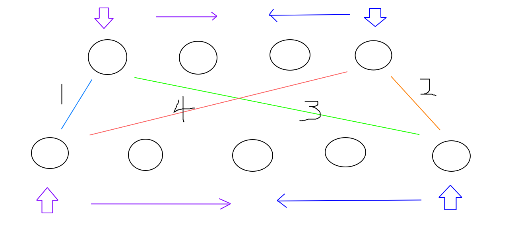
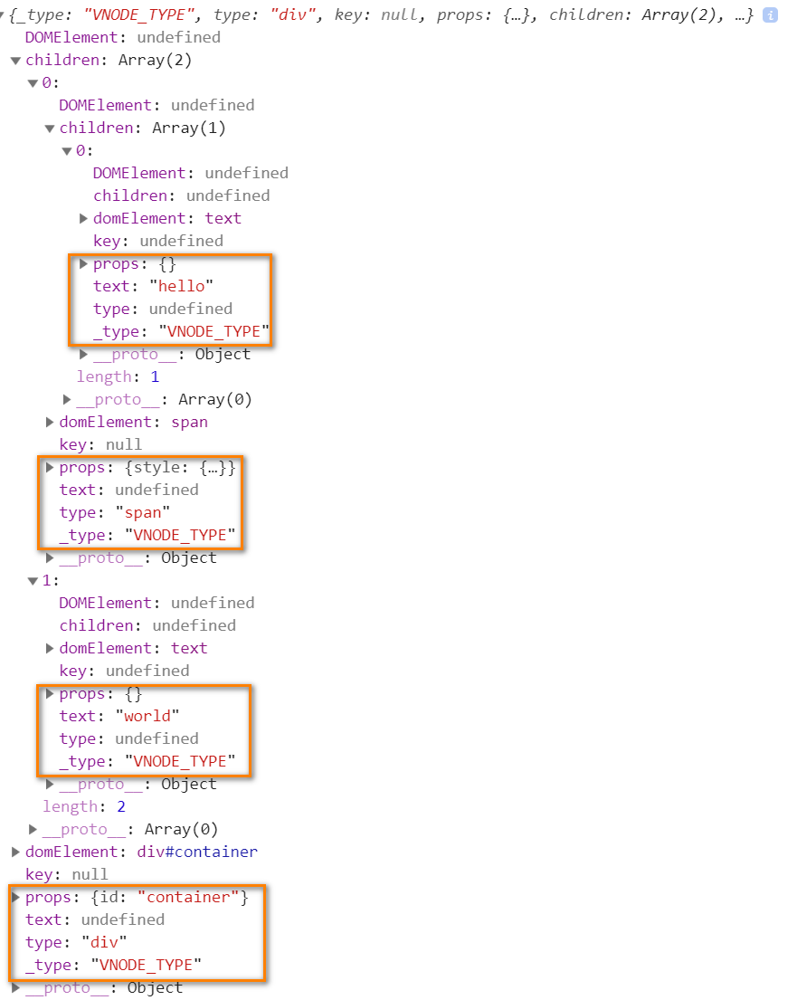
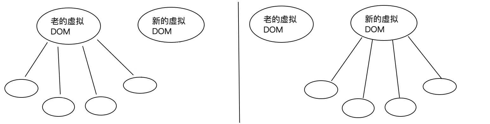
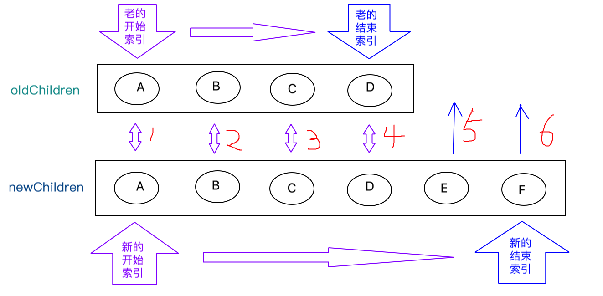
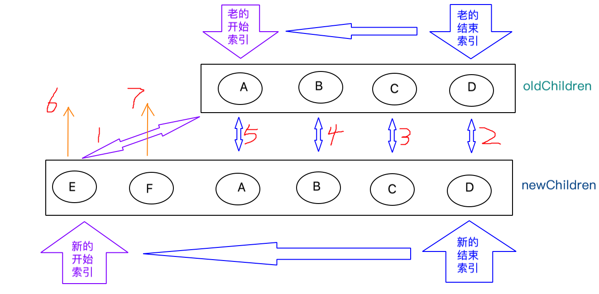
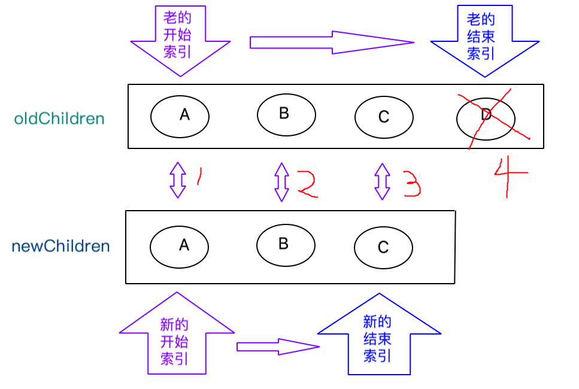
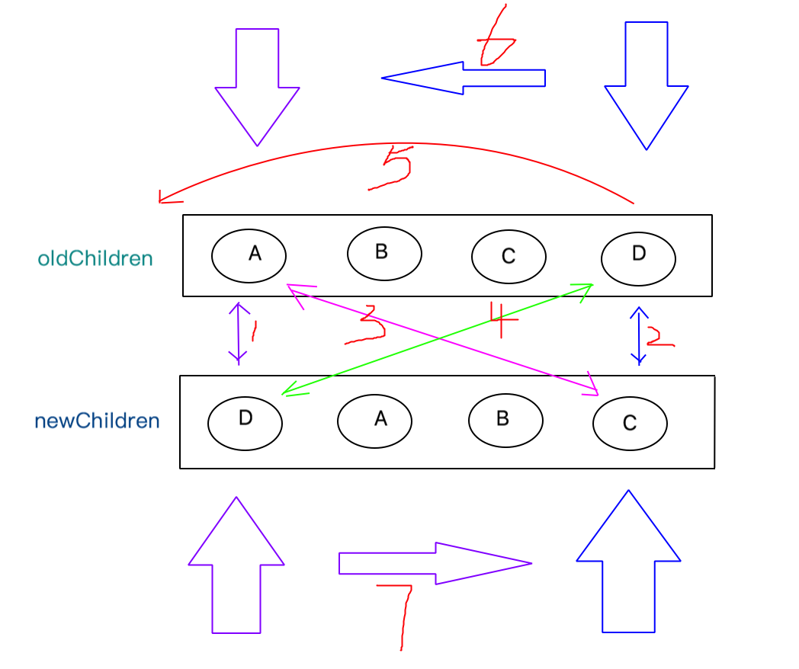
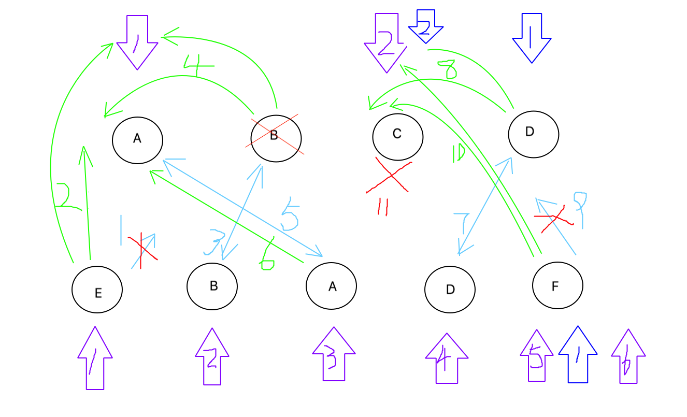
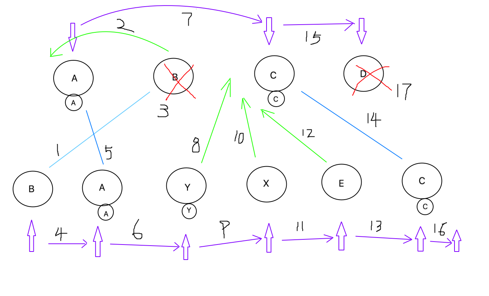

# dom-diff

## 1. 核心概要
### 1.1 目录结构
```{5,8}
|-- vue2-dom-diff
    |-- .gitignore
    |-- package-lock.json
    |-- package.json
    |-- dist
    |   |-- index.html
    |   |-- main.js
    |-- src
        |-- index.js
        |-- vdom
            |-- h.js
            |-- index.js
            |-- patch.js
            |-- vnode.js
```
### 1.2 算法原则

* 核心算法，比较步骤，1，2，3，4
* 指针方向，从两边向中间收敛
* 1，2，3，4 跟指针方向结合
* 1，2，3，4 找不到，迭代找

**后边的深入研究，需要参考算法原则，当前只需要对该图形有印象即可**

## 2. 构建项目
### 2.1 初始化项目
```bash
cd ~/Documents/
mkdir vue2-dom-diff
cd vue2-dom-diff
npm init -y
```
### 2.2 修改package.json文件
```json {7,8,13,14,15,16,17,18}
{
  "name": "vue2-dom-diff",
  "version": "1.0.0",
  "description": "",
  "main": "index.js",
  "scripts": {
    "build": "webpack --mode=development",
    "dev": "webpack-dev-server --mode=development --contentBase=./dist"
  },
  "keywords": [],
  "author": "",
  "license": "ISC",
  "devDependencies": {
    "@types/webpack-dev-server": "^3.1.7",
    "webpack": "^4.41.2",
    "webpack-cli": "^3.3.9",
    "webpack-dev-server": "^3.8.2"
  }
}
```
### 2.3 添加.gitignore
```
node_modules
```
### 2.4 添加 src/index.js
```js
alert('hello');
```
### 2.5 初始化main.js
```bash
npm install
npm run build
```
### 2.6 创建index.html
```html
<!DOCTYPE html>
<html lang="en">
<head>
    <meta charset="UTF-8">
    <meta name="viewport" content="width=device-width, initial-scale=1.0">
    <meta http-equiv="X-UA-Compatible" content="ie=edge">
    <title>Vue DOM DIFF</title>
    <style>
        ul {
            text-align: center;
            transition: all 1s;
        }
        li {
            width: 100px;
            color: #FFF;
            text-align: center;
            transition: all 1s;
        }
    </style>
</head>
<body>
    <div id="root"></div>
    <script src="main.js"></script>
</body>
</html>
```
### 2.7 启动服务
```bash
npm run dev
```

## 3. 虚拟dom实现
### 3.1 虚拟dom结构

### 3.2 src/vdom/vnode.js
```js
const VNODE_TYPE = 'VNODE_TYPE';
// 根据图定义结构
export default function(type, key, props = {}, children, text, domElement) {
  return {
    _type: VNODE_TYPE, // 表示这是一个虚拟dom节点
    type, key, props, children, text, domElement
  }
};
```
### 3.3 src/vdom/h.js
```js
import vnode from './vnode';
const hasOwnProperty = Object.prototype.hasOwnProperty;
function h(type, config, ...children) {
  const props = {}; // 属性对象
  let key;
  if (config) {
    if (config.key) {
      key = config.key;
    }
  }
  // 迭代config中的每一个属性
  for (let propName in config) {
    // 上边已经把config中的可以传给了key
    if (hasOwnProperty.call(config, propName) && propName != 'key') {
      props[propName] = config[propName];
    }
  }
  return vnode(type, key, props, children.map(child => (
    typeof child === 'string' || typeof child === 'number' ?
      vnode(undefined, undefined, undefined, undefined, child) :
      child
  )));
}
export default h;
```
### 3.4 src/vdom/index.js
```js
import h from './h';
export {h};
```
### 3.5 src/index.js
```js
import { h } from './vdom';
// h是用来创建虚拟dom的，虚拟dom就是一个普通js对象，放着类型、属性、多个子类
const root = document.getElementById('root');
const oldVnode = h(
  'div', { id: 'container' },
    h('span', { style: { color: 'red'}}, 'hello'),
    'world'
);
console.log(oldVnode);
```
### 查看测试效果
打开浏览器`审查`，在Console中查看效果

## 4. 初次渲染
```html
<div id="root">
  <div id="container">
    <span style="color: red;">hello</span>
    "world"
  </div>
</div>
```
### 4.1 src/vdom/patch.js
```js
/**
 * 把虚拟DOM变成真实DOM挂载到真实DOM容器上
 * @param {*} vnode 虚拟DOM节点
 * @param {*} container 真实DOM容器
 */
export function mount(vnode, container) {
};
```
### 4.2 src/vdom/index.js
```js {2,3}
import h from './h';
import { mount } from './patch';
export { h, mount };
```
### 4.3 src/index.js
```js {10,11}
import { h, mount } from './vdom';
// h是用来创建虚拟dom的，虚拟dom就是一个普通js对象，放着类型、属性、多个子类
const root = document.getElementById('root');
const oldVnode = h(
  'div', { id: 'container' },
    h('span', { style: { color: 'red'}}, 'hello'),
    'world'
);
console.log(oldVnode);
// 把虚拟DOM节点挂载到root上去
mount(oldVnode, root);
```
### 4.4 src/vdom/patch.js
```js
/**
 * 把虚拟DOM变成真实DOM挂载到真实DOM容器上
 * @param {*} vnode 虚拟DOM节点
 * @param {*} container 真实DOM容器
 */
export function mount(vnode, container) {
  let newDOMElement = createDOMElementFromVnode(vnode);
  container.appendChild(newDOMElement);
};
/**
 * 通过虚拟DOM节点创建真实DOM节点
 * @param {*} vnode 
 */
function createDOMElementFromVnode(vnode) {
  let {type, children} = vnode; // type: span div
  if (type) {
    // 创建真实DOM元素并挂载到vnode的domElement上
    const domElement = vnode.domElement = document.createElement(type);
    // 更新vnode属性
    updateProperties(vnode);
    // 如果子类存在，递归挂载append子类到domElement上
    if (Array.isArray(children)) {
      children.forEach(child => domElement.appendChild(createDOMElementFromVnode(child)));
    }
  } else {
    vnode.domElement = document.createTextNode(vnode.text);
  }
  return vnode.domElement;
}
/**
 * 更新样式及属性
 * @param {*} vnode 
 * @param {*} oldProps 
 */
function updateProperties(vnode, oldProps = {}) {
  let newProps = vnode.props; // 新属性对象
  let domElement = vnode.domElement; // 真实DOM
  // 样式对象
  let oldStyle = oldProps.style || {};
  let newStyle = newProps.style || {};
  // 先处理样式对象，老的对象里有，新的对象里没有，要删除
  for (let oldAttrName in oldStyle) {
    if (!newStyle[oldAttrName]) {
      domElement.style[oldAttrName] = '';
    }
  }
  // 处理属性对象，老的对象里有，新的对象里没有，要删除
  for (let oldPropName in oldProps) {
    if (!newProps[oldPropName]) {
      delete domElement[oldPropName];
    }
  }
  // 添加+更新 新的属性 和 样式
  for (let newPropName in newProps) {
    if (newPropName === 'style') {
      let styleObject = newProps.style; // 拿到新的样式对象
      for (let newAttrName in styleObject) {
        domElement.style[newAttrName] = styleObject[newAttrName];
      }
    } else {
      // 直接更新 用 新属性对象 中的属性 覆盖真实DOM的属性
      domElement[newPropName] = newProps[newPropName];
    }
  }
}
```
### 查看测试效果
看到`4. 初次渲染`标题下的效果

## 5. 替换不同类型
### 5.1 src/vdom/patch.js
```js {6-15}
/**
 * 比较老的虚拟DOM节点和新的虚拟DOM节点
 * @param {*} oldVnode 
 * @param {*} newVnode 
 */
export function patch(oldVnode, newVnode) {
  // 如果新的虚拟DOM节点类型type不一样，直接重建
  if (oldVnode.type !== newVnode.type) {
    return oldVnode.domElement.parentNode.replaceChild(createDOMElementFromVnode(newVnode), oldVnode.domElement);
  }
  // 老的是文本，新的也是文本，type都是undefined，undefined === undefined，因此不能通过判断type，来确定新值和老值是否相等
  if (typeof newVnode.text !== 'undefined') {
    return oldVnode.domElement.textContent = newVnode.text;
  }
}
/**
 * 把虚拟DOM变成真实DOM挂载到真实DOM容器上
 * @param {*} vnode 虚拟DOM节点
 * @param {*} container 真实DOM容器
 */
export function mount(vnode, container) {
  let newDOMElement = createDOMElementFromVnode(vnode);
  container.appendChild(newDOMElement);
};
/**
 * 通过虚拟DOM节点创建真实DOM节点
 * @param {*} vnode 
 */
function createDOMElementFromVnode(vnode) {
  let {type, children} = vnode; // type: span div
  if (type) {
    // 创建真实DOM元素并挂载到vnode的domElement上
    const domElement = vnode.domElement = document.createElement(type);
    // 更新vnode属性
    updateProperties(vnode);
    // 如果子类存在，递归挂载append子类到domElement上
    if (Array.isArray(children)) {
      children.forEach(child => domElement.appendChild(createDOMElementFromVnode(child)));
    }
  } else {
    vnode.domElement = document.createTextNode(vnode.text);
  }
  return vnode.domElement;
}
/**
 * 更新样式及属性
 * @param {*} vnode 
 * @param {*} oldProps 
 */
function updateProperties(vnode, oldProps = {}) {
  let newProps = vnode.props; // 新属性对象
  let domElement = vnode.domElement; // 真实DOM
  // 样式对象
  let oldStyle = oldProps.style || {};
  let newStyle = newProps.style || {};
  // 先处理样式对象，老的对象里有，新的对象里没有，要删除
  for (let oldAttrName in oldStyle) {
    if (!newStyle[oldAttrName]) {
      domElement.style[oldAttrName] = '';
    }
  }
  // 处理属性对象，老的对象里有，新的对象里没有，要删除
  for (let oldPropName in oldProps) {
    if (!newProps[oldPropName]) {
      delete domElement[oldPropName];
    }
  }
  // 添加+更新 新的属性 和 样式
  for (let newPropName in newProps) {
    if (newPropName === 'style') {
      let styleObject = newProps.style; // 拿到新的样式对象
      for (let newAttrName in styleObject) {
        domElement.style[newAttrName] = styleObject[newAttrName];
      }
    } else {
      // 直接更新 用 新属性对象 中的属性 覆盖真实DOM的属性
      domElement[newPropName] = newProps[newPropName];
    }
  }
}
```
### 5.2 src/vdom/index.js
```js {2-4}
import h from './h';
import { mount, patch } from './patch';
import vnode from './vnode';
export { h, mount, patch, vnode };
```
### 5.3 src/index.js
```js {1,4-10,13-24}
import { h, mount, patch, vnode } from './vdom';
// h是用来创建虚拟dom的，虚拟dom就是一个普通js对象，放着类型、属性、多个子类
const root = document.getElementById('root');
const oldVnode = h('ul', { id: 'container' },
    h('li', { style: { backgroundColor: '#110000' }, key: 'A' }, 'A'),
    h('li', { style: { backgroundColor: '#440000' }, key: 'B' }, 'B'),
    h('li', { style: { backgroundColor: '#770000' }, key: 'C' }, 'C'),
    h('li', { style: { backgroundColor: '#AA0000' }, key: 'D' }, 'D')
);
// console.log(oldVnode);
// 把虚拟DOM节点挂载到root上去
mount(oldVnode, root);
// DOM节点替换成了文本节点
// DOM-DIFF 如果老节点和新节点类型不一样的话，直接把老的替换成新的
const newVnode = h('div', { id: 'container' }, '新的文本');
setTimeout(() => {
  patch(oldVnode, newVnode);
}, 1000);
const oldTxtVnode = vnode(undefined, undefined, undefined, undefined, 'old文本');
mount(oldTxtVnode, root);
const newTxtVnode = vnode(undefined, undefined, undefined, undefined, 'new文本');
setTimeout(() => {
  patch(oldTxtVnode, newTxtVnode);
}, 1000);
```
### 查看测试效果
查看浏览器页面效果

## 6. 一方有子类，另一方没有子类
### 6.1 图例

### 6.2 src/vdom/patch.js
```js {15-30}
/**
 * 比较老的虚拟DOM节点和新的虚拟DOM节点
 * @param {*} oldVnode 
 * @param {*} newVnode 
 */
export function patch(oldVnode, newVnode) {
  // 如果新的虚拟DOM节点类型type不一样，直接重建
  if (oldVnode.type !== newVnode.type) {
    return oldVnode.domElement.parentNode.replaceChild(createDOMElementFromVnode(newVnode), oldVnode.domElement);
  }
  // 老的是文本，新的也是文本，type都是undefined，undefined === undefined，因此不能通过判断type，来确定新值和老值是否相等
  if (typeof newVnode.text !== 'undefined') {
    return oldVnode.domElement.textContent = newVnode.text;
  }
  // 如果类型一样，继续向下比较， 1.比较属性，2.比较子类
  let domElement = newVnode.domElement = oldVnode.domElement; // 老的真实DOM节点
  // 1.比较属性: 传入新的虚拟DOM节点和老的属性对象 更新真实DOM上的属性
  updateProperties(newVnode, oldVnode.props);
  // 2.比较子类
  let oldChildren = oldVnode.children; // 老的虚拟DOM节点的子类
  let newChildren = newVnode.children; // 新的虚拟DOM节点的子类
  if (oldChildren.length > 0 && newChildren.length > 0) { // 老的，新的 都有子类
    // TODO
  } else if (oldChildren.length > 0) { // 老的有子类，新的没有
    domElement.innerHTML = '';
  } else if (newChildren.length > 0) { // 新的有子类，老的没有
    for (let i = 0; i < newChildren.length; i++) {
      domElement.appendChild(createDOMElementFromVnode(newChildren[i]));
    }
  }
}
/**
 * 把虚拟DOM变成真实DOM挂载到真实DOM容器上
 * @param {*} vnode 虚拟DOM节点
 * @param {*} container 真实DOM容器
 */
export function mount(vnode, container) {
  let newDOMElement = createDOMElementFromVnode(vnode);
  container.appendChild(newDOMElement);
};
/**
 * 通过虚拟DOM节点创建真实DOM节点
 * @param {*} vnode 
 */
function createDOMElementFromVnode(vnode) {
  let {type, children} = vnode; // type: span div
  if (type) {
    // 创建真实DOM元素并挂载到vnode的domElement上
    const domElement = vnode.domElement = document.createElement(type);
    // 更新vnode属性
    updateProperties(vnode);
    // 如果子类存在，递归挂载append子类到domElement上
    if (Array.isArray(children)) {
      children.forEach(child => domElement.appendChild(createDOMElementFromVnode(child)));
    }
  } else {
    vnode.domElement = document.createTextNode(vnode.text);
  }
  return vnode.domElement;
}
/**
 * 更新样式及属性，确保新的属性和样式，都更新到真实DOM上
 * @param {*} vnode 
 * @param {*} oldProps 
 */
function updateProperties(vnode, oldProps = {}) {
  let newProps = vnode.props; // 新属性对象
  let domElement = vnode.domElement; // 真实DOM
  // 样式对象
  let oldStyle = oldProps.style || {};
  let newStyle = newProps.style || {};
  // 先处理样式对象，老的对象里有，新的对象里没有，要删除
  for (let oldAttrName in oldStyle) {
    if (!newStyle[oldAttrName]) {
      domElement.style[oldAttrName] = '';
    }
  }
  // 处理属性对象，老的对象里有，新的对象里没有，要删除
  for (let oldPropName in oldProps) {
    if (!newProps[oldPropName]) {
      delete domElement[oldPropName];
    }
  }
  // 添加+更新 新的属性 和 样式
  for (let newPropName in newProps) {
    if (newPropName === 'style') {
      let styleObject = newProps.style; // 拿到新的样式对象
      for (let newAttrName in styleObject) {
        domElement.style[newAttrName] = styleObject[newAttrName];
      }
    } else {
      // 直接更新 用 新属性对象 中的属性 覆盖真实DOM的属性
      domElement[newPropName] = newProps[newPropName];
    }
  }
}
```
### 6.3 src/index.js
```js
import { h, mount, patch, vnode } from './vdom';
// h是用来创建虚拟dom的，虚拟dom就是一个普通js对象，放着类型、属性、多个子类
// DOMDIFF原则 尽量少操作DOM 而且vue domdiff是针对常用DOM操作进行了优化
const root = document.getElementById('root');
const oldVnode = h('ul', { id: 'container' },
  h('li', { style: { backgroundColor: '#110000' }, key: 'A' }, 'A'),
  h('li', { style: { backgroundColor: '#440000' }, key: 'B' }, 'B'),
  h('li', { style: { backgroundColor: '#770000' }, key: 'C' }, 'C'),
  h('li', { style: { backgroundColor: '#AA0000' }, key: 'D' }, 'D')
);
const newVnode = h('ul', { id: 'newContainer', style: { border: '1px solid red', height: '10px' } });
mount(oldVnode, root);
setTimeout(() => {
  patch(oldVnode, newVnode);
}, 1000);
```
### 查看测试效果
查看浏览器页面效果

## 7. 前面或后面新加元素
**小回顾：**<br>
index.js将oldVnode挂载到root真实DOM上;<br>
oldVnode.domElement赋给newVnode.domElement, 同时声明domElement并赋值。

### 7.1 后面新加
#### 7.1.1 算法描述

1. 开始索引比较，新老节点是否相同，图中的 `1`
2. 开始节点如果相同，索引向后移动，分别进行了 `2` `3` `4` 的比较
3. 当其中任意一个 开始索引 > 结束索引，不再向后比较
4. 此时发现`newChildren`还有元素，则执行 `5` `6`，插入到`真实DOM`中
#### 7.1.2 src/vdom/vnode.js
```js {1-9}
const VNODE_TYPE = 'VNODE_TYPE';
/**
 * 判断虚拟DOM是否相等，如果key和type相等则相等
 * @param {*} oldVnode 
 * @param {*} newVnode 
 */
export function isSameVnode(oldVnode, newVnode) {
  return oldVnode.key === newVnode.key && oldVnode.type === newVnode.type;
}
// 根据图定义结构
export default function(type, key, props = {}, children, text, domElement) {
  return {
    _type: VNODE_TYPE, // 表示这是一个虚拟dom节点
    type, key, props, children, text, domElement
  }
};
```
#### 7.1.3 src/vdom/patch.js
```js {1,24,33-62}
import { isSameVnode } from './vnode';
/**
 * 比较老的虚拟DOM节点和新的虚拟DOM节点
 * @param {*} oldVnode 
 * @param {*} newVnode 
 */
export function patch(oldVnode, newVnode) {
  // 如果新的虚拟DOM节点类型type不一样，直接重建
  if (oldVnode.type !== newVnode.type) {
    return oldVnode.domElement.parentNode.replaceChild(createDOMElementFromVnode(newVnode), oldVnode.domElement);
  }
  // 老的是文本，新的也是文本，type都是undefined，undefined === undefined，因此不能通过判断type，来确定新值和老值是否相等
  if (typeof newVnode.text !== 'undefined') {
    return oldVnode.domElement.textContent = newVnode.text;
  }
  // 如果类型一样，继续向下比较， 1.比较属性，2.比较子类
  let domElement = newVnode.domElement = oldVnode.domElement; // 老的真实DOM节点
  // 1.比较属性: 传入新的虚拟DOM节点和老的属性对象 更新真实DOM上的属性
  updateProperties(newVnode, oldVnode.props);
  // 2.比较子类
  let oldChildren = oldVnode.children; // 老的虚拟DOM节点的子类
  let newChildren = newVnode.children; // 新的虚拟DOM节点的子类
  if (oldChildren.length > 0 && newChildren.length > 0) { // 老的，新的 都有子类
    updateChildren(domElement, oldChildren, newChildren);
  } else if (oldChildren.length > 0) { // 老的有子类，新的没有
    domElement.innerHTML = '';
  } else if (newChildren.length > 0) { // 新的有子类，老的没有
    for (let i = 0; i < newChildren.length; i++) {
      domElement.appendChild(createDOMElementFromVnode(newChildren[i]));
    }
  }
}
/**
 * 核心算法，比对oldChildren和newChildren，更新/插入/删除节点
 * @param {*} parentDomElement 
 * @param {*} oldChildren 
 * @param {*} newChildren 
 */
function updateChildren(parentDomElement, oldChildren, newChildren) {
  let oldStartIndex = 0, oldStartVnode = oldChildren[0]; // 老的开始索引和老的开始节点
  let oldEndIndex = oldChildren.length - 1, oldEndVnode = oldChildren[oldEndIndex]; // 老的结束索引和老的结束节点
  let newStartIndex = 0, newStartVnode = newChildren[0]; // 新的开始索引和新的开始节点
  let newEndIndex = newChildren.length - 1, newEndVnode = newChildren[newEndIndex]; // 新的结束索引和新的结束节点
  // 两个队列都没有循环结束，就继续循环；如果有一个结束，就停止循环
  while (oldStartIndex <= oldEndIndex && newStartIndex <= newEndIndex) {
    if (isSameVnode(oldStartVnode, newStartVnode)) {
      /* 更新属性
       * **注意**: 
       * 如果oldStartVnode和newStartVnode都有子类，则patch方法递归调用updateChildren;
       * 否则不再递归，根据 `有一方有子类` 原则进行处理
       */
      patch(oldStartVnode, newStartVnode);
      oldStartVnode = oldChildren[++oldStartIndex];
      newStartVnode = newChildren[++newStartIndex];
    }
  }
  if (newStartIndex <= newEndIndex) { // 老队列处理完，新队列没处理完
    for (let i = newStartIndex; i <= newEndIndex; i++) {
      parentDomElement.appendChild(createDOMElementFromVnode(newChildren[i]));
    }
  }
}
// ... ...
```
#### 7.1.4 src/index.js
```js
import { h, mount, patch, vnode } from './vdom';
// h是用来创建虚拟dom的，虚拟dom就是一个普通js对象，放着类型、属性、多个子类
// DOMDIFF原则 尽量少操作DOM 而且vue domdiff是针对常用DOM操作进行了优化
const root = document.getElementById('root');
const oldVnode = h('ul', { id: 'container' },
  h('li', { style: { backgroundColor: '#110000' }, key: 'A' }, 'A'),
  h('li', { style: { backgroundColor: '#440000' }, key: 'B' }, 'B'),
  h('li', { style: { backgroundColor: '#770000' }, key: 'C' }, 'C'),
  h('li', { style: { backgroundColor: '#AA0000' }, key: 'D' }, 'D'),
);
const newVnode = h('ul', { id: 'newContainer' },
  h('li', { style: { backgroundColor: '#110000' }, key: 'A' }, 'A1'),
  h('li', { style: { backgroundColor: '#440000' }, key: 'B' }, 'B1'),
  h('li', { style: { backgroundColor: '#770000' }, key: 'C' }, 'C1'),
  h('li', { style: { backgroundColor: '#990000' }, key: 'D' }, 'D1'),
  h('li', { style: { backgroundColor: '#AA0000' }, key: 'E' }, 'E'),
  h('li', { style: { backgroundColor: '#EE0000' }, key: 'F' }, 'F'),
);
mount(oldVnode, root);
setTimeout(() => {
  patch(oldVnode, newVnode);
}, 1000);
```
#### 查看效果
查看浏览器页面效果

### 7.2 前面新加
#### 7.2.1 算法描述

1. 开始索引比较，新老节点是否相同，图中的 `1`
2. 开始节点不同，结束索引比较，图中的 `2`
2. 结束节点如果相同，索引向前移动，分别进行了 1 `3` 1 `4` 1 `5`的比较
3. 当其中任意一个 结束索引 < 开始索引，不再向前比较
4. 此时发现`newChildren`还有元素，则执行 `6` `7`，插入到`真实DOM`中
#### 7.2.2 src/vdom/patch.js
```js {13-16,19-25}
  // ... ...
  // 两个队列都没有循环结束，就继续循环；如果有一个结束，就停止循环
  while (oldStartIndex <= oldEndIndex && newStartIndex <= newEndIndex) {
    if (isSameVnode(oldStartVnode, newStartVnode)) {
      /* 更新属性
       * **注意**: 
       * 如果oldStartVnode和newStartVnode都有子类，则patch方法递归调用updateChildren;
       * 否则不再递归，根据 `有一方有子类` 原则进行处理
       */
      patch(oldStartVnode, newStartVnode);
      oldStartVnode = oldChildren[++oldStartIndex];
      newStartVnode = newChildren[++newStartIndex];
    } else if (isSameVnode(oldEndVnode, newEndVnode)) {
      patch(oldEndVnode, newEndVnode);
      oldEndVnode = oldChildren[--oldEndIndex];
      newEndVnode = newChildren[--newEndIndex];
    }
  }
  if (newStartIndex <= newEndIndex) { // 老队列处理完，新队列没处理完
    // 插入到前面，找到前面的节点，如果为null，则insertBefore方法向后追加
    let beforeDOMElement = newChildren[newEndIndex + 1] == null ? null : newChildren[newEndIndex + 1].domElement;
    for (let i = newStartIndex; i <= newEndIndex; i++) {
      parentDomElement.insertBefore(createDOMElementFromVnode(newChildren[i]), beforeDOMElement);
    }
  }
  // ... ...
```
#### 7.2.3 src/index.js
```js
const newVnode = h('ul', { id: 'newContainer' },
  h('li', { style: { backgroundColor: '#AA0000' }, key: 'E' }, 'E'),
  h('li', { style: { backgroundColor: '#EE0000' }, key: 'F' }, 'F'),
  h('li', { style: { backgroundColor: '#110000' }, key: 'A' }, 'A1'),
  h('li', { style: { backgroundColor: '#440000' }, key: 'B' }, 'B1'),
  h('li', { style: { backgroundColor: '#770000' }, key: 'C' }, 'C1'),
  h('li', { style: { backgroundColor: '#990000' }, key: 'D' }, 'D1'),
);
```

### 7.3 前面或后面删除
#### 7.3.1 算法图例

#### 7.3.2 src/vdom/patch.js
```js {8-13}
  if (newStartIndex <= newEndIndex) { // 老队列处理完，新队列没处理完
    // 插入到前面，找到前面的节点，如果为null，则insertBefore方法向后追加
    let beforeDOMElement = newChildren[newEndIndex + 1] == null ? null : newChildren[newEndIndex + 1].domElement;
    for (let i = newStartIndex; i <= newEndIndex; i++) {
      parentDomElement.insertBefore(createDOMElementFromVnode(newChildren[i]), beforeDOMElement);
    }
  }
  if (oldStartIndex <= oldEndIndex) { // 新队列处理完，老队没处理完
    for (let i = oldStartIndex; i <= oldEndIndex; i++) {
      // 此处只删除了vnode节点的domElement属性，并没有改变索引，因此可以安全删除
      parentDomElement.removeChild(oldChildren[i].domElement);
    }
  }
```
#### 7.3.3 src/index.js
```js
const newVnode = h('ul', { id: 'newContainer' },
  h('li', { style: { backgroundColor: '#440000' }, key: 'B' }, 'B1'),
  h('li', { style: { backgroundColor: '#770000' }, key: 'C' }, 'C1'),
  h('li', { style: { backgroundColor: '#990000' }, key: 'D' }, 'D1'),
);
```
#### 7.3.4 查看效果
查看浏览器页面效果

### 7.4 src/vdom/patch.js
```js
import { isSameVnode } from './vnode';
/**
 * 比较老的虚拟DOM节点和新的虚拟DOM节点
 * @param {*} oldVnode 
 * @param {*} newVnode 
 */
export function patch(oldVnode, newVnode) {
  // 如果新的虚拟DOM节点类型type不一样，直接重建
  if (oldVnode.type !== newVnode.type) {
    return oldVnode.domElement.parentNode.replaceChild(createDOMElementFromVnode(newVnode), oldVnode.domElement);
  }
  // 老的是文本，新的也是文本，type都是undefined，undefined === undefined，因此不能通过判断type，来确定新值和老值是否相等
  if (typeof newVnode.text !== 'undefined') {
    return oldVnode.domElement.textContent = newVnode.text;
  }
  // 如果类型一样，继续向下比较， 1.比较属性，2.比较子类
  let domElement = newVnode.domElement = oldVnode.domElement; // 老的真实DOM节点
  // 1.比较属性: 传入新的虚拟DOM节点和老的属性对象 更新真实DOM上的属性
  updateProperties(newVnode, oldVnode.props);
  // 2.比较子类
  let oldChildren = oldVnode.children; // 老的虚拟DOM节点的子类
  let newChildren = newVnode.children; // 新的虚拟DOM节点的子类
  if (oldChildren.length > 0 && newChildren.length > 0) { // 老的，新的 都有子类
    updateChildren(domElement, oldChildren, newChildren);
  } else if (oldChildren.length > 0) { // 老的有子类，新的没有
    domElement.innerHTML = '';
  } else if (newChildren.length > 0) { // 新的有子类，老的没有
    for (let i = 0; i < newChildren.length; i++) {
      domElement.appendChild(createDOMElementFromVnode(newChildren[i]));
    }
  }
}
/**
 * 核心算法，比对oldChildren和newChildren，更新/插入/删除节点
 * @param {*} parentDomElement 
 * @param {*} oldChildren 
 * @param {*} newChildren 
 */
function updateChildren(parentDomElement, oldChildren, newChildren) {
  let oldStartIndex = 0, oldStartVnode = oldChildren[0]; // 老的开始索引和老的开始节点
  let oldEndIndex = oldChildren.length - 1, oldEndVnode = oldChildren[oldEndIndex]; // 老的结束索引和老的结束节点
  let newStartIndex = 0, newStartVnode = newChildren[0]; // 新的开始索引和新的开始节点
  let newEndIndex = newChildren.length - 1, newEndVnode = newChildren[newEndIndex]; // 新的结束索引和新的结束节点
  // 两个队列都没有循环结束，就继续循环；如果有一个结束，就停止循环
  while (oldStartIndex <= oldEndIndex && newStartIndex <= newEndIndex) {
    if (isSameVnode(oldStartVnode, newStartVnode)) {
      /* 更新属性
       * **注意**: 
       * 如果oldStartVnode和newStartVnode都有子类，则patch方法递归调用updateChildren;
       * 否则不再递归，根据 `有一方有子类` 原则进行处理
       */
      patch(oldStartVnode, newStartVnode);
      oldStartVnode = oldChildren[++oldStartIndex];
      newStartVnode = newChildren[++newStartIndex];
    } else if (isSameVnode(oldEndVnode, newEndVnode)) {
      patch(oldEndVnode, newEndVnode);
      oldEndVnode = oldChildren[--oldEndIndex];
      newEndVnode = newChildren[--newEndIndex];
    }
  }
  if (newStartIndex <= newEndIndex) { // 老队列处理完，新队列没处理完
    // 插入到前面，找到前面的节点，如果为null，则insertBefore方法向后追加
    let beforeDOMElement = newChildren[newEndIndex + 1] == null ? null : newChildren[newEndIndex + 1].domElement;
    for (let i = newStartIndex; i <= newEndIndex; i++) {
      parentDomElement.insertBefore(createDOMElementFromVnode(newChildren[i]), beforeDOMElement);
    }
  }
  if (oldStartIndex <= oldEndIndex) { // 新队列处理完，老队没处理完
    for (let i = oldStartIndex; i <= oldEndIndex; i++) {
      // 此处只删除了vnode节点的domElement属性，并没有改变索引，因此可以安全删除
      parentDomElement.removeChild(oldChildren[i].domElement);
    }
  }
}
/**
 * 把虚拟DOM变成真实DOM挂载到真实DOM容器上
 * @param {*} vnode 虚拟DOM节点
 * @param {*} container 真实DOM容器
 */
export function mount(vnode, container) {
  let newDOMElement = createDOMElementFromVnode(vnode);
  container.appendChild(newDOMElement);
};
/**
 * 通过虚拟DOM节点创建真实DOM节点
 * @param {*} vnode 
 */
function createDOMElementFromVnode(vnode) {
  let {type, children} = vnode; // type: span div
  if (type) {
    // 创建真实DOM元素并挂载到vnode的domElement上
    const domElement = vnode.domElement = document.createElement(type);
    // 更新vnode属性
    updateProperties(vnode);
    // 如果子类存在，递归挂载append子类到domElement上
    if (Array.isArray(children)) {
      children.forEach(child => domElement.appendChild(createDOMElementFromVnode(child)));
    }
  } else {
    vnode.domElement = document.createTextNode(vnode.text);
  }
  return vnode.domElement;
}
/**
 * 更新样式及属性，确保新的属性和样式，都更新到真实DOM上
 * @param {*} vnode 
 * @param {*} oldProps 
 */
function updateProperties(vnode, oldProps = {}) {
  let newProps = vnode.props; // 新属性对象
  let domElement = vnode.domElement; // 真实DOM
  // 样式对象
  let oldStyle = oldProps.style || {};
  let newStyle = newProps.style || {};
  // 先处理样式对象，老的对象里有，新的对象里没有，要删除
  for (let oldAttrName in oldStyle) {
    if (!newStyle[oldAttrName]) {
      domElement.style[oldAttrName] = '';
    }
  }
  // 处理属性对象，老的对象里有，新的对象里没有，要删除
  for (let oldPropName in oldProps) {
    if (!newProps[oldPropName]) {
      delete domElement[oldPropName];
    }
  }
  // 添加+更新 新的属性 和 样式
  for (let newPropName in newProps) {
    if (newPropName === 'style') {
      let styleObject = newProps.style; // 拿到新的样式对象
      for (let newAttrName in styleObject) {
        domElement.style[newAttrName] = styleObject[newAttrName];
      }
    } else {
      // 直接更新 用 新属性对象 中的属性 覆盖真实DOM的属性
      domElement[newPropName] = newProps[newPropName];
    }
  }
}
```

### 7.5 src/index.js
```js
import { h, mount, patch, vnode } from './vdom';
// h是用来创建虚拟dom的，虚拟dom就是一个普通js对象，放着类型、属性、多个子类
// DOMDIFF原则 尽量少操作DOM 而且vue domdiff是针对常用DOM操作进行了优化
const root = document.getElementById('root');
const oldVnode = h('ul', { id: 'container' },
  h('li', { style: { backgroundColor: '#110000' }, key: 'A' }, 'A'),
  h('li', { style: { backgroundColor: '#440000' }, key: 'B' }, 'B'),
  h('li', { style: { backgroundColor: '#770000' }, key: 'C' }, 'C'),
  h('li', { style: { backgroundColor: '#AA0000' }, key: 'D' }, 'D'),
);
const newVnode = h('ul', { id: 'newContainer' },
  h('li', { style: { backgroundColor: '#440000' }, key: 'B' }, 'B1'),
  h('li', { style: { backgroundColor: '#770000' }, key: 'C' }, 'C1'),
  h('li', { style: { backgroundColor: '#990000' }, key: 'D' }, 'D1'),
);
mount(oldVnode, root);
setTimeout(() => {
  patch(oldVnode, newVnode);
}, 1000);
```

## 8. 头移尾或尾移头
### 8.1 算法描述

1. 开始索引比较，新老节点是否相同，图中的 1
2. 开始节点如果不同，结束节点比较，图中的 2
3. 结束节点如果不同，开始节点和结束节点比较，图中的 3
4. 开始节点和结束节点不同，结束节点和开始节点比较，图中的 4
5. 结束节点和开始节点相同，把尾部数据移动到头部，图中的 5
6. **老节点尾部指针向前移动**
7. **新节点头部指针向后移动**
* 判断头部指针、尾部指针谁移动，就根据 **谁找到了相同节点，谁移动**
* **注意**:下次循环就匹配到了A和`A`相等

### 8.2 src/vdom/patch.js
```js {59-70}
import { isSameVnode } from './vnode';
/**
 * 比较老的虚拟DOM节点和新的虚拟DOM节点
 * @param {*} oldVnode 
 * @param {*} newVnode 
 */
export function patch(oldVnode, newVnode) {
  // 如果新的虚拟DOM节点类型type不一样，直接重建
  if (oldVnode.type !== newVnode.type) {
    return oldVnode.domElement.parentNode.replaceChild(createDOMElementFromVnode(newVnode), oldVnode.domElement);
  }
  // 老的是文本，新的也是文本，type都是undefined，undefined === undefined，因此不能通过判断type，来确定新值和老值是否相等
  if (typeof newVnode.text !== 'undefined') {
    return oldVnode.domElement.textContent = newVnode.text;
  }
  // 如果类型一样，继续向下比较， 1.比较属性，2.比较子类
  let domElement = newVnode.domElement = oldVnode.domElement; // 老的真实DOM节点
  // 1.比较属性: 传入新的虚拟DOM节点和老的属性对象 更新真实DOM上的属性
  updateProperties(newVnode, oldVnode.props);
  // 2.比较子类
  let oldChildren = oldVnode.children; // 老的虚拟DOM节点的子类
  let newChildren = newVnode.children; // 新的虚拟DOM节点的子类
  if (oldChildren.length > 0 && newChildren.length > 0) { // 老的，新的 都有子类
    updateChildren(domElement, oldChildren, newChildren);
  } else if (oldChildren.length > 0) { // 老的有子类，新的没有
    domElement.innerHTML = '';
  } else if (newChildren.length > 0) { // 新的有子类，老的没有
    for (let i = 0; i < newChildren.length; i++) {
      domElement.appendChild(createDOMElementFromVnode(newChildren[i]));
    }
  }
}
/**
 * 核心算法，比对oldChildren和newChildren，更新/插入/删除节点
 * @param {*} parentDomElement 
 * @param {*} oldChildren 
 * @param {*} newChildren 
 */
function updateChildren(parentDomElement, oldChildren, newChildren) {
  let oldStartIndex = 0, oldStartVnode = oldChildren[0]; // 老的开始索引和老的开始节点
  let oldEndIndex = oldChildren.length - 1, oldEndVnode = oldChildren[oldEndIndex]; // 老的结束索引和老的结束节点
  let newStartIndex = 0, newStartVnode = newChildren[0]; // 新的开始索引和新的开始节点
  let newEndIndex = newChildren.length - 1, newEndVnode = newChildren[newEndIndex]; // 新的结束索引和新的结束节点
  // 两个队列都没有循环结束，就继续循环；如果有一个结束，就停止循环
  while (oldStartIndex <= oldEndIndex && newStartIndex <= newEndIndex) {
    if (isSameVnode(oldStartVnode, newStartVnode)) {
      /* 更新属性
       * **注意**: 
       * 如果oldStartVnode和newStartVnode都有子类，则patch方法递归调用updateChildren;
       * 否则不再递归，根据 `有一方有子类` 原则进行处理
       */
      patch(oldStartVnode, newStartVnode);
      oldStartVnode = oldChildren[++oldStartIndex];
      newStartVnode = newChildren[++newStartIndex];
    } else if (isSameVnode(oldEndVnode, newEndVnode)) {
      patch(oldEndVnode, newEndVnode);
      oldEndVnode = oldChildren[--oldEndIndex];
      newEndVnode = newChildren[--newEndIndex];
    } else if (isSameVnode(oldStartVnode, newEndVnode)) {
      // 老的开始和新的结束，对应的把头部的元素移动到尾部
      patch(oldStartVnode, newEndVnode);
      parentDomElement.insertBefore(oldStartVnode.domElement, oldEndVnode.domElement.nextSibling);
      oldStartVnode = oldChildren[++oldStartIndex];
      newEndVnode = newChildren[--newEndIndex];
    } else if (isSameVnode(oldEndVnode, newStartVnode)) {
      // 老的结束和新的开始，对应的把尾部的元素移动到头部
      patch(oldEndVnode, newStartVnode);
      parentDomElement.insertBefore(oldEndVnode.domElement, oldStartVnode.domElement);
      oldEndVnode = oldChildren[--oldEndIndex];
      newStartVnode = newChildren[++newStartIndex];
    }
  }
  if (newStartIndex <= newEndIndex) { // 老队列处理完，新队列没处理完
    // 插入到前面，找到前面的节点，如果为null，则insertBefore方法向后追加
    let beforeDOMElement = newChildren[newEndIndex + 1] == null ? null : newChildren[newEndIndex + 1].domElement;
    for (let i = newStartIndex; i <= newEndIndex; i++) {
      parentDomElement.insertBefore(createDOMElementFromVnode(newChildren[i]), beforeDOMElement);
    }
  }
  if (oldStartIndex <= oldEndIndex) { // 新队列处理完，老队没处理完
    for (let i = oldStartIndex; i <= oldEndIndex; i++) {
      // 此处只删除了vnode节点的domElement属性，并没有改变索引，因此可以安全删除
      parentDomElement.removeChild(oldChildren[i].domElement);
    }
  }
}
/**
 * 把虚拟DOM变成真实DOM挂载到真实DOM容器上
 * @param {*} vnode 虚拟DOM节点
 * @param {*} container 真实DOM容器
 */
export function mount(vnode, container) {
  let newDOMElement = createDOMElementFromVnode(vnode);
  container.appendChild(newDOMElement);
};
/**
 * 通过虚拟DOM节点创建真实DOM节点
 * @param {*} vnode 
 */
function createDOMElementFromVnode(vnode) {
  let {type, children} = vnode; // type: span div
  if (type) {
    // 创建真实DOM元素并挂载到vnode的domElement上
    const domElement = vnode.domElement = document.createElement(type);
    // 更新vnode属性
    updateProperties(vnode);
    // 如果子类存在，递归挂载append子类到domElement上
    if (Array.isArray(children)) {
      children.forEach(child => domElement.appendChild(createDOMElementFromVnode(child)));
    }
  } else {
    vnode.domElement = document.createTextNode(vnode.text);
  }
  return vnode.domElement;
}
/**
 * 更新样式及属性，确保新的属性和样式，都更新到真实DOM上
 * @param {*} vnode 
 * @param {*} oldProps 
 */
function updateProperties(vnode, oldProps = {}) {
  let newProps = vnode.props; // 新属性对象
  let domElement = vnode.domElement; // 真实DOM
  // 样式对象
  let oldStyle = oldProps.style || {};
  let newStyle = newProps.style || {};
  // 先处理样式对象，老的对象里有，新的对象里没有，要删除
  for (let oldAttrName in oldStyle) {
    if (!newStyle[oldAttrName]) {
      domElement.style[oldAttrName] = '';
    }
  }
  // 处理属性对象，老的对象里有，新的对象里没有，要删除
  for (let oldPropName in oldProps) {
    if (!newProps[oldPropName]) {
      delete domElement[oldPropName];
    }
  }
  // 添加+更新 新的属性 和 样式
  for (let newPropName in newProps) {
    if (newPropName === 'style') {
      let styleObject = newProps.style; // 拿到新的样式对象
      for (let newAttrName in styleObject) {
        domElement.style[newAttrName] = styleObject[newAttrName];
      }
    } else {
      // 直接更新 用 新属性对象 中的属性 覆盖真实DOM的属性
      domElement[newPropName] = newProps[newPropName];
    }
  }
}
```
### 8.3 src/index.js
```js
import { h, mount, patch, vnode } from './vdom';
// h是用来创建虚拟dom的，虚拟dom就是一个普通js对象，放着类型、属性、多个子类
// DOMDIFF原则 尽量少操作DOM 而且vue domdiff是针对常用DOM操作进行了优化
const root = document.getElementById('root');
const oldVnode = h('ul', { id: 'container' },
  h('li', { style: { backgroundColor: '#110000' }, key: 'A' }, 'A'),
  h('li', { style: { backgroundColor: '#440000' }, key: 'B' }, 'B'),
  h('li', { style: { backgroundColor: '#770000' }, key: 'C' }, 'C'),
  h('li', { style: { backgroundColor: '#AA0000' }, key: 'D' }, 'D'),
);
const newVnode = h('ul', { id: 'newContainer' },
  h('li', { style: { backgroundColor: '#990000' }, key: 'D' }, 'D1'),
  h('li', { style: { backgroundColor: '#110000' }, key: 'A' }, 'A1'),
  h('li', { style: { backgroundColor: '#440000' }, key: 'B' }, 'B1'),
  h('li', { style: { backgroundColor: '#770000' }, key: 'C' }, 'C1'),
);
mount(oldVnode, root);
setTimeout(() => {
  patch(oldVnode, newVnode);
}, 1000);
```
### 查看测试效果
查看浏览器页面效果

## 9. 有key的其他情况
### 9.1 算法描述

**每个新DOM寻找都遵循，头和头、尾和尾、头和尾、尾和头，再在oldChildren中向后找**
1. E节点没找到
2. E节点插入到`old头指针1`前边，`new头指针`向后移动
3. B节点找到了，更新老的B节点，B位置至空
4. 老的B节点插入到`old头指针1`前边，`new头指针`向后移动
5. A节点找到了
6. 更新老的A节点，跳过B节点，并将`old头指针`向后移
7. D节点找到了，更新老的D节点
8. 老的D节点插入到`old头指针2`前边，`new头指针`向后移动，`old尾指针`向前移动
9. F节点没找到
10. F节点插入到`old头指针2`前边，`new头指针向`后移动
11. `new头指针` > `new尾指针`，不再寻找，发现老节点C剩余，删掉老节点C

### 9.2 src/vdom/patch.js
```js {44,45,48-51,78-92,104-107,112-125}
import { isSameVnode } from './vnode';
/**
 * 比较老的虚拟DOM节点和新的虚拟DOM节点
 * @param {*} oldVnode 
 * @param {*} newVnode 
 */
export function patch(oldVnode, newVnode) {
  // 如果新的虚拟DOM节点类型type不一样，直接重建
  if (oldVnode.type !== newVnode.type) {
    return oldVnode.domElement.parentNode.replaceChild(createDOMElementFromVnode(newVnode), oldVnode.domElement);
  }
  // 老的是文本，新的也是文本，type都是undefined，undefined === undefined，因此不能通过判断type，来确定新值和老值是否相等
  if (typeof newVnode.text !== 'undefined') {
    return oldVnode.domElement.textContent = newVnode.text;
  }
  // 如果类型一样，继续向下比较， 1.比较属性，2.比较子类
  let domElement = newVnode.domElement = oldVnode.domElement; // 老的真实DOM节点
  // 1.比较属性: 传入新的虚拟DOM节点和老的属性对象 更新真实DOM上的属性
  updateProperties(newVnode, oldVnode.props);
  // 2.比较子类
  let oldChildren = oldVnode.children; // 老的虚拟DOM节点的子类
  let newChildren = newVnode.children; // 新的虚拟DOM节点的子类
  if (oldChildren.length > 0 && newChildren.length > 0) { // 老的，新的 都有子类
    updateChildren(domElement, oldChildren, newChildren);
  } else if (oldChildren.length > 0) { // 老的有子类，新的没有
    domElement.innerHTML = '';
  } else if (newChildren.length > 0) { // 新的有子类，老的没有
    for (let i = 0; i < newChildren.length; i++) {
      domElement.appendChild(createDOMElementFromVnode(newChildren[i]));
    }
  }
}
/**
 * 核心算法，比对oldChildren和newChildren，更新/插入/删除节点
 * @param {*} parentDomElement 
 * @param {*} oldChildren 
 * @param {*} newChildren 
 */
function updateChildren(parentDomElement, oldChildren, newChildren) {
  let oldStartIndex = 0, oldStartVnode = oldChildren[0]; // 老的开始索引和老的开始节点
  let oldEndIndex = oldChildren.length - 1, oldEndVnode = oldChildren[oldEndIndex]; // 老的结束索引和老的结束节点
  let newStartIndex = 0, newStartVnode = newChildren[0]; // 新的开始索引和新的开始节点
  let newEndIndex = newChildren.length - 1, newEndVnode = newChildren[newEndIndex]; // 新的结束索引和新的结束节点
  
  let oldKey2IndexMap = createKey2IndexMap(oldChildren);
  // 两个队列都没有循环结束，就继续循环；如果有一个结束，就停止循环
  while (oldStartIndex <= oldEndIndex && newStartIndex <= newEndIndex) {
    if (!oldStartVnode) { // 上一次 oldChildren[oldIndexByKey] = undefined; 当前被至空
      oldStartVnode = oldChildren[++oldStartIndex]; // 指针向后找，跳过undefined
    } else if (!oldEndVnode) { // 上一次 oldChildren[oldIndexByKey] = undefined; 当前被至空
      oldEndVnode = oldChildren[--oldEndIndex]; // 指针向前找，跳过undefined
    } else if (isSameVnode(oldStartVnode, newStartVnode)) {
      /* 更新属性
       * **注意**: 
       * 如果oldStartVnode和newStartVnode都有子类，则patch方法递归调用updateChildren;
       * 否则不再递归，根据 `有一方有子类` 原则进行处理
       */
      patch(oldStartVnode, newStartVnode);
      oldStartVnode = oldChildren[++oldStartIndex];
      newStartVnode = newChildren[++newStartIndex];
    } else if (isSameVnode(oldEndVnode, newEndVnode)) {
      patch(oldEndVnode, newEndVnode);
      oldEndVnode = oldChildren[--oldEndIndex];
      newEndVnode = newChildren[--newEndIndex];
    } else if (isSameVnode(oldStartVnode, newEndVnode)) {
      // 老的开始和新的结束，对应的把头部的元素移动到尾部
      patch(oldStartVnode, newEndVnode);
      parentDomElement.insertBefore(oldStartVnode.domElement, oldEndVnode.domElement.nextSibling);
      oldStartVnode = oldChildren[++oldStartIndex];
      newEndVnode = newChildren[--newEndIndex];
    } else if (isSameVnode(oldEndVnode, newStartVnode)) {
      // 老的结束和新的开始，对应的把尾部的元素移动到头部
      patch(oldEndVnode, newStartVnode);
      parentDomElement.insertBefore(oldEndVnode.domElement, oldStartVnode.domElement);
      oldEndVnode = oldChildren[--oldEndIndex];
      newStartVnode = newChildren[++newStartIndex];
    } else {
      let oldIndexByKey = oldKey2IndexMap[newStartVnode.key];
      if (oldIndexByKey == null) { // undefined || null
        parentDomElement.insertBefore(createDOMElementFromVnode(newStartVnode), oldStartVnode.domElement);
      } else {
        let oldVnode2Move = oldChildren[oldIndexByKey];
        if (isSameVnode(oldVnode2Move, newStartVnode)) {
          patch(oldVnode2Move, newStartVnode);
          oldChildren[oldIndexByKey] = undefined; // 原位置至空，跳过oldIndexByKey，vue2源码也是这样写的
          parentDomElement.insertBefore(oldVnode2Move.domElement,oldStartVnode.domElement);
        } else {
          // key相同但是type不同，不是同一个节点，需要插入。vue2源码中，有明确注释
          parentDomElement.insertBefore(createDOMElementFromVnode(newStartVnode), oldStartVnode.domElement);
        }
      }
      newStartVnode = newChildren[++newStartIndex];
    }
  }
  if (newStartIndex <= newEndIndex) { // 老队列处理完，新队列没处理完
    // 插入到前面，找到前面的节点，如果为null，则insertBefore方法向后追加
    let beforeDOMElement = newChildren[newEndIndex + 1] == null ? null : newChildren[newEndIndex + 1].domElement;
    for (let i = newStartIndex; i <= newEndIndex; i++) {
      parentDomElement.insertBefore(createDOMElementFromVnode(newChildren[i]), beforeDOMElement);
    }
  }
  if (oldStartIndex <= oldEndIndex) { // 新队列处理完，老队没处理完
    for (let i = oldStartIndex; i <= oldEndIndex; i++) {
      let oldChild = oldChildren[i];
      if (oldChild) { // 考虑 undefined 情况。 oldChildren[oldIndexByKey] = undefined;
        // 此处只删除了vnode节点的domElement属性，并没有改变索引，因此可以安全删除
        parentDomElement.removeChild(oldChild.domElement);
      }
    }
  }
}
/**
 * 创建map，value值存索引，该方法通过key找到索引，避免重复迭代children
 * @param {*} children 
 */
function createKey2IndexMap(children) {
  let map = {};
  for (let i = 0; i < children.length; i++) {
    let key = children[i].key;
    if (key) {
      map[key] = i;
    }
  }
  return map;
}
/**
 * 把虚拟DOM变成真实DOM挂载到真实DOM容器上
 * @param {*} vnode 虚拟DOM节点
 * @param {*} container 真实DOM容器
 */
export function mount(vnode, container) {
  let newDOMElement = createDOMElementFromVnode(vnode);
  container.appendChild(newDOMElement);
};
/**
 * 通过虚拟DOM节点创建真实DOM节点
 * @param {*} vnode 
 */
function createDOMElementFromVnode(vnode) {
  let {type, children} = vnode; // type: span div
  if (type) {
    // 创建真实DOM元素并挂载到vnode的domElement上
    const domElement = vnode.domElement = document.createElement(type);
    // 更新vnode属性
    updateProperties(vnode);
    // 如果子类存在，递归挂载append子类到domElement上
    if (Array.isArray(children)) {
      children.forEach(child => domElement.appendChild(createDOMElementFromVnode(child)));
    }
  } else {
    vnode.domElement = document.createTextNode(vnode.text);
  }
  return vnode.domElement;
}
/**
 * 更新样式及属性，确保新的属性和样式，都更新到真实DOM上
 * @param {*} vnode 
 * @param {*} oldProps 
 */
function updateProperties(vnode, oldProps = {}) {
  let newProps = vnode.props; // 新属性对象
  let domElement = vnode.domElement; // 真实DOM
  // 样式对象
  let oldStyle = oldProps.style || {};
  let newStyle = newProps.style || {};
  // 先处理样式对象，老的对象里有，新的对象里没有，要删除
  for (let oldAttrName in oldStyle) {
    if (!newStyle[oldAttrName]) {
      domElement.style[oldAttrName] = '';
    }
  }
  // 处理属性对象，老的对象里有，新的对象里没有，要删除
  for (let oldPropName in oldProps) {
    if (!newProps[oldPropName]) {
      delete domElement[oldPropName];
    }
  }
  // 添加+更新 新的属性 和 样式
  for (let newPropName in newProps) {
    if (newPropName === 'style') {
      let styleObject = newProps.style; // 拿到新的样式对象
      for (let newAttrName in styleObject) {
        domElement.style[newAttrName] = styleObject[newAttrName];
      }
    } else {
      // 直接更新 用 新属性对象 中的属性 覆盖真实DOM的属性
      domElement[newPropName] = newProps[newPropName];
    }
  }
}
```
### 9.3 src/index.js
```js
import { h, mount, patch, vnode } from './vdom';
// h是用来创建虚拟dom的，虚拟dom就是一个普通js对象，放着类型、属性、多个子类
// DOMDIFF原则 尽量少操作DOM 而且vue domdiff是针对常用DOM操作进行了优化
const root = document.getElementById('root');
const oldVnode = h('ul', { id: 'container' },
  h('li', { style: { backgroundColor: '#110000' }, key: 'A' }, 'A'),
  h('li', { style: { backgroundColor: '#440000' }, key: 'B' }, 'B'),
  h('li', { style: { backgroundColor: '#770000' }, key: 'C' }, 'C'),
  h('li', { style: { backgroundColor: '#AA0000' }, key: 'D' }, 'D'),
);
const newVnode = h('ul', { id: 'newContainer' },
  h('li', { style: { backgroundColor: '#AA0000' }, key: 'E' }, 'E'),
  h('li', { style: { backgroundColor: '#440000' }, key: 'B' }, 'B1'),
  h('li', { style: { backgroundColor: '#110000' }, key: 'A' }, 'A1'),
  h('li', { style: { backgroundColor: '#AA0000' }, key: 'D' }, 'D1'),
  h('li', { style: { backgroundColor: '#770000' }, key: 'F' }, 'F'),
);
mount(oldVnode, root);
setTimeout(() => {
  patch(oldVnode, newVnode);
}, 1000);
```
### 查看测试效果
查看浏览器页面效果

## 10. key可有可无
### 10.1 算法描述

**每个新DOM寻找都遵循，头和头、尾和尾、头和尾、尾和头，再在oldChildren中向后找。**<br>
*如果是上述4种情况，新节点替换老节点；如果老的头被替换，老的头指针向后移动；如果老的尾被替换，老的尾指针向前移动。其他情况，被替换的老节点或者新增的节点，插入到老的头指针前边。*<br>
**注意: undefined === undefined 为true，因此 老节点和新节点都没有key时，代表key是相等的。**
1. 找到B，替换B
2. 将B移动到old头指针前边
3. B位置至空（头指针看到空位置，会跳过去）
4. new头指针向后移动
5. 找到A，替换A
6. (old头指针先会移动到B位置) new头指针向后移动
7. old头指针跳过B位置，向后移动
8. 找不到Y节点，插入到old头指针前边
9. new头指针向后移动
10. 找不到X节点，插入到old头指针前边
11. new头指针向后移动
12. 找不到E节点，插入到old头指针前边
13. new头指针向后移动
14. 找到C，替换C
15. old头指针向后移动
16. new头指针向后移动，其中一个children越界
17. 迭代队列中的剩余，删除oldChildren剩余的D
### 10.2 src/index.js
```js
import { h, mount, patch, vnode } from './vdom';
// h是用来创建虚拟dom的，虚拟dom就是一个普通js对象，放着类型、属性、多个子类
// DOMDIFF原则 尽量少操作DOM 而且vue domdiff是针对常用DOM操作进行了优化
const root = document.getElementById('root');
const oldVnode = h('ul', { id: 'container' },
    h('li', { style: { backgroundColor: '#110000' }, id: 'A', key: 'A' }, 'A'),
    h('li', { style: { backgroundColor: '#440000' }, id: 'B' }, 'B'),
    h('li', { style: { backgroundColor: '#770000' }, id: 'C', key: 'C' }, 'C'),
    h('li', { style: { backgroundColor: '#AA0000' }, id: 'D' }, 'D')
);
const newVnode = h('ul', { id: 'newContainer' },
    h('li', { style: { backgroundColor: '#440000' }, id: 'B' }, 'B'),
    h('li', { style: { backgroundColor: '#110000', color: 'white' }, id: 'A', key: 'A' }, 'A'),
    h('li', { style: { backgroundColor: '#770000' }, id: 'Y', key: 'Y' }, 'Y'),
    h('li', { style: { backgroundColor: '#AA0000' }, id: 'X' }, 'X'),
    h('li', { style: { backgroundColor: '#CC0000' }, id: 'E' }, 'E'),
    h('li', { style: { backgroundColor: '#770000' }, id: 'C', key: 'C' }, 'C'),
);
mount(oldVnode, root);
setTimeout(() => {
  patch(oldVnode, newVnode);
}, 1000);
```
### 10.3 src/index.js
```js
import { h, mount, patch, vnode } from './vdom';
// h是用来创建虚拟dom的，虚拟dom就是一个普通js对象，放着类型、属性、多个子类
// DOMDIFF原则 尽量少操作DOM 而且vue domdiff是针对常用DOM操作进行了优化
const root = document.getElementById('root');
const oldVnode = h('ul', { id: 'container' },
    h('li', { style: { backgroundColor: '#110000' }, id: 'A', key: 'A' }, 'A'),
    h('li', { style: { backgroundColor: '#440000' }, id: 'B' }, 'B'),
    h('li', { style: { backgroundColor: '#770000' }, id: 'C', key: 'C' }, 'C'),
    h('li', { style: { backgroundColor: '#AA0000' }, id: 'D' }, 'D')
);
const newVnode = h('ul', { id: 'newContainer' },
    h('div', { style: { backgroundColor: '#440000' }, id: 'B' }, 'B'),
    h('span', { style: { backgroundColor: '#110000', color: 'white' }, id: 'A', key: 'A' }, 'A'),
    h('div', { style: { backgroundColor: '#770000' }, id: 'Y', key: 'Y' }, 'Y'),
    h('div', { style: { backgroundColor: '#AA0000' }, id: 'X' }, 'X'),
    h('div', { style: { backgroundColor: '#CC0000' }, id: 'E' }, 'E'),
    h('li', { style: { backgroundColor: '#770000' }, id: 'C', key: 'C' }, 'C'),
);
mount(oldVnode, root);
setTimeout(() => {
  patch(oldVnode, newVnode);
}, 1000);
```
### 查看测试效果
查看浏览器页面效果

## 补充说明
该文档属于小编重新翻版，相对于原课程的几个特点：
1. 行文思路，减少了一些跳跃性，结合测试用例`src/index.js`，更便于理解
2. 该文档大量引用画图工具，对照图片梳理思路更加清晰
3. 文中纠正了一些算法上的错误理解
4. 针对最后一个测试用例，修复了一个bug，原课程运行会报错

**希望读者用心体会，会对读者有很大帮助。**<br>
**希望读者积极维护《珠峰架构》版权，不要用于商业及赢利性目的，违者自负后果。**<br>


