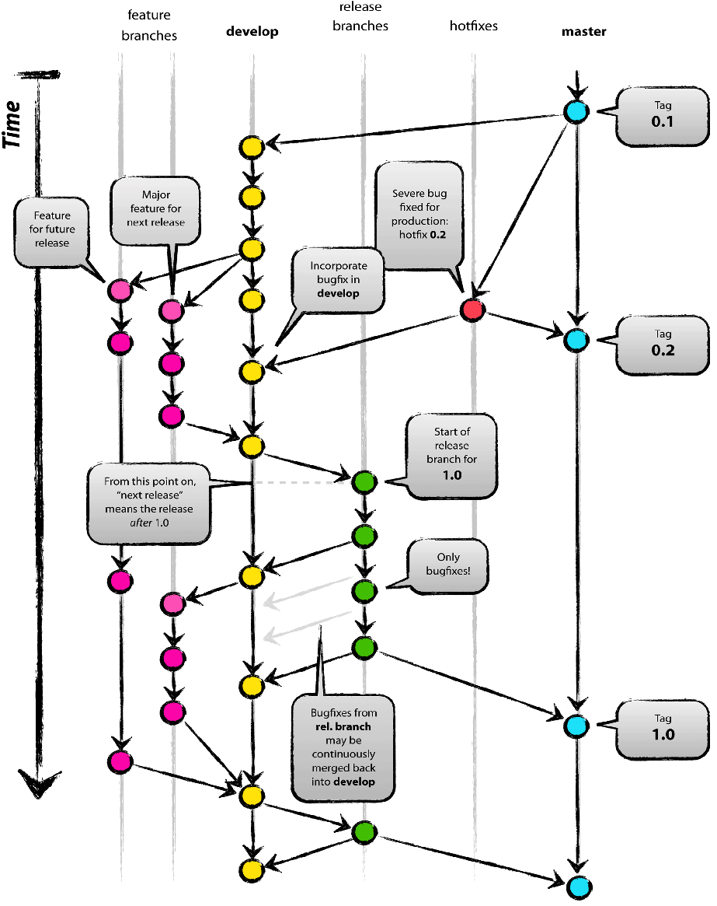

# Git综合知识

## 1. Git介绍
### 1.2 推荐教程
[Git教程-廖雪峰的官方网站](https://www.liaoxuefeng.com/wiki/896043488029600)
### 1.3 git origin

如上图所示。 
把origin仓库作为中心仓库，跟其他仓库类似，只不过`origin`是约定的命名，就指中心仓库。 
每位developer都可以对origin进行pull/push操作，同时developer之间可以相互pull/push。 
Alice and Bob, Alice and David, and Clair and David 构成了3个小组。 

## 2. Git客户端工具
### 1.1 工具下载
git bash: [https://git-scm.com/downloads](https://git-scm.com/downloads)

## git-flow
### 2.1 git-flow介绍
就像代码需要代码规范一样，代码管理同样需要一个清晰的流程和规范 
`Vincent Driessen` 为了解决这个问题提出了 [A Successful Git Branching Model](https://nvie.com/posts/a-successful-git-branching-model/)
#### 2.1.1 git-flow分支图

#### 2.1.2 各分支职责
* **Production 分支** 
Master分支，发布到生产环境的代码，最近发布的Release， 这个分支只能从其他分支合并，不能在这个分支直接修改
* **Develop 分支** 
这个分支是我们是我们的主开发分支，包含所有要发布到下一个Release的代码，这个主要合并与其他分支，比如Feature分支
* **Feature 分支** 
这个分支主要是用来开发一个新的功能，一旦开发完成，我们合并回Develop分支进入下一个Release
* **Release分支** 
当你需要一个发布一个新Release的时候，我们基于Develop分支创建一个Release分支，完成Release后，我们合并到Master和Develop分支
* **Hotfix分支** 
当我们在Production发现新的Bug时候，我们需要创建一个Hotfix, 完成Hotfix后，我们合并回Master和Develop分支，所以Hotfix的改动会进入下一个Release

